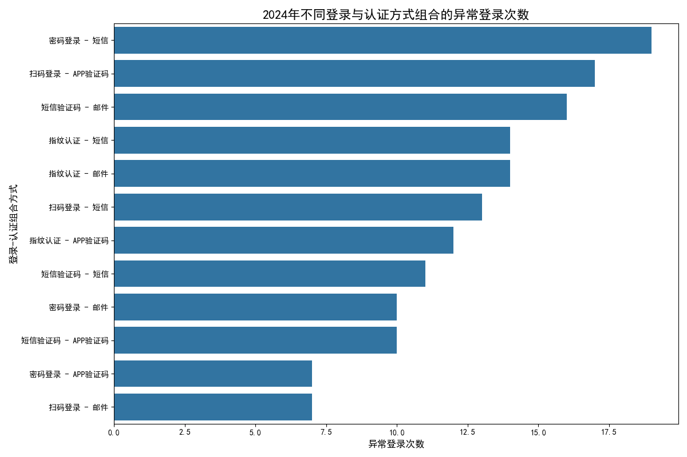

# 2024年登录认证方式薄弱环节分析报告

## 一、分析背景与目标

本次数据分析旨在深入探究2024年度不同登录方式与认证方式组合场景下的安全表现，识别存在的薄弱环节，并为后续优化登录与认证策略提供数据驱动的建议。

## 二、数据分析过程

为了定位异常登录的高发场景，我们进行了如下分析步骤：

1.  **数据整合**：通过 `登录记录ID` 将 `登录记录表` 与 `异常登录表` 进行关联，将每次异常登录与具体的登录方式和二次认证方式相对应。
2.  **数据筛选**：提取所有发生于2024年的登录记录，以确保分析的时效性。
3.  **聚合统计**：按照“登录方式”与“二次认证方式”的组合进行分组，统计每种组合下发生的异常登录总次数。
4.  **可视化呈現**：将统计结果绘制成条形图，以便直观地比较不同组合的风险水平。

## 三、核心发现：薄弱环节识别

通过对2024年异常登录数据的分析，我们发现不同登录与认证组合的安全表现存在显著差异。如下图所示，特定的组合是异常登录的主要来源。

**核心洞察：**

*   **“密码登录 - 短信认证”** 是异常登录次数最多的组合，构成了当前最主要的安全薄弱环节。
*   **“密码登录 - 免密认证”** 的异常登录次数也显著偏高，是第二大风险点。
*   相比之下，**“双因素认证 - 令牌认证”** 和 **“指纹识别 - 扫码认证”** 等组合的异常登录次数非常低，表现出更高的安全性。

## 四、原因分析

“密码登录”相关的组合之所以成为薄弱环节，主要原因在于：

1.  **密码的脆弱性**：用户倾向于设置简单、易记的密码，或在多个平台复用密码。这使得密码容易通过撞库攻击、暴力破解或社会工程学等手段被窃取。
2.  **短信认证的风险**：虽然短信认证增加了一层保护，但短信验证码仍可能通过短信嗅探、病毒劫持等技术手段被攻击者拦截，从而绕过二次认证。
3.  **免密认证的依赖性**：“免密认证”虽然方便，但其安全性高度依赖于用户设备的物理安全或生物识别特征的可靠性。一旦设备丢失或生物特征被伪造，账户将面临直接风险。

## 五、策略建议与后续措施

为加固登录体系，减少安全风险，我们建议采取以下措施：

1.  **强化现有高风险组合的安全策略：**
    *   **针对“密码登录”**: 强制推行更严格的密码策略，如要求密码长度不低于12位、包含大小写字母、数字和特殊符号，并定期提醒用户更换密码。引入风险检测机制，在检测到异地登录或非常用设备登录时，强制进行额外的身份验证。
    *   **针对“短信认证”**: 加强用户安全教育，提醒用户警惕伪基站、钓鱼链接等攻击手段，保护个人信息安全。

2.  **引导并推广更安全的认证方式：**
    *   **积极推广**: 投入资源向用户推广和引导使用“双因素认证 - 令牌认证”、“指纹识别 - 扫码认证”等异常率极低的认证组合。
    *   **提供激励**: 为切换到高安全级别认证方式的用户提供一定的激励，如积分奖励、会员特权等，以提高用户迁移的意愿。

3.  **建立持续的监控与迭代机制：**
    *   **动态监控**: 持续监控所有登录与认证组合的异常登录数据，建立动态风险告警机制。
    *   **定期评估**: 定期（如每季度）对安全策略进行评估和复盘，根据新的攻击手法和技术演进，及时调整和优化认证体系，确保持续的安全性。

通过以上措施，我们可以有效加固系统的登录防线，降低潜在的安全风险，并提升整体用户账户的安全性。
