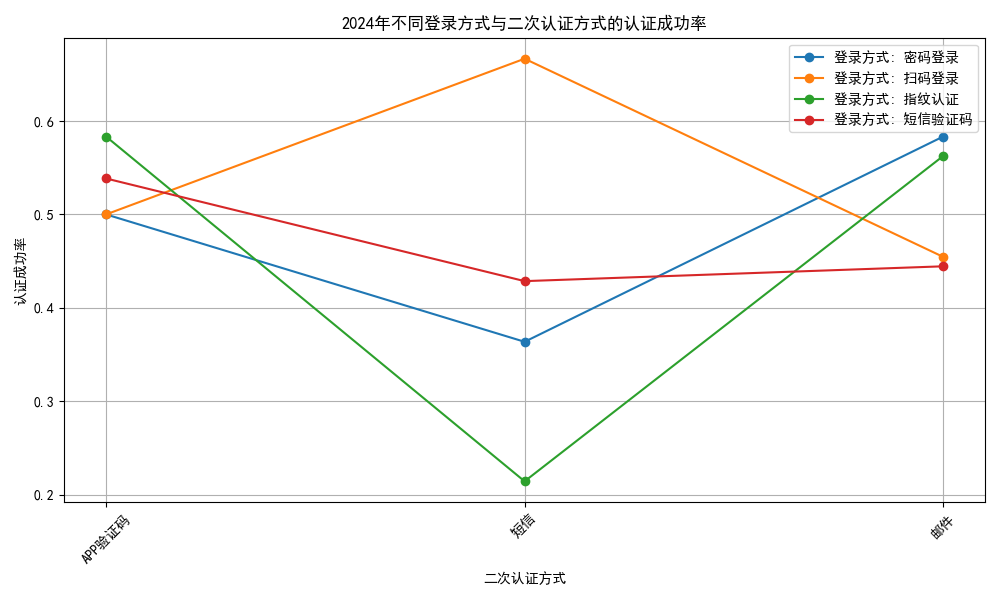

# 2024年登录方式与二次认证方式的安全分析报告

## 概述
本报告分析了 2024 年登录方式与二次认证方式的组合场景，评估其安全性并识别潜在的薄弱环节。通过数据驱动的分析，我们提出了改进建议，以提高系统安全性。

---

## 数据分析

分析基于 2024 年的登录记录，主要关注以下字段：
- **登录方式**：例如密码登录、扫码登录等。
- **二次认证方式**：例如短信、邮件、APP验证码等。
- **认证成功率**：成功登录次数与总尝试次数的比率。

分析使用 Python 进行数据可视化，以展示不同组合的认证成功率。

---

## 认证成功率可视化

如上图所示，不同登录方式与二次认证方式的认证成功率存在显著差异：
- **密码登录 + 短信验证码** 的成功率较低（约 36%）。
- **扫码登录 + APP验证码** 的成功率较高（50%）。
- 整体来看，**短信验证码** 和 **APP验证码** 组合的安全性较强。

---

## 薄弱环节分析

1. **密码登录 + 短信验证码**：虽然短信验证码在移动设备普及的背景下广泛使用，但其成功率较低，可能与以下问题有关：
   - **短信拦截风险**：攻击者可能截取短信验证码。
   - **用户输入错误**：验证码过期或用户输入失误。

2. **密码登录 + 邮件验证**：成功率不高（约 58%），可能是因为：
   - **邮件延迟**：邮箱服务器延迟导致验证码失效。
   - **邮件垃圾箱误判**：用户未能及时查看验证码邮件。

3. **扫码登录 + 短信验证码**：虽有一定成功率（67%），但短信验证码的缺点仍然限制了其安全性。

---

## 改进建议

1. **优化短信验证码机制**：
   - 提供更长的验证码有效时间。
   - 引入多层加密技术，防止中间人攻击。

2. **推广使用 APP验证码**：
   - 推荐使用基于时间的一次性密码（TOTP），如 Google Authenticator。
   - 鼓励用户下载专用身份验证APP，减少依赖短信/邮件。

3. **引入生物识别技术**：
   - 结合指纹识别、人脸识别等生物特征，提高安全性。

4. **加强用户教育**：
   - 教育用户避免将验证码泄露给他人。
   - 提醒用户及时检查邮件垃圾箱。

5. **动态增强认证策略**：
   - 对于高风险操作（如大额交易），动态增加额外的认证步骤。

---

## 结论

通过分析 2024 年的登录和认证数据，我们发现不同组合方式的安全性存在差异。**密码登录 + 短信验证码** 存在较高的风险，建议优化其机制或转向 **APP 验证码** 和 **生物识别** 技术。同时，加强用户教育和动态认证策略，以进一步提高系统的整体安全性。
