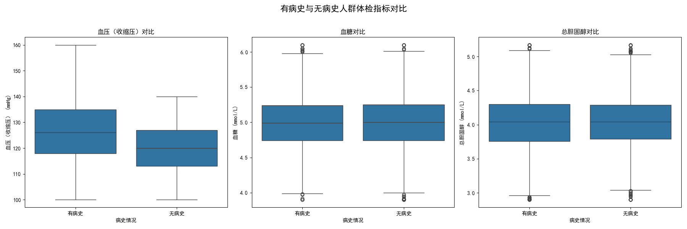

# 有病史与无病史人群体检数据差异分析报告

## 一、引言

本次分析旨在探究有无病史的人群在体检数据上存在的差异，并进一步分析不同类型的病史对关键体检指标的具体影响。通过对 `健康状况` 和 `体检指标` 两个数据集的综合分析，我们期望能够揭示病史与体检结果之间的关联，从而为个人健康管理和医疗机构的预防性健康服务提供数据支持和可行性建议。

## 二、分析过程

本次分析主要分为以下几个步骤：

1.  **数据探索**：我们首先对提供的 SQLite 数据库进行了初步探索，识别出 `健康状况` 和 `体检指标` 两个核心数据表，并了解了其数据结构。
2.  **数据整合与分组**：通过 SQL 查询，我们将两个数据表以 `编号` 字段进行关联，并根据 `疾病史` 字段将人群分为“有病史”和“无病史”两大类。
3.  **描述性统计分析**：我们计算了不同人群在多项关键体检指标（如血压、血糖、总胆固醇等）上的平均值，以量化他们之间的差异。
4.  **可视化分析**：为了更直观地展示数据差异，我们使用 Python 的`matplotlib`和`seaborn`库创建了箱线图，对有病史和无病史人群在血压、血糖和总胆固醇等指标上的数据分布进行了可视化对比。

## 三、主要发现

### 1. 总体差异：有病史人群多项指标偏高

通过对两组人群的平均指标进行比较，我们发现：

*   **血压**：有病史人群的平均**收缩压**（126.16 mmHg）和**舒张压**（79.54 mmHg）均高于无病史人群（收缩压 120.00 mmHg，舒张压 75.04 mmHg）。
*   **体重**：有病史人群的平均**体重**（65.03 kg）略高于无病史人群（62.39 kg）。
*   **其他指标**：在心率、血糖和总胆固醇等指标上，两组人群的平均值差异不显著。

这表明，有病史的个体在整体上可能面临更高的心血管健康风险。

### 2. 具体病史分析：高血压影响显著

为了探究具体病史的影响，我们按不同疾病（高血压、糖尿病、心脏病）对数据进行了分组分析。结果显示：

*   **高血压史人群**：其平均**收缩压**（135.17 mmHg）和**舒张压**（86.25 mmHg）远高于其他所有人群，包括无病史人群和其他类型病史的人群。这清晰地揭示了高血压病史与当前血压水平的强相关性。
*   **其他病史人群**：患有糖尿病和心脏病史的人群，其血压、血糖和总胆固醇等指标的平均值与无病史人群相比，未显示出统计上的显著差异。这可能是由于样本量限制或疾病控制情况良好所致。

### 3. 可视化洞察：箱线图揭示分布差异

我们通过箱线图进一步确认了上述发现。

从上图可以清晰地看到：

*   **血压（收缩压）对比**：有病史人群的收缩压中位数、上下四分位数均显著高于无病史人群，且数据分布范围更广，存在更多的异常高值。这再次印证了病史（尤其是高血压史）对血压水平的显著影响。
*   **血糖与总胆固醇对比**：在这两个指标上，有病史和无病史人群的箱体位置和大小非常相似，表明两组人群的血糖和总胆固醇水平分布差异不大。

## 四、结论与建议

### 结论

综合以上分析，我们可以得出以下结论：

1.  **病史是影响体检指标的重要因素**，尤其是在心血管健康相关指标上。
2.  **高血压病史**与当前血压水平存在极强的正相关关系。有高血压病史的个体，其血压读数系统性地高于无病史和其他病史的个体。
3.  在本次分析的数据集中，糖尿病和心脏病史对血压、血糖和总胆固醇等指标的独立影响不显著，但这并不排除其在更大样本或不同维度分析中的潜在重要性。

### 建议

基于以上结论，我们提出以下建议：

1.  **对个人的建议**：
    *   有**高血压病史**的个体应将血压监测作为日常健康管理的重中之重，严格遵循医嘱，定期复查。
    *   所有人都应保持对自身健康状况的关注，即使没有明确病史，也应定期体检，及早发现潜在风险。

2.  **对医疗机构的建议**：
    *   在体检系统中，应将被检者的**疾病史**作为一个重要的风险分层指标。
    .
    *   对于有高血压等明确心血管病史的客户，体检报告应提供更具针对性的解读和健康指导，并建议增加相关检查的频率。
