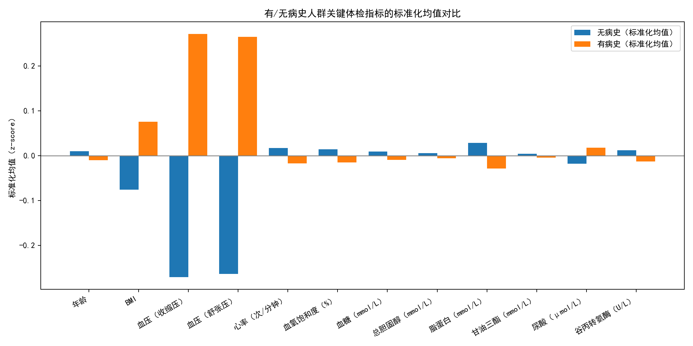
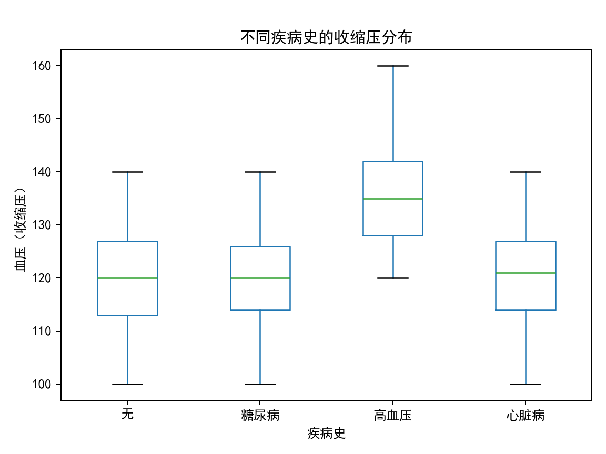
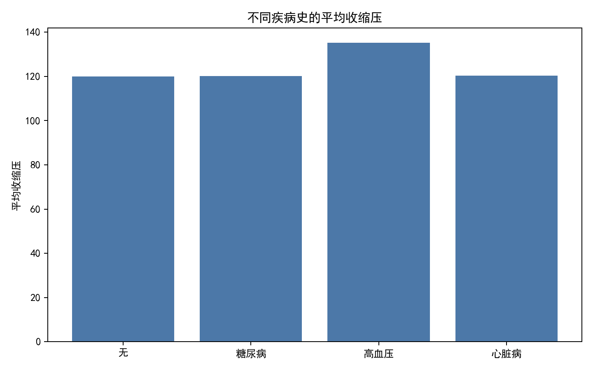
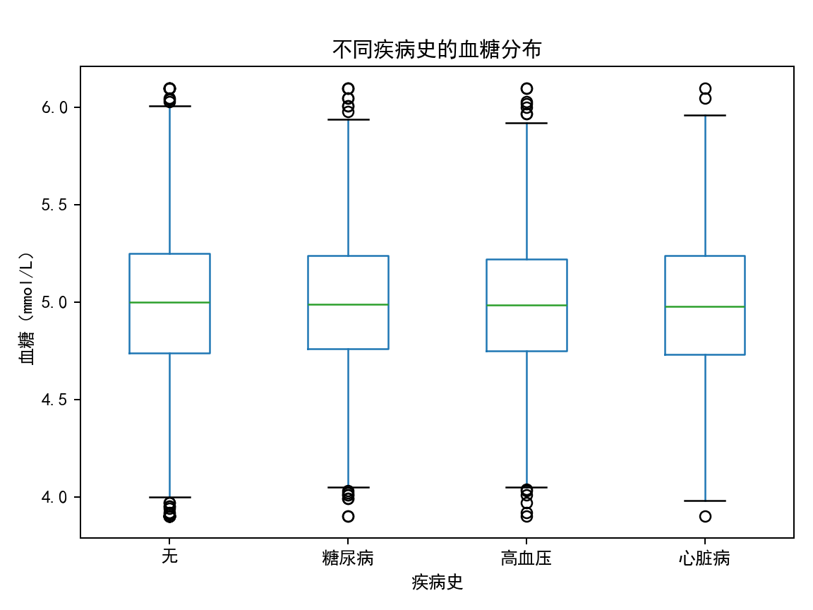

# 体检数据中“有病史 vs 无病史”差异与不同病史类型的影响洞察报告

## 摘要
- 样本总量：9,972 人；按疾病史分布：无病史 4,996；糖尿病 2,037；高血压 1,982；心脏病 957。
- 年龄与性别分布：有病史与无病史在年龄（均值约 36 岁）与男性占比（约 50%）非常接近，年龄与性别对总体差异的混杂影响较小。
- 总体差异（有病史 vs 无病史）：
  - 血压差异显著：收缩压 Cohen’s d≈0.56、舒张压 d≈0.55（中到大的效应量，有病史人群更高）。
  - BMI 略高：d≈0.15（小效应）。
  - 其他指标（血糖、血脂、心率、血氧、ALT、尿酸）总体差异较小（|d|<0.06）。
- 分疾病史类型影响：
  - 高血压：收缩压均值约 135.2 mmHg vs 无病史 120.0 mmHg；舒张压差异同样巨大（相对无病史的 d≈1.57）。BMI 略高（d≈0.19）。
  - 糖尿病：BMI 略高（d≈0.17），但观测到与“无病史”组的血糖均值几乎一致（d≈0.00），提示可能存在良好控制或测量场景（如非空腹/药物控制）因素。
  - 心脏病：在血压、血糖、BMI 上与“无病史”接近（|d|≤0.04），说明“心脏病”类别内部可能异质性较大或样本处于稳定期。

综合来看，“有病史”组与“无病史”的主要差距来自于血压，差异基本由“高血压”人群驱动；BMI 在所有有病史类别中都有轻度上移。

---

## 数据与方法
- 数据来源：SQLite 数据库 dacomp-037.sqlite，表：
  - 体检指标：编号、性别、年龄、身高、体重、血压（收缩/舒张）、心率、呼吸频率、血氧、血糖、血脂（总胆固醇、脂蛋白、甘油三酯）、尿酸、尿素氮、ALT、血清钾等。
  - 健康状况：编号、健康状况、疾病史、过敏史、吸烟状况、饮酒状况。
- 关联方式：按“编号”内连接，得到 9,972 条观测。
- 派生变量：BMI=体重(kg)/身高(m)^2；有病史标记：疾病史≠“无”。
- 统计与检验：
  - 按“有病史/无病史”与“疾病史类型（无/糖尿病/高血压/心脏病）”聚合均值/标准差/样本数。
  - 计算 Cohen’s d（标准化效应量），衡量差异大小。
  - 可视化：标准化均值对比、按疾病史的血糖/收缩压分布箱线图、不同疾病史的收缩压均值柱图。

---

## 结果

### 1) 有病史 vs 无病史：指标差异全貌
下图展示了各关键体检指标在两组中的标准化均值对比（以全体均值和方差做标准化）。可见：
- 有病史人群在收缩压与舒张压显著高于无病史（最为突出的差异）。
- 有病史人群 BMI 略高。
- 其余指标差异不大。

图片：group_standardized_means.png



定量效应量（Cohen’s d，正值表示“有病史”更高）：
- 血压（收缩压）d≈0.56，血压（舒张压）d≈0.55（中到大）。
- BMI d≈0.15（小）。
- 其他如血糖、总胆固醇、甘油三酯、脂蛋白、尿酸、心率、血氧、ALT 的 |d|<0.06，差异很小。

群体结构一致性：
- 年龄均值：有病史 35.87 vs 无病史 36.05（d≈-0.02，基本相同）。
- 男性占比：有病史 50.1% vs 无病史 49.5%（接近）。

结论：总体上，“有病史”与“无病史”的主要差异集中在血压，其次是 BMI。年龄与性别并非造成差异的主要原因。

---

### 2) 不同疾病史类型对体检指标的影响

- 高血压：
  - 收缩压：均值约 135.17 mmHg，显著高于“无病史”的 120.00 mmHg；舒张压差异同样显著（相对“无”组 d≈1.57）。
  - BMI：略高（d≈0.19）。
  - 其他指标：未见稳定的大幅差异。
  - 可视化：从收缩压分布箱线图与均值柱图可清晰看出高位上移。

图片：sbp_box_by_disease.png



图片：sbp_mean_by_disease.png



- 糖尿病：
  - BMI：略高（d≈0.17）。
  - 血糖：与“无病史”组均值几乎一致（d≈0.00）。
  - 解释（诊断性）：一是测量可能并非空腹/随机血糖，受短期行为影响；二是糖尿病患者可能在药物或生活方式干预下，检时得到良好控制；三是样本的“糖尿病”标签可能包含病程、控制水平差异较大的人群。
  - 运营启示：不要仅凭一次血糖值判断风险，建议结合空腹血糖、OGTT、HbA1c 等多维指标与随访序列。

- 心脏病：
  - 在血压、血糖、BMI 上与“无病史”接近（|d|≤0.04）。
  - 解释（诊断性）：心脏病为宽泛标签（冠心病/心律失常/瓣膜病等），体检当时可能处于稳定期，传统静态指标对当前差异不敏感；建议结合心电图、超声、运动试验与随访事件。

- 血糖分布（各疾病史）：
  - 下图显示各类疾病史的血糖分布箱线图，可见糖尿病组的中位数与四分位与“无病史”较接近，呼应“均值接近”的发现。

图片：glucose_box_by_disease.png



---

## 为什么会这样（诊断性思考）
- 差异来源：总体差异主要由“高血压”人群推动；高血压本身定义即持续性血压升高，直接导致收缩压/舒张压在统计上的显著上移。
- BMI 与慢性病：轻度上移的 BMI 与慢性病风险相关；但效应不大，提示 BMI 在该样本中不是区分“有病史/无病史”的强信号（可能与总体 BMI 水平偏低或干预普及有关）。
- 糖尿病血糖“不高”的原因：单次测量、服药、饮食与就诊时机等导致观测到的随机/当次血糖与真实代谢控制不完全一致；需更灵敏的指标（HbA1c）或时间维度数据才能体现差异。
- 年龄/性别：两组在年龄、性别结构几乎一致，减少了混杂解释空间。

---

## 如果继续发展（预测性思考）
- 若以体检指标预测“是否有病史”，血压特征将是首要预测因子；BMI 有一定但有限的贡献；单次血糖的区分力有限。
- 对“无病史”但血压/BMI 偏高的人群，属于潜在风险人群；对其进行后续跟踪可提升早诊早治的效果。

---

## 我们应该做什么（规范性建议）
- 人群分层管理：
  - 即刻干预：已确诊“高血压”人群（SBP/DBP 明显上移），应优先纳入强化管理：规范用药、家庭血压监测、低盐饮食、运动减重与依从性管理。
  - 重点关注：无病史但血压临界/偏高者（例如 SBP 130-139 或 DBP 85-89），纳入 3-6 个月随访；结合家庭自测与生活方式干预，防止进展。
  - 体重管理：对所有“有病史”亚群，推广体重管理计划，预期可在血压、代谢指标上获得联动改善。
- 指标体系优化（对糖尿病）：
  - 在常规体检中引入/强化空腹血糖、HbA1c 或 OGTT，避免单次随机血糖“误判”；鼓励糖尿病人群携带自测记录（用药/饮食/运动）以提高评估准确度。
- 监测与预警：
  - 建立基于阈值的预警策略（如 SBP≥140 或 DBP≥90 自动触发复测/转诊建议）。
  - 结合趋势分析：对 12 个月内血压/BMI 连续上升者发出“进展风险”提示。
- 资源配置：
  - 将健康管理资源优先投向“高血压”与“无病史但高血压边缘”的人群，预计边际收益最大。

---

## 可复现实验的关键代码片段（含字体设置）
以下为本次分析绘图中使用到的关键设置与示例代码（完整代码见当前目录 analysis.py）：
```python
import matplotlib.pyplot as plt

# 中文显示与负号设置
plt.rcParams['font.sans-serif'] = ['SimHei']
plt.rcParams['axes.unicode_minus'] = False

# 示例：两组标准化均值对比（保存为 group_standardized_means.png）
plt.figure(figsize=(12, 6))
x = range(len(metrics))
plt.bar([i-0.19 for i in x], z_means.loc[False].values, width=0.38, label='无病史（标准化均值）')
plt.bar([i+0.19 for i in x], z_means.loc[True].values,  width=0.38, label='有病史（标准化均值）')
plt.axhline(0, color='gray', linewidth=1)
plt.xticks(list(x), metrics, rotation=30, ha='right')
plt.ylabel('标准化均值（z-score）')
plt.title('有/无病史人群关键体检指标的标准化均值对比')
plt.legend()
plt.tight_layout()
plt.savefig('group_standardized_means.png', dpi=180)
```

---

## 限制与后续工作
- 数据仅为一次体检的“截面”，对糖尿病这类需要时序/综合指标评估的疾病，单次血糖区分力有限。
- “心脏病”为宽泛标签，建议细分病种，并引入心电图/超声/运动试验等结果。
- 后续可融合吸烟/饮酒/过敏史等生活方式特征，建立多变量模型以量化各因素的独立贡献与交互效应。

---

## 结论
- “有病史”与“无病史”的主要差异在血压，尤其由“高血压”人群驱动；BMI 在有病史组略高。
- 糖尿病组未呈现更高的当次血糖均值，提示需要更合适的代谢控制指标与时序跟踪。
- 在资源有限的情况下，应聚焦血压管理与体重控制，建立连续监测与门槛触发的规范化路径，以获得最大的健康收益。
