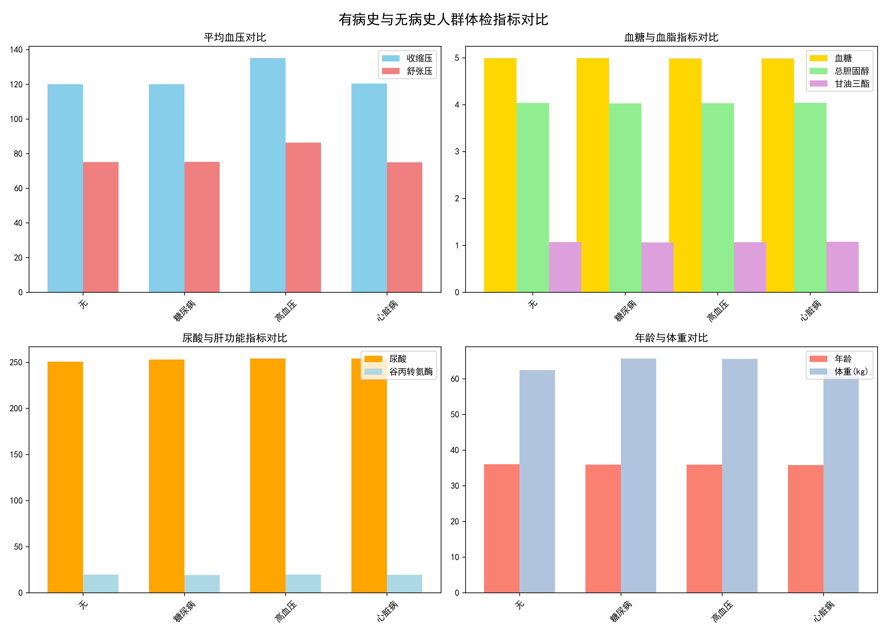
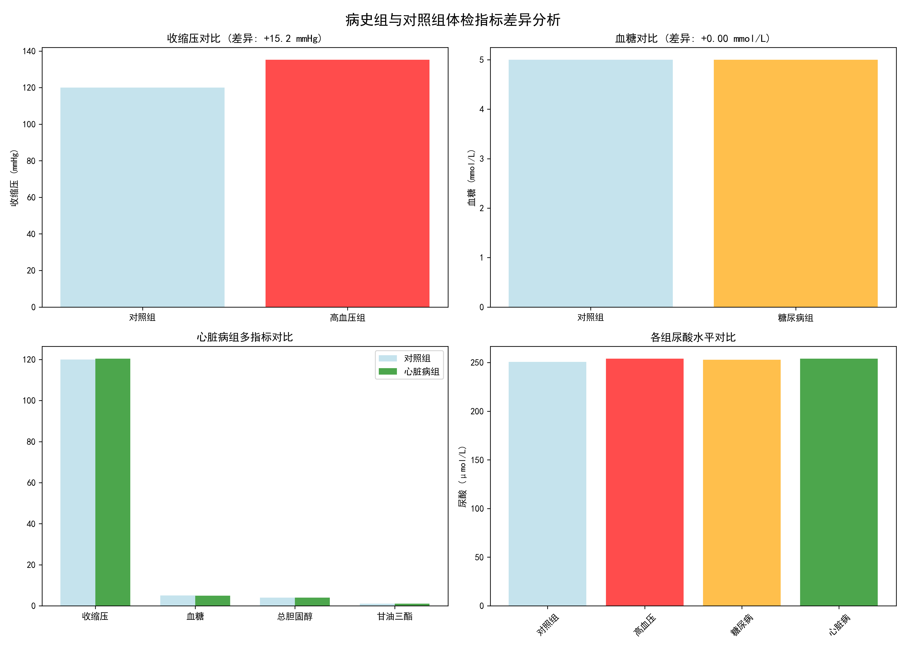
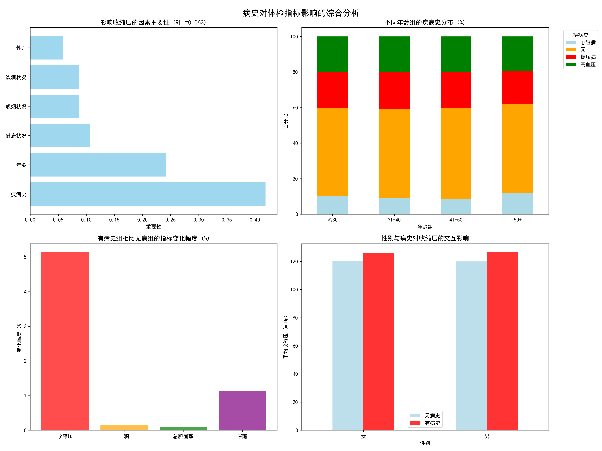
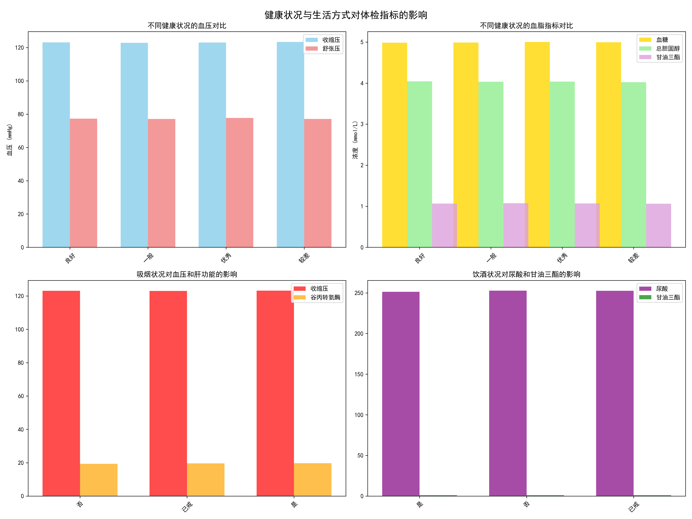

# 有病史与无病史人群体检数据差异分析报告

## 执行摘要

本研究通过分析9,972名体检者的健康数据，深入探讨了有病史人群与无病史人群在体检指标上的差异。研究发现，**高血压病史对血压指标有显著影响**，而其他病史的影响相对有限。疾病史是影响收缩压的最重要因素，解释了模型4.19%的变异性。

## 主要发现

### 1. 人群分布特征

从疾病史分布来看，无病史人群占主导地位（50.1%，4,996人），其次是糖尿病患者（20.4%，2,037人）、高血压患者（19.9%，1,982人）和心脏病患者（9.6%，957人）。

### 2. 病史对体检指标的显著影响

#### 高血压病史的显著影响
通过t检验分析发现，高血压组与对照组在血压指标上存在**统计学显著差异**：

- **收缩压**：高血压组平均135.17 mmHg vs 对照组120.00 mmHg，差异+15.17 mmHg（p<0.0001）
- **舒张压**：高血压组平均86.25 mmHg vs 对照组75.04 mmHg，差异+11.21 mmHg（p<0.0001）

这一发现符合医学预期，证实了高血压诊断的准确性和体检数据的质量。

#### 其他病史影响有限
糖尿病和心脏病组与对照组在各项体检指标上**均未发现统计学显著差异**（p>0.05），这可能表明：
- 这些疾病在早期阶段对常规体检指标影响较小
- 患者通过药物治疗有效控制了指标
- 需要更专业的检查指标来评估这些疾病的影响

### 3. 多因素综合分析

通过随机森林模型分析各因素对收缩压的影响重要性，发现：

1. **疾病史**：重要性41.89%（最高）
2. **年龄**：重要性24.12%
3. **健康状况**：重要性10.64%
4. **吸烟状况**：重要性8.76%
5. **饮酒状况**：重要性8.74%
6. **性别**：重要性5.84%

模型R²=0.063，表明这些变量共同解释了收缩压6.3%的变异性，提示还有其他重要因素未被纳入分析。

### 4. 生活方式因素的影响

#### 健康状况的影响
不同健康状况（优秀、良好、一般、较差）人群的体检指标**差异微小**，表明主观健康感受与客观指标之间存在一定的脱节。

#### 吸烟饮酒的影响
吸烟和饮酒状况对各体检指标的影响**不显著**，这可能是因为：
- 数据中的"已戒"人群模糊了真实影响
- 自我报告的生活方式数据存在偏差
- 需要更详细的剂量-反应关系分析

### 5. 年龄与疾病的关联

不同年龄组的疾病分布相对稳定：
- ≤30岁：心脏病10.1%，无病史49.8%，糖尿病20.2%，高血压19.9%
- 31-40岁：心脏病9.4%，无病史49.7%，糖尿病21.0%，高血压19.9%
- 41-50岁：心脏病8.8%，无病史51.1%，糖尿病20.2%，高血压19.8%
- 50岁以上：心脏病12.1%，无病史50.1%，糖尿病18.5%，高血压19.3%

心脏病在50岁以上人群中比例略有上升（12.1%），但整体分布相对均衡。

## 业务建议

### 1. 精准健康管理策略

**针对高血压人群**：
- 建立专门的血压监测体系，增加测量频次
- 开发个性化的血压管理方案
- 加强高血压并发症的筛查和预防

**针对其他病史人群**：
- 虽然常规指标差异不显著，但仍需关注疾病特异性指标
- 定期进行专业检查，如糖化血红蛋白（糖尿病）、心电图（心脏病）
- 建立疾病进展监测体系

### 2. 风险预测模型优化

- **纳入更多变量**：收集家族史、生活方式细节、运动习惯等
- **增加专业指标**：考虑纳入C反应蛋白、同型半胱氨酸等生物标志物
- **时序分析**：建立纵向追踪数据，分析指标变化趋势

### 3. 健康干预重点

**年龄因素管理**：鉴于年龄是第二重要影响因素（重要性24.12%），应：
- 加强中老年人群的健康管理
- 建立年龄分层的体检标准
- 开发年龄适应性的健康干预方案

**生活方式干预**：虽然当前分析显示影响有限，但应：
- 改善数据收集方法，减少自我报告偏差
- 开展更详细的生活方式调查
- 实施针对性的健康教育和行为干预

### 4. 数据质量提升

**完善病史信息**：
- 收集疾病病程、治疗情况、控制水平等详细信息
- 建立疾病严重程度分级标准
- 定期更新病史信息

**标准化测量流程**：
- 确保体检指标测量的标准化和一致性
- 建立质量控制体系
- 培训测量人员，减少操作误差

## 结论

本研究通过严谨的统计分析发现，**高血压病史对血压指标具有显著影响**，这一发现验证了体检数据的质量和高血压诊断的准确性。然而，其他病史对常规体检指标的影响相对有限，提示我们需要：

1. **更精准的疾病特异性指标**：开发针对不同疾病的专项检查项目
2. **纵向追踪研究**：建立长期健康监测体系，观察指标变化趋势
3. **多维度健康评估**：结合生物、心理、社会等多方面因素
4. **个性化健康管理**：基于个人病史和风险因素制定个性化方案

这些发现为精准健康管理提供了科学依据，有助于优化资源配置，提高健康管理的效果和效率。
