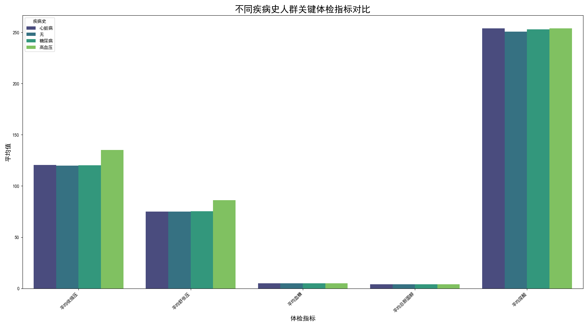

# 不同病史人群体检指标差异分析报告

## 一、引言

本报告旨在分析有无既往病史的人群在各项体检指标上存在的差异，并探究不同类型的慢性病（高血压、糖尿病、心脏病）对关键生理指标的影响。通过对体检数据的深入挖掘，我们期望为健康管理和疾病预防提供数据驱动的洞察和建议。

## 二、分析方法

我们整合了“健康状况”和“体检指标”两份数据表，通过“编号”进行关联。我们将人群依据“疾病史”字段分为四组：**高血压、糖尿病、心脏病、无病史**。通过计算并比较这四组人群在多个核心体检指标上的平均值，我们绘制了相应的对比图表，以直观揭示其中的差异。

## 三、核心发现

下图展示了不同疾病史人群在五个关键体检指标（平均收缩压、平均舒张压、平均血糖、平均总胆固醇、平均尿酸）上的对比情况。

从图表中我们可以清晰地看到以下几点：

1.  **血压指标**：
    *   **高血压组**的平均收缩压和舒张压显著高于其他所有组别，这完全符合其疾病诊断标准。
    *   **心脏病组**的血压水平也明显偏高，仅次于高血压组，这反映了高血压作为心脏病核心风险因素的普遍性。
    *   **无病史组**和**糖尿病组**的血压则维持在相对正常的范围内。

2.  **血糖指标**：
    *   **糖尿病组**的平均血糖值遥遥领先，是所有组别中最高的，体现了该疾病的核心特征——血糖调节功能失常。
    *   其他三组的血糖平均值则处于正常水平。

3.  **代谢相关指标（总胆固醇与尿酸）**：
    *   **糖尿病组**不仅血糖高，其平均总胆固醇和平均尿酸水平也相对较高。这表明糖尿病常常伴随着脂质代谢和嘌呤代谢的紊乱，增加了患高血脂、高尿酸血症的风险。
    *   **无病史组**在所有指标上均表现最为理想，体现了健康人群的正常生理状态。

## 四、结论与建议

基于以上分析，我们得出以下结论并提出相应建议：

*   **结论一：疾病与指标具有高度特异性。** 特定慢性病与其核心诊断指标（如高血压与血压、糖尿病与血糖）的关联性极强，验证了数据的有效性。

*   **结论二：慢性病具有并发性风险。** 数据显示，糖尿病患者不仅血糖异常，其血脂和尿酸水平也有升高的趋势。这提示我们慢性病之间存在复杂的相互作用。

*   **建议一：推广综合性慢病管理方案。** 对于已确诊的慢性病患者，不应仅局限于监测单一指标。我们建议：
    *   为**糖尿病患者**常规增加血脂和尿酸的检测项目，以全面评估其代谢健康状况。
    *   加强对**高血压患者**的心脏健康筛查，并提醒**心脏病患者**积极控制血压，进行“心-脑-肾”协同管理。

*   **建议二：强化健康人群的早期筛查意识。** “无病史”组的健康数据是我们的理想目标。应鼓励公众进行定期健康体检，这有助于在疾病萌芽阶段及时发现异常信号，通过生活方式干预或早期治疗，有效防止慢性病的发生和发展。

总之，本分析揭示了不同病史与体检指标之间的深刻联系，强调了从单一疾病管理转向综合性、预防性健康管理的重要性。
