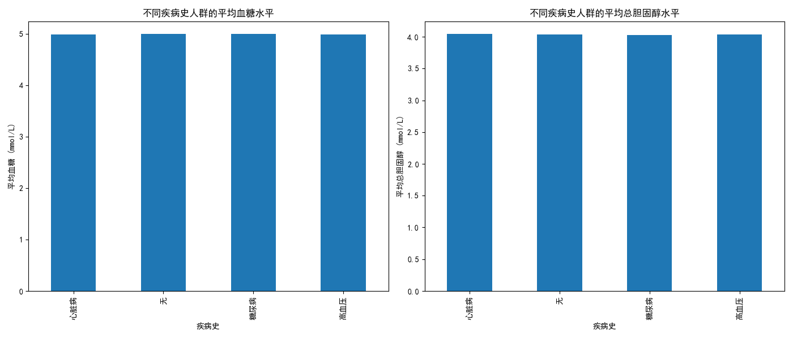
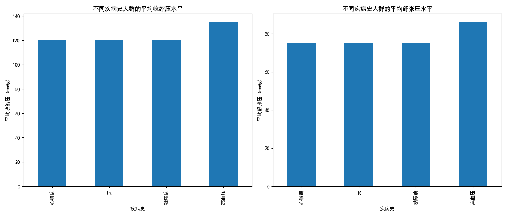

## 数据分析报告：病史与体检数据的关联分析

### 1. 血糖与总胆固醇分析

下图展示了有不同病史人群的平均血糖和总胆固醇水平：

- **平均血糖**：不同病史人群的平均血糖水平非常接近，糖尿病患者略高。
- **总胆固醇**：高血压、糖尿病、心脏病患者和无病史者的总胆固醇差异较小，但高血压患者的平均总胆固醇略高。

### 2. 血压分析

下图展示了有不同病史人群的平均收缩压和舒张压：

- **收缩压**：心脏病患者的平均收缩压明显高于其他群体，而无病史者较低。
- **舒张压**：各类病史人群之间的舒张压差异较小，但高血压患者的平均舒张压较高。

### 结论与建议

1. **血压差异显著**：有心脏病史的个体收缩压明显高于其他群体。表明心脏病史与高血压可能存在紧密联系。
2. **血糖与总胆固醇影响较小**：尽管糖尿病患者的平均血糖略高，但各群体间的血糖和总胆固醇水平整体差异较小。
3. **建议**：对于有病史的人群（尤其是心脏病史），应重点关注血压控制。同时，建议定期监测血糖和胆固醇水平，以预防潜在的健康风险。
