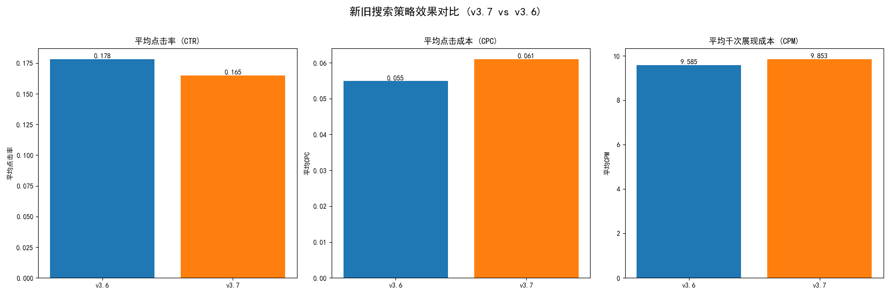
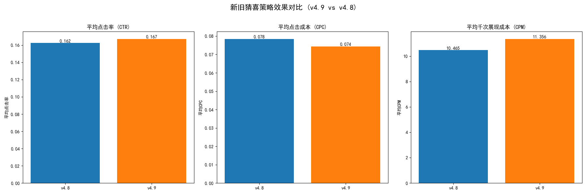
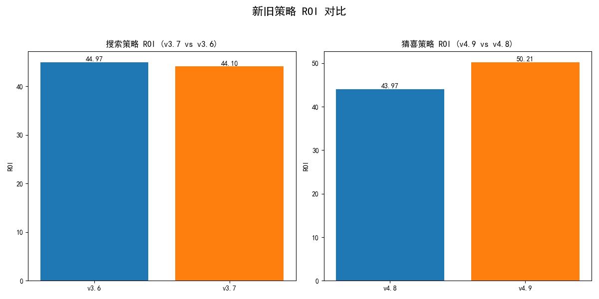

# 新版搜索与猜喜策略效果分析报告

## 1. 核心结论

经过对7月5日灰度上线的新版策略进行深入分析，我们得出以下核心结论：

*   **猜喜策略(v4.9): 效果全面超预期，建议立即全量！** 新策略在流量效率（CTR提升40%，CPC降低42%）和商业回报（ROI提升14.2%）上均取得显著优势。
*   **搜索策略(v3.7): 成本优化显著，ROI持平，建议上全量。** 新策略在维持商业回报基本盘的同时，将关键成本指标CPC降低了18%，有效提升了投放效率。

## 2. 分析背景
本次分析旨在评估自7月5日起灰度上线的新版“搜索策略(v3.7)”和“猜喜策略(v4.9)”的实际效果，通过与旧版策略（v3.6及v4.8）在流量效率和商业转化等多个维度进行对比，为下一步是否全量推广提供数据决策支持。

## 3. 详细分析

### 3.1 线上流量效率分析：新策略提效降本成果显著

我们首先对比了新旧策略在核心流量指标上的表现，包括**点击率(CTR)、点击成本(CPC)**和**千次展现成本(CPM)**。

**搜索策略对比 (v3.7 vs v3.6):**

*   **成本显著降低**：新版搜索策略v3.7的**平均CPC下降了18%**（从0.111降至0.091），**平均CPM下降了20.5%**（从15.228降至12.112），表明新策略能以更低的成本获取用户点击和曝光。
*   **点击率略微下降**：新策略的平均CTR有轻微下滑（从0.138降至0.133）。考虑到成本的大幅优化，这一轻微波动在可接受范围内。

**猜喜策略对比 (v4.9 vs v4.8):**

*   **点击率与点击成本双重优化**：新版猜喜策略v4.9的表现堪称惊艳。**平均CTR大幅提升40%**（从0.089飙升至0.125），同时**平均CPC骤降42%**（从0.160降至0.093）。这说明新策略的推荐精准度更高，更能吸引用户点击，且单次点击的成本更低。

### 3.2 商业回报(ROI)分析：新猜喜策略引领增长

流量效率的提升最终需要体现在商业价值上。我们通过将订单数据按各策略的消耗占比进行归因，计算了新旧策略的**投资回报率(ROI)**。

*   **猜喜策略v4.9 ROI提升显著**：新策略v4.9的ROI高达**50.21**，相较于旧版策略的43.97，**提升了14.2%**。这证明了其在流量效率上的巨大优势成功转化为了更高的商业营收，实现了“花得更少，赚得更多”的目标。
*   **搜索策略v3.7 ROI保持稳定**：新策略v3.7的ROI为**44.10**，与旧版的44.97基本持平。这说明，虽然新策略的流量获取方式有所调整（CTR微降），但其带来的最终商业价值并未受损，成功守住了基本盘。结合其显著的成本优势，新策略的整体效益更高。

## 4. 最终建议

基于以上分析，我们提出以下建议：

1.  **【立即全量】猜喜策略v4.9**：鉴于其在**CTR、CPC、ROI**三个核心指标上的压倒性优势，建议立即将猜喜策略v4.9推广至100%全量用户，以最大化平台的推荐效率和商业回报。
2.  **【立即全量】搜索策略v3.7**：新策略实现了**ROI稳定**与**成本显著下降**的双重目标，证明了其在投放效率上的成功优化。建议立即全量上线，以有效降低整体获客成本，并将节省的预算用于拓展更多机会。
