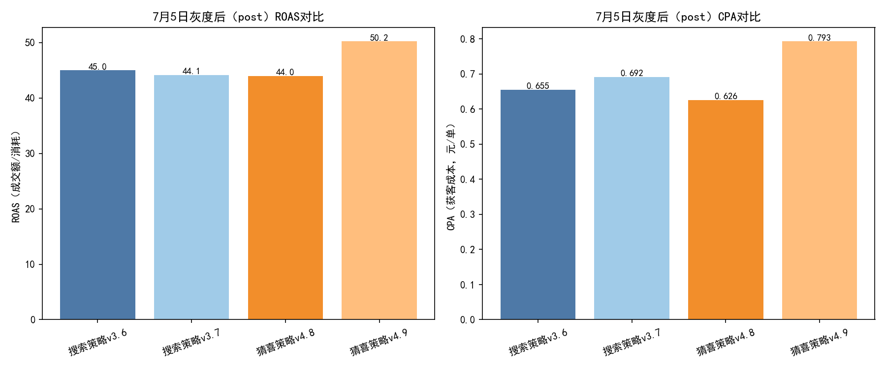
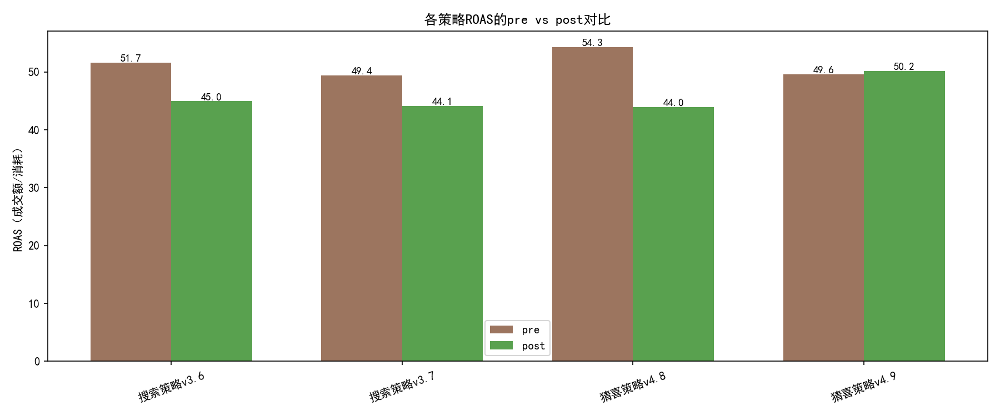

# 新搜索/猜喜策略灰度评估报告（7月5日为分界）

## 摘要结论
- 猜喜策略：v4.9 相较 v4.8 在灰度后（post）显著提高了ROAS（+14.2%），AOV大幅提升（+44.7%），尽管CVR与CPA略有劣化，但在“GMV效率（ROAS）”目标下表现明显更优，建议上全量，并配套订单量监控阈值。
- 搜索策略：v3.7 在post期ROAS（44.10）略低于v3.6（44.97），CPA更高（0.692 vs 0.655），CTR下降、CVR小幅上升但不足以抵消成本上升；综合表现未优于旧版，暂不建议上全量，建议继续灰度优化并分场景细化策略。

---

## 数据与方法
- 数据来源：SQLite数据库 dacomp-038.sqlite
  - 工作表1：曝光、点击、消耗、策略等（2025-07-01 至 2025-07-07，共511行）
  - 工作表2：T+0引导订单量、成交金额（同时间范围，共511行）
- 评估策略：
  - 搜索：v3.6（旧） vs v3.7（新）
  - 猜喜：v4.8（旧） vs v4.9（新）
- 分界定义：2025-07-05（含）起为post，之前为pre（灰度后效果）
- 指标口径：
  - CTR=点击/曝光, CVR=订单/点击, CPC=消耗/点击, CPM=1000*消耗/曝光
  - CPA=消耗/订单, ROAS=成交额/消耗, AOV=成交额/订单
- 合并方法：表1（策略层）与表2（无策略层）按“日期+周几+品类(1/2/3级)”对齐。为避免订单/GMV重复计数，采用“点击占比分摊”：在同日同品类内，按各策略点击占比分配该维度订单与GMV；如点击为0，用曝光占比兜底。

为了绘图，使用了如下字体设置代码（已在生成脚本中使用）：
```python
plt.rcParams['font.sans-serif'] = ['SimHei']
plt.rcParams['axes.unicode_minus'] = False
```

---

## 结果总览（post维度对比）
下图展示灰度后（post）的ROAS与CPA：



关键发现：
- 搜索策略：
  - v3.7 相比 v3.6：CTR更低（0.1516 vs 0.1760），CVR略高（0.0875 vs 0.0845），但CPC更高（0.0605 vs 0.0554）、CPA更高（0.6916 vs 0.6554），ROAS略低（44.10 vs 44.97）。
  - 解释：新版本在转化质量（CVR）上略有提升，但触达与成本效率方面（CTR、CPC、CPA、ROAS）不占优，整体效率不如旧版。
- 猜喜策略：
  - v4.9 相比 v4.8：CVR下降（0.0882 vs 0.1035）、CPA上升（0.7928 vs 0.6258），但ROAS显著提升（50.21 vs 43.97，+14.2%），AOV大幅提升（39.81 vs 27.52，+44.7%）。
  - 解释：v4.9更倾向于引导高客单价成交，虽然订单量更少（20,246 vs 24,741），但客单价与GMV产出拉升，使得单位消耗产出的价值更高（ROAS更优）。

---

## pre vs post演变（宏观扰动校准）
为剔除宏观波动影响，仅关注相对变化。下图展示各策略pre/post的ROAS：



- 搜索：
  - v3.6：ROAS 51.66 → 44.97（-12.9%）
  - v3.7：ROAS 49.38 → 44.10（-10.7%）
  两者在post期均下滑，符合同期环境变化；但相对排名依旧v3.6 > v3.7，且差距在post期仍存在，说明新版本未体现相对优势。
- 猜喜：
  - v4.8：ROAS 54.34 → 43.97（-19.1%）
  - v4.9：ROAS 49.63 → 50.21（+1.2%）
  灰度后v4.9逆势提升，显著优于v4.8，显示新版本在post期环境下更具适配性与GMV效率优势。

---

## 诊断性洞察（为什么会这样）
- 搜索 v3.7：
  - CTR下降而CVR略升，说明流量选择更“窄且精”，但出价或竞争导致CPC升高，使CPA与ROAS未改善；推测为关键词/人群定向更保守或对高质量词出价更高，未能在成本端抵消。
  - 预算或展现结构可能偏向高竞争词，因此CPC抬升；建议对高成本低产出的query/人群/品类分组做负向调优。
- 猜喜 v4.9：
  - CVR下降但AOV显著提升，表明策略更偏向高客单价商品/人群；尽管单量下降，但GMV/消耗提升带来更高ROAS。
  - 如果业务目标是“GMV效率（ROAS）”，v4.9明显更优；如目标是“订单量/CPA”，需设定最低单量阈值与CPA约束，以免“高客单价带动”的策略稀释单量。

---

## 规范性建议（我们应该做什么）
1) 决策建议
- 猜喜：v4.9 建议上全量。
  - 全量同时设置运营护栏：
    - CPA不高于0.85（当前post为0.793）
    - 订单量不低于post期均值的95%（保序）
    - 按品类监控AOV，防止过度向超高价商品集中导致流量过窄
- 搜索：v3.7 暂不全量，继续灰度。
  - 继续A/B到7月中旬，目标是在不降低CVR的前提下降低CPC与CPA（如：关键词精细化出价、负向词扩展、召回拓展但保持意图强度）
  - 预算倾斜给在post期CVR提升明显且CPC不过高的细分品类/人群

2) 进一步分析与行动
- 细分到“促销一级/二级/三级品类”层面，筛出v4.9在何类品类AOV拉升最明显、v3.7在哪些类目CPC高但CVR未跟进，做结构化调优。
- 按“周几/日期”时序看切换前后是否存在节假日效应；必要时以同日同品类的对照策略做差分分析（DID）增强因果信度。
- 对猜喜v4.9设置单量与CPA的告警阈值，若连续2天不达标自动回退10-20%流量。

---

## 关键数值参考（post期）
- 搜索 v3.6 vs v3.7：
  - CTR 0.1760 vs 0.1516；CVR 0.0845 vs 0.0875；CPC 0.0554 vs 0.0605；CPA 0.655 vs 0.692；ROAS 44.97 vs 44.10；AOV 29.47 vs 30.50
- 猜喜 v4.8 vs v4.9：
  - CTR 0.1616 vs 0.1570；CVR 0.1035 vs 0.0882；CPC 0.0648 vs 0.0700；CPA 0.626 vs 0.793；ROAS 43.97 vs 50.21；AOV 27.52 vs 39.81

---

## 局限性与注意事项
- 时间窗仅7天，且pre/post样本量有限；建议延长观察期保证统计稳定性。
- 分摊方法基于点击占比，未考虑跨策略的多触点归因与外部流量影响。
- 未进行显著性检验；建议在扩量前做更长周期的A/B与稳态监控。

---

## 附：图表说明与代码
- 生成图片文件：post_kpi.png、pre_post_roas.png（已保存在当前目录）
- 字体与负号显示设置（绘图脚本中已包含）：
```python
plt.rcParams['font.sans-serif'] = ['SimHei']
plt.rcParams['axes.unicode_minus'] = False
```

综上：建议“猜喜策略v4.9”上全量并设运营护栏；“搜索策略v3.7”继续灰度迭代，聚焦降CPC与稳CVR，达成ROAS不低于v3.6的目标后再评估全量。
