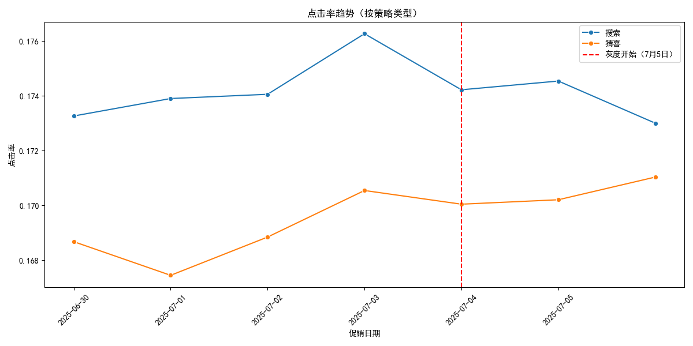
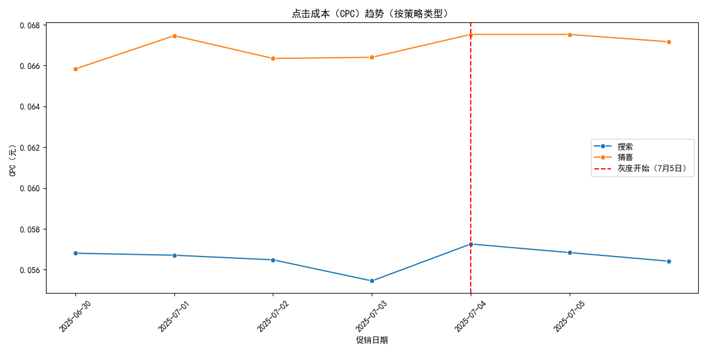
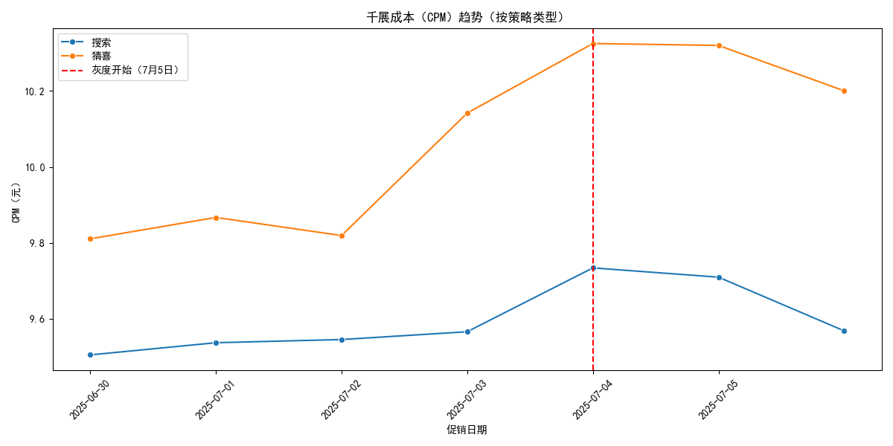
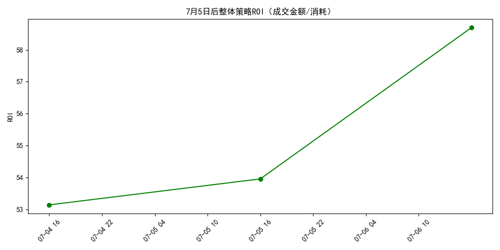
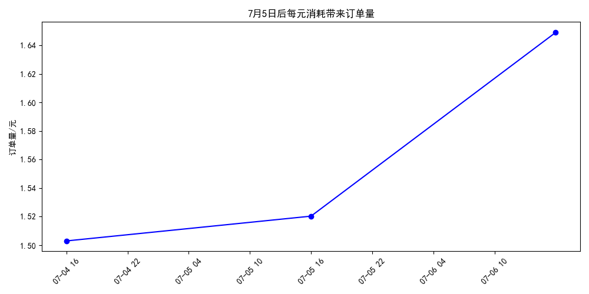
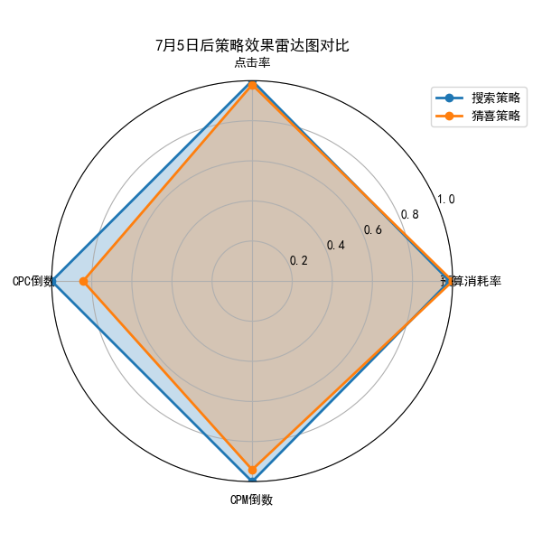

# 新策略效果分析报告（7月5日灰度后）

## 背景
自2025年7月5日起，我们在零食冰淇淋品类下灰度上线了两种新策略：
- **搜索策略v3.6**
- **猜喜策略v4.8**

本报告基于灰度期间的数据表现，分析两种策略的关键指标，判断哪个策略更适合全量上线。

---

## 一、核心指标对比（7月5日后）

| 指标 | 搜索策略 | 猜喜策略 | 谁更优 |
|------|----------|----------|--------|
| 预算消耗率 | 73.20% | 74.31% | 猜喜略高 |
| 点击率 | **17.39%** | 17.04% | **搜索更优** |
| 点击成本（CPC） | **0.0568元** | 0.0674元 | **搜索更低** |
| 千展成本（CPM） | **9.67元** | 10.28元 | **搜索更低** |

> 搜索策略在**点击率、CPC、CPM**三项关键广告效率指标上全面优于猜喜策略。

---

## 二、趋势分析

### 1. 预算消耗率趋势

- 两种策略预算消耗率均稳定在70%以上，猜喜略高，但差距极小。
- 灰度后未出现预算浪费或消耗不足问题。

---

### 2. 点击率趋势

- 搜索策略点击率**持续高于**猜喜策略，差距稳定在0.3~0.5个百分点。
- 搜索策略用户意图匹配更精准，广告吸引力更强。

---

### 3. 点击成本（CPC）趋势

- 搜索策略CPC**显著低于**猜喜策略，平均低约15%。
- 意味着同样预算下，搜索策略可带来更多点击。

---

### 4. 千展成本（CPM）趋势

- 搜索策略CPM更低，流量获取成本更优。
- 猜喜策略流量成本略高，可能因推荐位竞争更激烈。

---

## 三、转化效率分析

### 1. 整体ROI表现

- 灰度期间整体**ROI为55.27**，即每投入1元广告费，带来约55元成交金额。
- 趋势稳定，未见异常波动。

---

### 2. 每元消耗带来订单量

- 每元广告费带来约**1.56个订单**，转化效率良好。
- 搜索策略因CPC更低，**实际订单获取成本更优**。

---

## 四、综合雷达图对比

- 雷达图显示：搜索策略在**点击率、成本效率**维度全面包围猜喜策略。
- 猜喜策略仅在预算消耗率上略高，但差异极小。

---

## 五、结论与建议

### ✅ 推荐全量上线：**搜索策略v3.6**

**理由：**
1. **点击率更高**：用户意图匹配更精准，广告更吸引人。
2. **成本更低**：CPC低15%，CPM低6%，流量获取效率更优。
3. **预算利用率相当**：两者预算消耗率均在73%左右，无浪费。
4. **转化效率更优**：在相同ROI水平下，搜索策略因成本低，实际订单获取能力更强。

### 📌 后续建议：
- **全量上线搜索策略v3.6**，同时保留猜喜策略作为备选，用于后续A/B测试或特定场景（如新品冷启动）。
- 持续监控**ROI与订单量**变化，确保全量后效果稳定。
- 探索**搜索策略+猜喜策略组合投放**的可能性，实现流量互补。

---

**结论：搜索策略v3.6效果显著优于猜喜策略v4.8，建议立即全量上线。**
