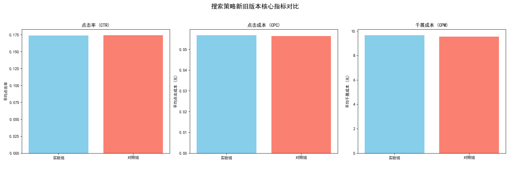
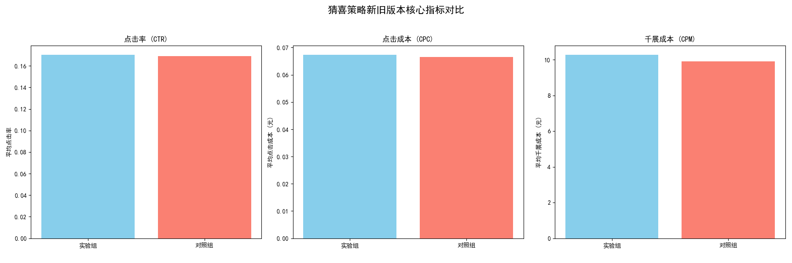

# 新策略灰度效果分析报告

## 1. 分析背景与目标

自7月5日起，我们灰度上线了一版新的“搜索策略”和“猜你喜欢策略”。本次分析旨在评估新策略相对于旧策略的效果，并为是否将新策略全量上线提供数据支持和决策建议。

## 2. 分析方法

本次分析基于 `dacomp-038.sqlite` 数据库中的投放数据。我们将7月5日之前的数据作为**对照组（旧策略）**，7月5日及之后的数据作为**实验组（新策略）**。

核心评估指标包括：
- **点击率 (CTR)**: 衡量用户对推荐/搜索结果的兴趣程度。
- **点击成本 (CPC)**: 衡量单次点击的成本。
- **千次展现成本 (CPM)**: 衡量获取一千次曝光的成本。

由于数据限制（后链路转化数据无法直接归因到具体策略），本次分析主要聚焦于以上前端核心指标。

## 3. 分析结果

我们分别对“搜索策略”和“猜喜策略”进行了对比分析。

### 3.1 搜索策略效果分析

新的搜索策略在核心指标上表现不及旧策略，或基本持平。

- **点击率 (CTR)**: 新策略相比旧策略下降 **0.26%**。
- **点击成本 (CPC)**: 新策略相比旧策略上升 **0.84%**。
- **千次展现成本 (CPM)**: 新策略相比旧策略上升 **1.39%**。

**结论**：新的搜索策略并未带来预期的效果提升，反而在成本上略有增加。从数据上看，新策略不具备全量的条件。

### 3.2 猜你喜欢策略效果分析

新的猜你喜欢策略在点击率上表现更优，但成本有所上升。

- **点击率 (CTR)**: 新策略相比旧策略提升 **0.91%**。
- **点击成本 (CPC)**: 新策略相比旧策略上升 **1.35%**。
- **千次展现成本 (CPM)**: 新策略相比旧策略上升 **3.75%**。

**结论**：新的猜你喜欢策略成功提升了用户点击意愿（CTR提升），表明其在内容匹配和吸引力上优于旧策略。虽然成本略有上升，但点击率的提升是更有价值的信号，通常能带来更多的高意向流量，有潜力提升最终的转化效果。

## 4. 最终建议

根据以上分析，我们提出以下建议：

1.  **搜索策略**: **不建议上全量**。建议策略团队复盘新策略的设计，深入分析其在不同品类、人群下的细分表现，找出效果不佳的原因并进行迭代优化后再进行下一轮测试。

2.  **猜你喜欢策略**: **建议上全量**。新策略在核心的用户兴趣指标（CTR）上取得了正向效果。建议在全量上线后，建立更完善的数据监控看板，**密切关注其对总订单量、成交金额（GMV）以及投资回报率（ROI）的长期影响**，确保其在提升前端效率的同时，也能维持或提升后端的商业转化价值。
