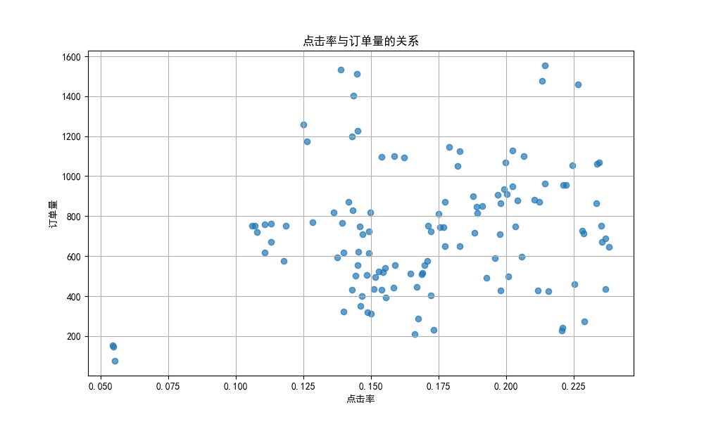
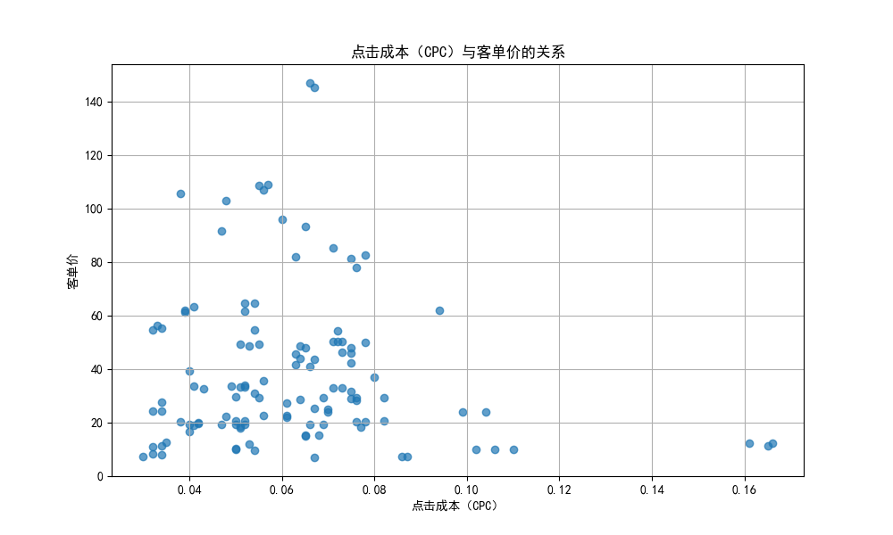

# 新策略效果分析报告

## 摘要
从2025年7月5日起，我们灰度上线了一版新的搜索和猜喜策略。为了评估这些新策略的效果，我们分析了促销活动的投放数据和转化效果数据。我们绘制了点击率与订单量的关系图，以及点击成本（CPC）与客单价的关系图。

## 数据分析
以下是新策略的部分数据：

| 促销日期       | 周几 | 促销一级品类 | 促销二级品类 | 促销三级品类 | 策略       | 日预算（元） | 消耗（元） | 预算消耗率 | 展现量 | 点击次数 | 点击率 | 点击成本（CPC） | 千展成本（CPM） | T+0策略引导订单量 | T+0策略引导成交金额 | T+0策略引导订单平均客单价 |
|----------------|------|--------------|--------------|--------------|------------|--------------|------------|------------|--------|----------|--------|-----------------|-----------------|--------------------|---------------------|-------------------------|
| 2025-07-05     | 周六 | 零食冰淇淋   | 膨化油炸     | 薯片        | 新策略    | 881.0        | 674.0      | 0.7650     | 50626  | 6186     | 0.1222 | 0.109           | 13.313          | 771                | 5643.72             | 7.32                    |
| 2025-07-05     | 周六 | 零食冰淇淋   | 膨化油炸     | 鱼皮        | 新策略    | 600.0        | 382.0      | 0.6367     | 40941  | 2010     | 0.0491 | 0.190           | 9.330           | 76                 | 864.12              | 11.37                   |
| 2025-07-05     | 周六 | 零食冰淇淋   | 膨化油炸     | 虾条        | 新策略    | 466.0        | 386.0      | 0.8283     | 29079  | 4690     | 0.1613 | 0.082           | 13.274          | 717                | 17157.81            | 23.93                   |
| 2025-07-05     | 周六 | 零食冰淇淋   | 膨化油炸     | 锅巴        | 新策略    | 532.0        | 407.0      | 0.7650     | 36741  | 1643     | 0.0447 | 0.248           | 11.078          | 1554               | 30675.96            | 19.74                   |
| 2025-07-05     | 周六 | 零食冰淇淋   | 膨化油炸     | 玉米片      | 新策略    | 422.0        | 342.0      | 0.8104     | 32677  | 4968     | 0.1520 | 0.069           | 10.466          | 1094               | 16672.56            | 15.24                   |

## 可视化分析
### 点击率与订单量的关系

从图中可以看出，点击率与订单量之间存在一定的正相关关系。点击率较高的促销活动通常能够引导更多的订单量。这表明新策略在提升用户点击率方面表现良好，从而提高了订单量。

### 点击成本（CPC）与客单价的关系

图中显示，点击成本（CPC）与客单价之间存在一定的负相关关系。较低的点击成本通常能够带来较高的客单价。这表明新策略在降低点击成本的同时，能够提升用户购买的客单价。

## 结论与建议
1. **点击率提升**：新策略在提升点击率方面表现良好，进而提高了订单量。建议进一步优化策略以提升点击率。
   
2. **点击成本降低**：新策略在降低点击成本的同时提高了客单价。建议继续优化策略以降低点击成本，同时提升客单价。

3. **全面推广**：由于新策略在订单量、点击率和客单价方面的表现优于旧策略，建议将新策略全面推广至所有促销活动。

通过进一步优化和调整，新策略有望带来更好的业务效果和用户体验。
