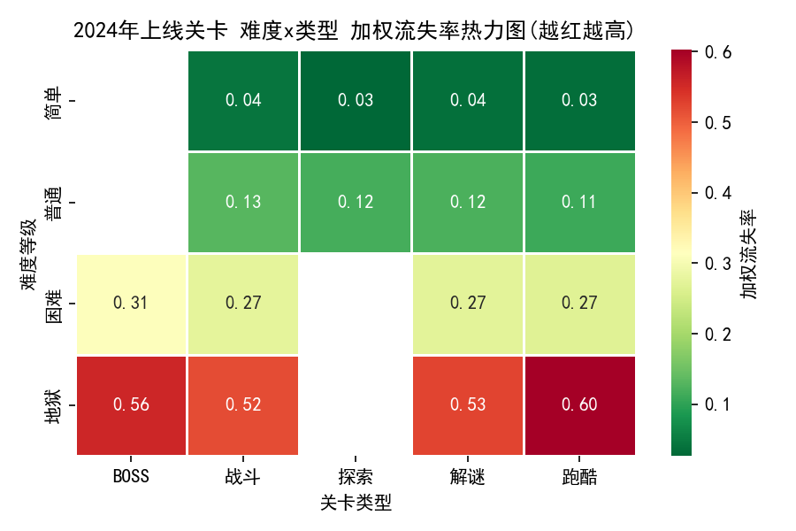
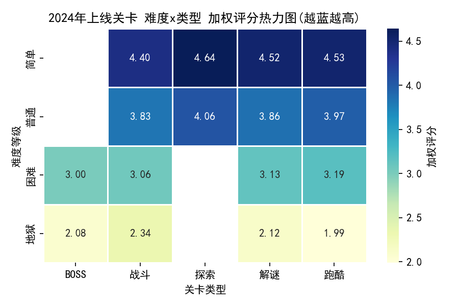
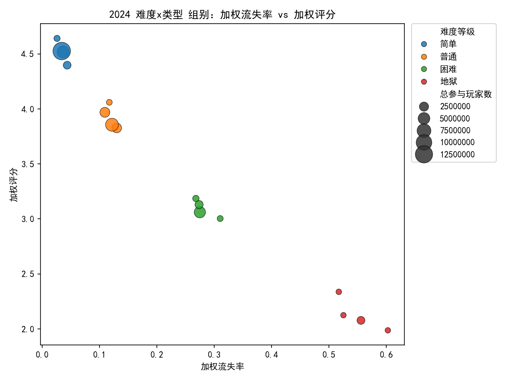

# 2024年上线关卡：难度x关卡类型下的流失率与关卡评分规律洞察与优化建议

## 摘要
- 2024年上线关卡共计：3142 个。  
- 难度分布：普通 819、困难 815、简单 806、地狱 702。  
- 类型分布：解谜 828、战斗 823、跑酷 779、BOSS 696、探索 16。  
- 总体规律：难度越高（尤其是“地狱”）流失率显著上升、评分显著下降；类型维度中，BOSS 与高难跑酷在高难度下流失率最突出。  
- 关键相关：关卡评分与流失率强负相关（-0.93），完成率与流失率强负相关（-0.99），重试次数与流失率强正相关（0.87），通关时长与流失率正相关（0.62）——提示“挫败感（高重试/长时长）”是流失的重要驱动。

下面以“难度等级x关卡类型组合”为单位，呈现流失与评分的变化规律，并给出可操作的优化策略。

---

## 数据与方法
- 数据来源：SQLite 表「游戏_游戏关卡内容数据表_(1)」，仅筛选 2024 年上线的关卡（字段：关卡ID、难度等级、关卡类型、通关率、完成率、平均重试次数、平均通关时间(S)、流失率、关卡评分、参与玩家数、上线时间等）。
- 计算方法：
  - 按“难度等级-关卡类型”分组，计算非加权均值与“按参与玩家数加权”的流失率与评分，作为更贴近玩家规模的指标。
  - 生成三张图：
    1) 加权流失率热力图
    2) 加权评分热力图
    3) 组别散点图（加权流失率 vs 加权评分，点大小=总参与玩家数，颜色=难度）
- 可视化图片文件（已生成在当前目录）：
  - heatmap_churn_2024.png
  - heatmap_rating_2024.png
  - scatter_churn_rating_2024.png

可视化示例（点击查看）：
- 加权流失率热力图：
- 加权评分热力图：
- 组别散点图：

---

## 关键发现

1) 难度提升带来的系统性效应
- 难度越高，流失率越高、评分越低，呈稳定单调趋势：
  - 简单档：流失率最低、评分最高（例如“简单-探索/跑酷/解谜/战斗”，加权流失率约 0.026~0.044、评分 4.40~4.64）。
  - 普通档：中等流失、较高评分（如“普通-跑酷”0.109 流失、评分 3.97；“普通-解谜”0.122、评分 3.86）。
  - 困难档：流失上升到 0.27~0.31，评分降至 3.0~3.19（尤其“困难-BOSS/战斗/解谜/跑酷”）。
  - 地狱档：显著高流失、低评分，成为重点风险区。
    - 地狱-跑酷：加权流失率 0.603，评分 1.99（9 关卡，参与 2.99 万）。
    - 地狱-BOSS：加权流失率 0.556，评分 2.08（660 关卡，参与 151.8 万）。
    - 地狱-解谜：加权流失率 0.525，评分 2.12。
    - 地狱-战斗：加权流失率 0.517，评分 2.34。

2) 类型维度的差异
- 低难度下：
  - 探索/跑酷/解谜普遍低流失且高评分，说明“学习负担低、反馈及时”的内容更讨喜。
- 中等难度下：
  - 跑酷/解谜仍维持较好口碑与留存（普通-跑酷 0.109 流失、评分 3.97；普通-解谜 0.122、评分 3.86）。
- 高难度下：
  - BOSS 与高难跑酷、解谜、战斗均出现较高流失低评分，BOSS尤甚（样本体量大，问题普适性强）。

3) 诊断性证据（相关性）
- 流失率与评分：-0.933（极强负相关），评分越低的关卡更易流失。
- 流失率与关卡完成率：-0.985（极强负相关），完成率越低流失越高，说明“通关阻力/门槛”是核心矛盾。
- 流失率与平均重试次数：0.867（强正相关），反映“挫败感（高重试）”是流失的重要驱动。
- 流失率与通关时长：0.616（中等偏强正相关），可能源于“拖沓/冗长/重复”带来疲劳。
- 各类型内部“评分-流失”相关（皮尔逊）：
  - 探索 -0.956、跑酷 -0.904、解谜 -0.901、战斗 -0.844、BOSS -0.682。
  - 说明在每个类型内，提升玩家感知质量（评分）几乎都能同步降低流失；而BOSS相对弱一些，可能因“强制门槛/卡关”导致即使评价较好也有刚性流失。

---

## 规律总结（难度x类型）
- 低难度（简单/普通）：
  - 探索、跑酷、解谜表现最佳：低流失+高评分，适合作为新手引导、节奏缓冲与章节开胃菜。
- 中难度（普通/困难）：
  - 跑酷、解谜仍具韧性，但需控制重试与时长；困难-BOSS开始显露较高流失。
- 高难度（地狱）：
  - BOSS与跑酷最为显著的“高流失低评分”组合，解谜、战斗亦存在明显问题。
  - 共性症状：高重试、低完成、时长偏长，体现为强挫败和疲劳。

---

## 预测性判断（给即将上线关卡的先验预期）
- 若不做额外干预，预计：
  - 地狱-跑酷：流失率约 0.55~0.60、评分约 2.0 附近。
  - 地狱-BOSS：流失率约 0.52~0.56、评分约 2.0~2.2。
  - 困难-BOSS：流失率约 0.29~0.31、评分约 3.0。
  - 普通-跑酷：流失率约 0.10~0.12、评分约 3.9~4.0。
  - 简单-探索：流失率约 0.02~0.04、评分约 4.5~4.7。

这些区间可作为内容验收与上线前评审的参考基线。

---

## 规范性建议：如何利用规律优化关卡

A. 难度曲线与门槛设计
- 地狱/BOSS/高难跑酷：
  - 降低前几波（或前半段）的伤害/速度/判定严苛度，后段再逐步提高，避免“一上来就劝退”。
  - 引入更密集的“检查点/复活点”，减少一次失败回退的时间成本。
  - 提供弹性难度（DDA）：在高重试、多失败或超时后，逐步放宽判定窗口、降低敌方血量/攻速或提供临时增益。
- 困难档：
  - 精修关键机制的可读性与输入容错；把“卡点”打磨成“可学会的挑战”而非纯粹硬核门槛。

B. 教学与可读性
- 针对高失败的机制（BOSS招式/跑酷机关/解谜关键线索）：
  - 在首次出现前加入“安全演示段”（不掉血/不判定失败的训练房、慢速演示、幽灵引导）。
  - 多次失败后弹出“可选提示”，包括操作时机、弱点、路径预览等。
  - 优化镜头、音画引导、光效/震动“预判信号”，降低识别难度。

C. 奖励与动机
- 高难内容：
  - 提供“分段奖励/保底奖励”（到达中间进度即给资源/外观碎片），避免长时间无正反馈。
  - 将奖励显著挂钩于尝试与学习：连续重试的玩家获得小幅增益/额外掉落，缓解挫败。

D. 内容编排与节奏
- 章节内打散高难组合，穿插“低难高愉悦”关卡（如探索或简易解谜/跑酷）作为节奏恢复带。
- 避免连续堆叠 BOSS 或“地狱-跑酷”，把高峰挑战设置在章节高潮而非入口。

E. 上线与验证（实验设计）
- 对高风险组合（地狱-BOSS/跑酷）做 A/B 实验：
  - A 组：现有设计；B 组：加入检查点+判定放宽+教学提示。
  - 关键指标：加权流失率、评分、完成率、重试次数、时长分布（P50/P90）、下一关转化率。
  - 成功标准（示例）：流失率下降 ≥ 20% 相对改善、评分提升 ≥ 0.3、完成率提升 ≥ 10pp、重试中位数下降 ≥ 20%。

---

## 面向制作的检查清单（上线前快速自查）
- 是否存在“开局劝退”的数值峰值/速度峰值/一击致命机制？
- 是否有足够的中途检查点与时长控制（P90 不超设计阈值）？
- 是否为关键机制提供了演示/提示/可读性增强？
- 是否设计了“重试友好”的奖励与容错？
- 章节内是否穿插了低难度恢复段，避免疲劳累积？
- 是否预设了 DDA 钩子（失败次数门槛与调整幅度）？

---

## 附：绘图代码片段（示例）
以下片段用于保证中文正常显示，且与本次绘图一致：
```python
import matplotlib.pyplot as plt
plt.rcParams['font.sans-serif'] = ['SimHei']
plt.rcParams['axes.unicode_minus'] = False
```
本次可视化的图片文件为：heatmap_churn_2024.png、heatmap_rating_2024.png、scatter_churn_rating_2024.png。

---

## 数据支撑（关键结果摘录）
- 高流失&低评分（加权）TOP 示例：
  - 地狱-跑酷：流失率 0.603，评分 1.99（参与 2.99 万）
  - 地狱-BOSS：流失率 0.556，评分 2.08（参与 151.8 万）
  - 地狱-解谜：流失率 0.525，评分 2.12
  - 地狱-战斗：流失率 0.517，评分 2.34
- 低流失&高评分（加权）TOP 示例：
  - 简单-探索：流失率 0.026，评分 4.64（参与 41.1 万）
  - 简单-跑酷：流失率 0.034，评分 4.53（参与 1284.9 万）
  - 简单-解谜：流失率 0.037，评分 4.52（参与 521.5 万）
  - 简单-战斗：流失率 0.044，评分 4.40（参与 144.8 万）
- 相关性（总体层面）：
  - 流失率 vs 评分：-0.933
  - 流失率 vs 完成率：-0.985
  - 流失率 vs 平均重试次数：0.867
  - 流失率 vs 平均通关时间：0.616
- 各类型内部“评分-流失”相关（皮尔逊）：
  - 探索 -0.956、跑酷 -0.904、解谜 -0.901、战斗 -0.844、BOSS -0.682

---

## 结论
- 2024年上线关卡在“难度x类型”维度上呈现出清晰而稳定的规律：难度抬升带来显著的流失上升与评分下降，尤其“地狱-BOSS/跑酷”组合为重点风险区；相反，“简单-探索/跑酷/解谜/战斗”是稳定的留存口碑来源。
- 诊断显示“高重试+长时长+低完成”构成了挫败链条，是流失的主要动因。通过门槛平滑、教学与可读性增强、奖励与节奏设计，以及 DDA 的引入，可以有效改善这些高风险组合的表现。
- 建议以“实验驱动”的方式逐步落地优化，并以加权流失率/评分/完成率/重试分布为核心指标进行持续监测与迭代。
