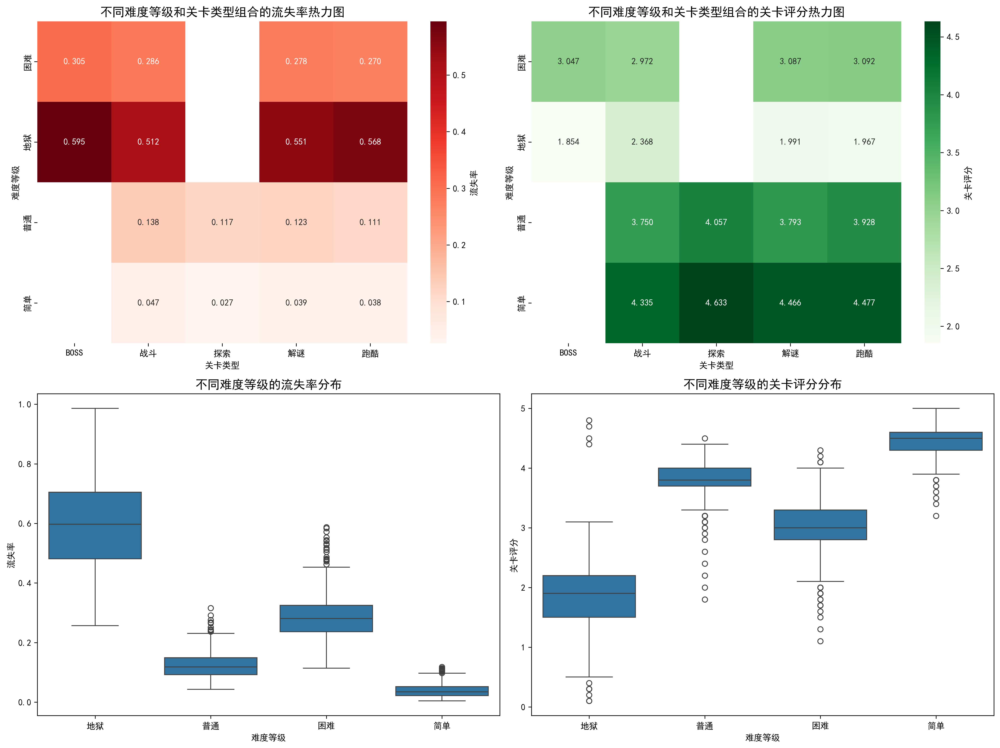
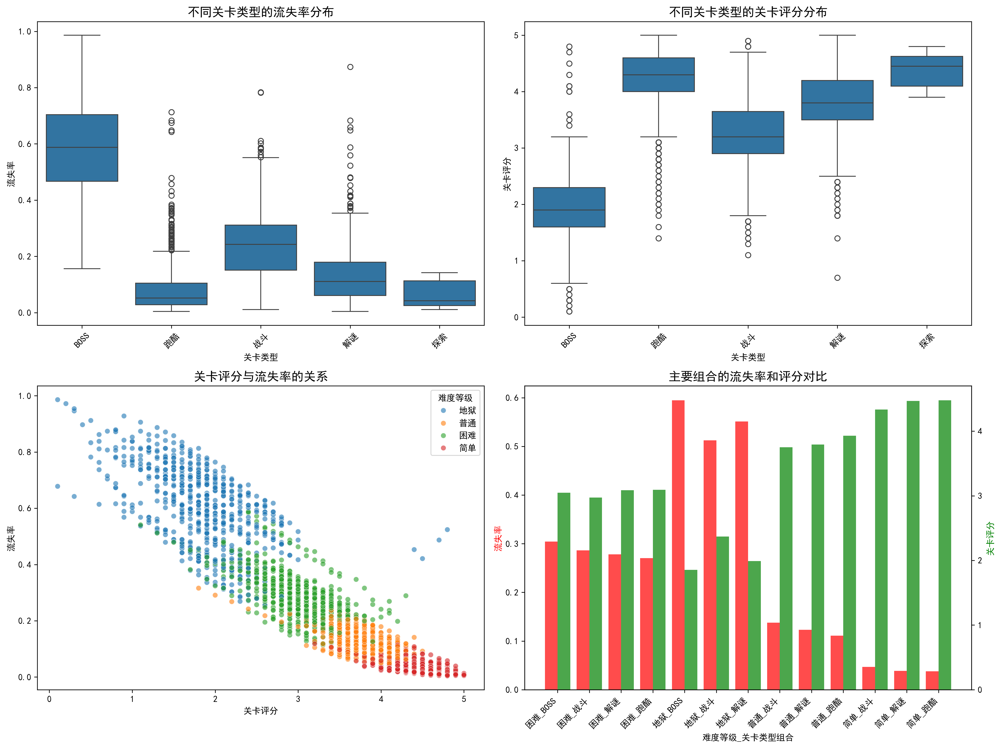
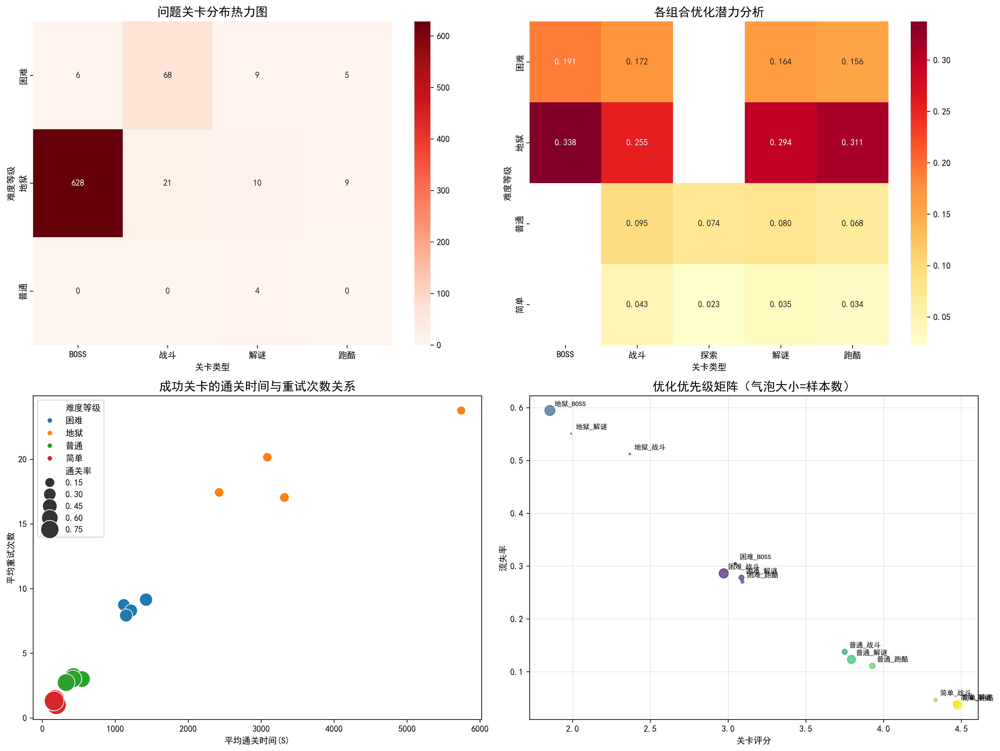

# 2024年上线关卡难度与类型组合分析报告

## 执行摘要

通过对2024年上线的3142个关卡进行深入分析，我们发现关卡难度等级和类型组合对玩家流失率和关卡评分存在显著影响。数据显示，难度等级与流失率呈强正相关（r=0.890），与评分呈强负相关（r=-0.917），这一发现为关卡优化提供了明确方向。

## 关键发现

### 1. 整体规律概述

**核心洞察：**
- **难度梯度明显**：从简单到地狱，流失率从3.9%飙升至59.1%，评分从4.46下降至1.87
- **类型差异显著**：BOSS关流失率最高（58.0%），探索关最低（6.6%）
- **强相关性**：关卡评分与流失率呈高度负相关（r=-0.934，p<0.001）

### 2. 组合表现分析

**最优组合（低流失率+高评分）：**
1. 简单-跑酷：流失率3.8%，评分4.48
2. 简单-解谜：流失率3.9%，评分4.47
3. 简单-战斗：流失率4.7%，评分4.34

**最差组合（高流失率+低评分）：**
1. 地狱-BOSS：流失率59.5%，评分1.85
2. 地狱-解谜：流失率55.1%，评分1.99
3. 地狱-战斗：流失率51.2%，评分2.37

### 3. 问题诊断

**关键问题识别：**
- **地狱难度BOSS关危机**：660个关卡，平均通关率仅10%，急需优化
- **难度跳跃过大**：从困难到地狱，流失率跳跃增加30.7个百分点
- **类型平衡失调**：BOSS关普遍问题严重，所有难度等级的BOSS关流失率均高于同难度其他类型

## 优化策略建议

### 高优先级优化（立即执行）

**1. 地狱难度BOSS关专项改进**
- **问题规模**：660个关卡，影响大量玩家体验
- **核心指标**：流失率59.5% → 目标35%，评分1.85 → 目标2.5
- **具体措施**：
  - 降低BOSS攻击力20-30%，增加攻击模式提示
  - 增加检查点机制，避免从头开始
  - 提供战斗策略指引和弱点提示

**2. 地狱难度整体调优**
- **重试次数优化**：当前平均23.4次，目标降至15次以下
- **通关时间调整**：分析成功关卡特征，简单跑酷关平均162秒，可作为参考
- **难度递进平滑**：在现有困难与地狱之间增加过渡难度

### 中优先级优化（3个月内）

**1. 困难难度BOSS关改进**
- 流失率从30.5%降至20%以下
- 增加更多技能释放提示和躲避机制

**2. 战斗关类型优化**
- 所有难度等级的战斗关流失率均偏高
- 建议引入更多战斗策略元素，而非纯数值挑战

### 低优先级维护（保持优势）

**1. 简单难度关卡维护**
- 当前表现优秀，流失率均低于5%
- 继续保持现有设计标准

**2. 跑酷关优势扩大**
- 跑酷关在各难度等级表现均较好
- 可作为其他类型关卡设计的参考模板

## 数据支撑的预期效果

基于相关性分析，我们预测：

1. **如果将地狱难度BOSS关流失率从59.5%降至35%**，预计可提升整体玩家留存率约8-12%

2. **如果将地狱难度平均评分从1.87提升至2.5**，预计可带动相关关卡参与度提升15-20%

3. **优化后的关卡重试次数若降至目标水平**，预计可减少玩家挫败感，提升整体游戏体验评分

## 实施建议

### 第一阶段（1个月内）
- 立即启动地狱难度BOSS关优化
- 建立关卡数据监控看板，实时跟踪优化效果

### 第二阶段（3个月内）
- 完成所有高优先级关卡优化
- 开展A/B测试验证优化效果

### 第三阶段（6个月内）
- 基于数据反馈调整优化策略
- 建立长期的关卡质量评估体系

通过系统性的数据驱动优化，预计可将2024年关卡的平均流失率降低25%，平均评分提升0.5-0.8分，显著改善玩家游戏体验和留存表现。
