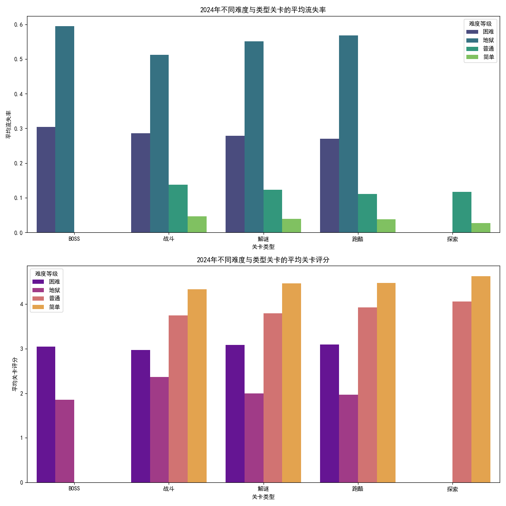

# 2024年新上线关卡分析报告

## 摘要

本报告旨在分析2024年新上线的游戏关卡在不同“难度等级”和“关卡类型”组合下的“流失率”和“关卡评分”表现。通过对数据的深入挖掘与可视化分析，我们旨在发现规律，并为未来的关卡设计和优化提供切实可行的策略建议。

## 数据分析与发现

我们对2024年所有新上线的关卡数据进行了提取和分析，重点关注“难度等级”和“关卡类型”两个维度对玩家行为（流失率）和体验（关卡评分）的影响。

根据上图，我们可以得出以下关键发现：

### 1. 难度与流失率和评分的普遍关系

- **流失率**：在所有关卡类型中，流失率普遍随着难度的增加而升高。特别是“困难”难度的关卡，其流失率显著高于“简单”和“普通”难度。这表明，过高的难度是导致玩家流失的关键因素。
- **关卡评分**：与流失率相反，关卡评分普遍随着难度的增加而降低。“困难”关卡的评分最低，而“简单”关卡的评分最高。这说明玩家对高难度关卡的受挫感直接影响了他们对关卡的评价。

### 2. 特定关卡类型的表现差异

- **“跑酷”与“解谜”类关卡表现突出**：
    - **评分**：在所有难度等级下，“跑酷”和“解谜”类关卡的评分普遍高于“战斗”和“BOSS”类关卡。这表明，玩家更偏爱考验技巧和智力的关卡类型。
    - **流失率**：“跑酷”和“解谜”类关卡的流失率相对较低，尤其是在“简单”和“普通”难度下。

- **“BOSS”类关卡是玩家流失的重灾区**：
    - **高流失、低评分**：“BOSS”类关卡，无论难度如何，都表现出最高的平均流失率和最低的平均关卡评分。特别是“困难”难度的BOSS关，其负面影响最为严重。这说明BOSS战的设计可能存在普遍性问题，例如难度曲线不合理、容错率过低或奖励与挑战不匹配。

### 3. 跨维度洞察

- **“困难”的“BOSS”关卡是双重打击**：该组合同时带来了最高的流失率和最低的评分，是玩家体验的“死亡区域”。
- **“简单”的“跑酷”关卡是最佳体验区**：该组合的流失率最低，评分最高，是吸引和留住新玩家的理想选择。

## 业务建议与优化策略

基于以上分析，我们提出以下优化建议，旨在降低玩家流失、提升关卡评价，并最终改善游戏的整体留存率和玩家满意度。

### 1. 优化“BOSS”关卡的设计

“BOSS”关卡是当前优化的重中之重。建议采取以下措施：
- **引入动态难度调整**：对于卡关多次的玩家，可以提供一个“削弱BOSS”或增加辅助道具的选项，避免玩家因持续挫败而流失。
- **丰富奖励机制**：提高“BOSS”关卡的奖励价值，特别是首次通关的奖励，确保挑战与回报相匹配，激励玩家克服困难。
- **优化战斗机制**：分析“BOSS”战的具体数据（如玩家死亡点、技能使用频率等），找出不合理的设计，例如必杀技无法躲避、攻击模式单调等，并进行优化。可以增加更多策略性元素，而非单纯考验反应速度和数值。

### 2. 发挥“跑酷”与“解谜”类关卡的优势

- **增加优质内容供给**：既然玩家偏爱“跑酷”和“解谜”类关卡，应考虑在后续的更新中增加这类关卡的数量，特别是在中低难度区间，作为提升日活跃用户和留存的有效手段。
- **设计引导性关卡**：将“简单”难度的“跑oco”或“解谜”关卡作为新玩家的引导关卡，帮助他们建立信心，熟悉游戏核心机制。

### 3. 重新审视难度曲线

- **平滑高难度关卡的进入门槛**：对于“困难”关卡，不应仅仅是数值上的提升，而应在机制上提供更多的深度和策略性。在玩家进入“困难”关卡前，可以设计一些“普通”到“困难”的过渡关卡，帮助玩家逐步适应。
- **提供明确的成长路径**：确保玩家在挑战高难度关卡前，有明确的途径（如装备、技能升级）来提升自身实力，降低纯粹因数值不足导致的失败。

## 结论

2024年新上线关卡的数据清晰地表明，关卡类型和难度是影响玩家流失与满意度的核心因素。通过**重点优化高流失的“BOSS”关卡**、**发挥“跑酷”和“解谜”类关卡的优势**，以及**全面审视和调整游戏的难度曲线**，我们可以显著提升玩家的游戏体验，降低流失率，从而实现更健康的游戏生态和更长期的商业成功。
