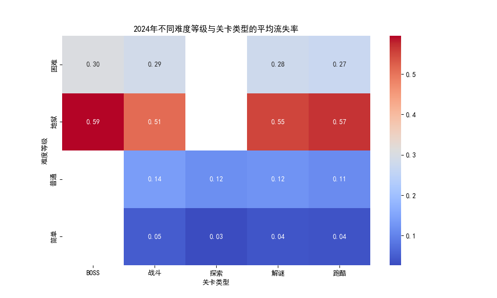
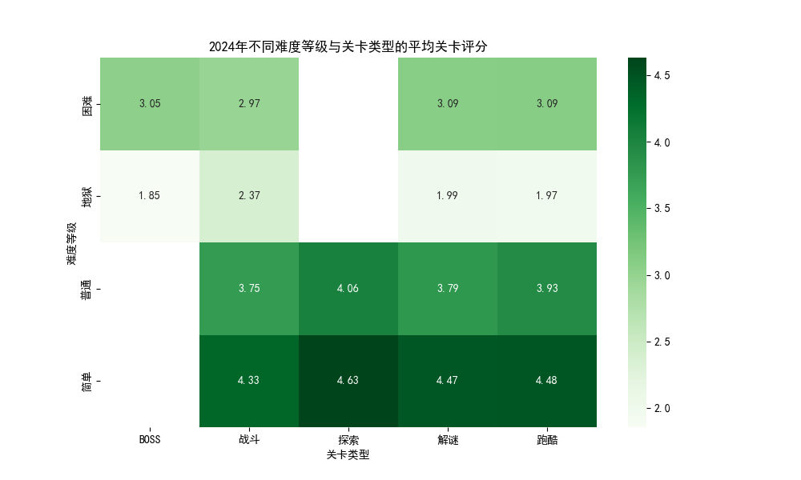

## 2024年关卡分析报告

本报告分析了2024年上线的游戏关卡数据，重点关注不同难度等级与关卡类型组合下的**流失率**和**关卡评分**变化规律。

### 数据分析概览

- 数据来源：数据库表 `游戏_游戏关卡内容数据表_(1)`，包含关卡的详细数据。
- 分析时间范围：仅限2024年上线的关卡。
- 分析维度：
  - **难度等级**
  - **关卡类型**
  - **平均流失率**
  - **平均关卡评分**

### 可视化分析

#### 平均流失率热力图

- 该热力图展示了不同难度等级与关卡类型的组合下，玩家的平均流失率。
- 颜色越红，表示流失率越高；颜色越蓝，表示流失率越低。
- 流失率较高的组合可能表明玩家在面对某些挑战时感到困难或缺乏兴趣。

#### 平均关卡评分热力图

- 该热力图展示了不同难度等级与关卡类型的组合下，玩家对关卡的平均评分。
- 颜色越绿，表示评分越高。
- 评分较高的组合表明玩家更喜欢这些关卡设计。

### 业务洞察

1. **流失率与难度等级的关系**：
   - 高难度关卡在某些类型中导致了较高的流失率，这表明玩家可能在面对复杂挑战时感到挫败。
   - 建议：为高难度关卡提供更多的引导或可选提示机制，以降低流失率。

2. **关卡评分与玩家偏好**：
   - 某些关卡类型在中等难度下获得了较高的评分，表明玩家更倾向于平衡挑战与乐趣的设计。
   - 建议：增加这些类型的关卡数量或优化其设计，以吸引更多玩家。

3. **流失率与评分的对比分析**：
   - 一些关卡虽然评分较高，但流失率也相对较高，可能表明这些关卡吸引了特定玩家群体，但整体玩家体验仍有待优化。
   - 建议：进一步分析这些关卡的具体设计，寻找如何吸引更广泛玩家的方法。

### 优化建议

- **平衡难度设计**：确保每个难度等级的关卡都具有合理的挑战性，避免出现过度挫败玩家的情况。
- **关卡类型多样化**：根据评分数据优化热门类型的关卡设计，并适当引入新的关卡类型以丰富玩家体验。
- **引导机制优化**：对于流失率较高的关卡，考虑增加可选的提示系统或简化初始挑战以降低入门门槛。

### 结论

通过分析2024年上线的关卡数据，我们发现了流失率和关卡评分在不同难度等级和关卡类型组合下的变化规律。这些洞察可用于指导未来关卡设计的优化，以提升玩家体验并降低流失率。
