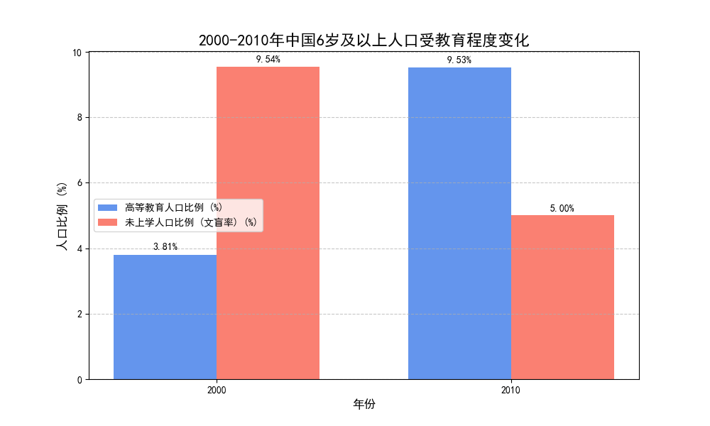
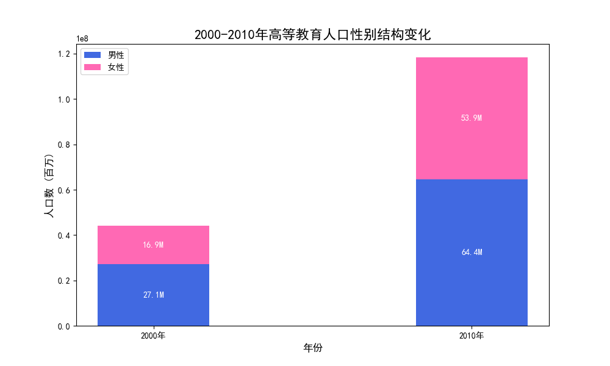
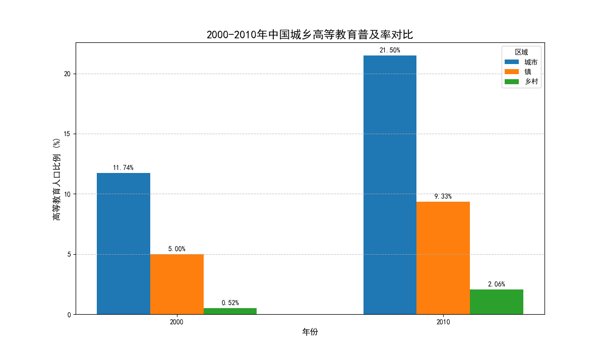

# 2000-2010年中国教育发展的辉煌十年：基于数据的深度剖析

在21世纪的第一个十年（2000年至2010年），中国的教育事业取得了举世瞩目的成就。通过对2000年和2010年的人口普查教育数据的多维度分析，我们可以清晰地看到这一历史性跨越。本报告将从**总体教育水平、性别教育平等和城乡教育差距**三个核心角度，结合具体数据和图表，揭示这十年间中国教育的关键成果。

### 1. 总体教育水平实现跨越式发展

从2000年到2010年，中国国民的整体受教育水平得到了根本性的提升，主要体现在“一升一降”两个方面：高等教育普及率的飙升和文盲率的锐减。

- **高等教育普及化开启**：接受高等教育（大专及以上）的人口比例从2000年的3.81%跃升至2010年的9.53%，增长幅度高达150%。这意味着每100个6岁以上的人口中，就有近10人接受过高等教育，标志着中国正从精英教育阶段迈向高等教育普及化阶段。
- **扫盲成果卓著**：与此同时，未上过学的人口比例（可视为文盲与半文盲率）从2000年的9.54%大幅下降至2010年的5.00%，降幅接近50%。这有力地证明了“九年义务教育”政策的成功推行和国家扫盲工作的巨大成效。

如上图所示，高等教育的“蓝色”条柱显著增高，而代表文盲率的“橙色”条柱大幅缩短，直观地展现了这十年教育质量的整体飞跃。

### 2. 性别教育鸿沟显著缩小，女性教育权利获长足进步

教育公平是社会公平的重要基石，而性别平等是衡量教育公平的关键指标。数据显示，2000至2010年间，中国在促进女性接受高等教育方面取得了突破性进展。

- **高等教育女性占比大幅提升**：在所有接受高等教育的人口中，女性的比例从2000年的38.33%提升至2010年的45.56%。这一变化意味着高等教育的性别结构正在快速趋向平衡，传统的“男性优势”被显著削弱。
- **女性高等教育人口数量爆炸式增长**：接受高等教育的女性人数从2000年的约1687万激增至2010年的约5394万，增长率超过200%，远高于男性同期的137%增幅。这不仅是一个数字上的变化，更反映了社会观念的进步和女性发展机遇的极大拓宽。

图表通过堆叠条形图清晰地展示了高等教育人口总量的扩张以及其中女性（粉色部分）占比的持续扩大，这是中国教育公平化进程中的一个光辉亮点。

### 3. 城乡教育差距依然存在，但农村地区奋起直追

尽管城乡二元结构带来的教育资源不均问题依然存在，但这十年间，国家通过政策倾斜和资源投入，有效促进了农村和乡镇地区教育水平的提升。

- **各区域教育水平均获发展**：从2000年到2010年，城市、镇、乡村的高等教育普及率均实现了翻倍或近翻倍的增长。城市从11.74%增至21.50%，镇从5.00%增至9.33%，乡村也从0.52%增至2.06%。
- **乡村地区展现最快增速**：虽然乡村地区的高等教育普及率基数低、绝对值仍有较大差距，但其增速最为迅猛，十年间增长了近300%。这一惊人的增速表明，面向农村的教育扶持政策取得了显著成效，为阻断贫困的代际传递、促进教育公平注入了强大动力。

上图明确对比了三个区域的高等教育普及率变化。尽管城乡之间的差距（“蓝色”条柱与“绿色”条柱的高度差）依然显著，但所有条柱的普遍增高，特别是乡村地区的强劲增长势头，预示着中国教育的均衡发展正在稳步推进。

### 结论与启示

数据雄辩地证明，2000年至2010年是中国教育史上浓墨重彩的十年。在**扩大高等教育规模、普及基础教育、促进性别平等和推动城乡教育均衡发展**等多个维度上，均取得了关键性、标志性的成果。这些成就不仅为中国后续的经济社会转型奠定了坚实的人才基础，也为全球教育发展贡献了宝贵的“中国经验”。

展望未来，尽管我们已取得巨大成功，但城乡之间、区域之间更深层次的教育质量均衡问题，以及如何适应新技术革命对人才培养提出的新要求，将是下一个十年需要面对和解决的核心课题。
