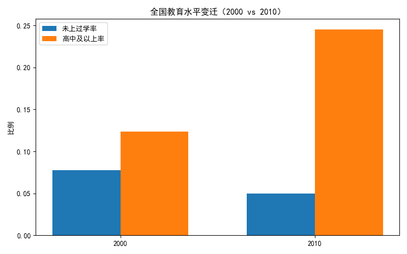
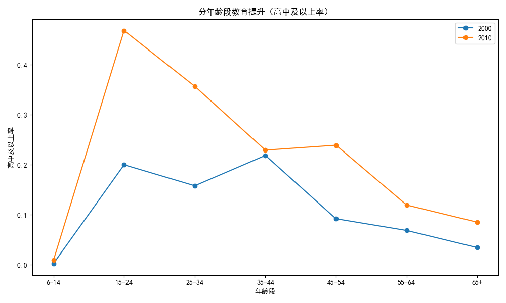
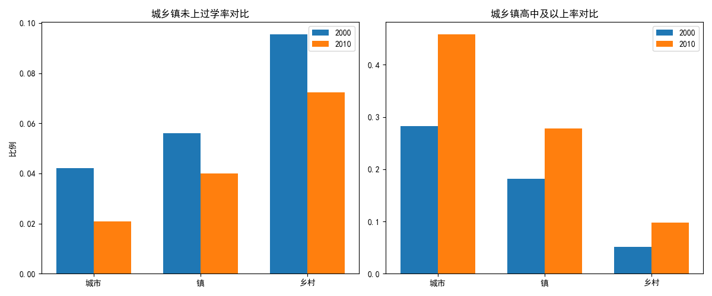
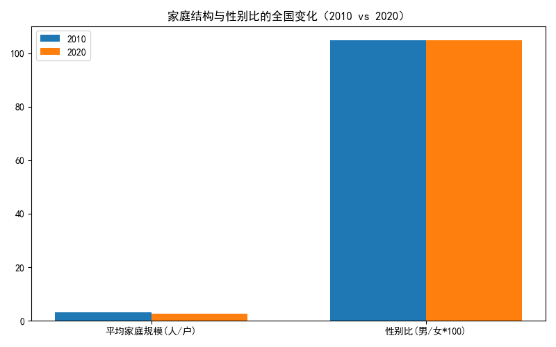

# 2000-2020中国教育关键成果：地域×性别×年龄的综合分析（基于人口普查派生表）

本文基于SQLite数据库 dacomp-040.sqlite 中的以下表进行分析：
- 2000年/2010年 全国分年龄、性别、受教育程度的6岁及6岁以上人口（全国总表、并使用城/镇/乡子表做地域对比）
- 2010年/2020年 各地区户数、人口数和性别比（用于2010-2020社会环境变化：城镇化、家庭规模、性别比）

方法口径说明：
- 高中及以上率（不含中专）：统一定义为“高中+大学专科+大学本科+研究生”占6岁及以上人口的比例，保持2000与2010年口径一致（不计入中专）。
- 未上过学率：未上过学人口占6岁及以上人口的比例。
- 年龄段：将年龄抽取为数值后分为7档（6-14、15-24、25-34、35-44、45-54、55-64、65+），用于年龄结构的横截面对比。
- 2020年未提供分学历表，本文使用2010-2020的“家庭规模、性别比、城市人口占比（城镇化）”作为教育进步的环境背景指标。

可视化说明：文中所有图均由Python绘制并保存在当前目录。示例代码片段（中文显示设置）：
```python
import matplotlib.pyplot as plt
plt.rcParams['font.sans-serif'] = ['SimHei']
plt.rcParams['axes.unicode_minus'] = False
# ...继续绘图
```


一、全国总体：教育水平显著跃升，未上过学率明显下降
- 高中及以上率：由2000年的12.37%提升至2010年的24.55%，提升约12.18个百分点。
- 未上过学率：由2000年的7.75%降至2010年的5.00%，下降约2.75个百分点。

结合图：
- 2000 vs 2010全国教育水平变迁（高中及以上率与未上过学率）



解读：
- 1999年开始的高等教育扩招、九年义务教育的深入推进，以及高中阶段教育普及工程的持续发力，是总体教育跃升的关键推动力。


二、年龄维度：年轻群体“高教化”速度最快，老年群体“扫盲化”成效显著
- 高中及以上率（部分年龄段）：
  - 15-24岁：由2000年的19.99%跃升至2010年的46.84%，提升26.85个百分点。
  - 25-34岁：由15.80%升至35.70%，提升19.90个百分点。
  - 55-64岁：由6.85%升至11.95%，提升5.10个百分点。
  - 65岁及以上：由3.42%升至8.51%，提升5.09个百分点。
- 未上过学率（部分年龄段）：
  - 65岁及以上：由46.83%降至28.06%，下降18.77个百分点。
  - 55-64岁：由20.59%降至9.10%，下降11.49个百分点。
  - 15-24岁：由1.12%降至0.50%，下降0.62个百分点。

可视化：分年龄段高中及以上率（2000 vs 2010）



诊断：
- 年轻群体的“高教化”是整体教育跃升的发动机。2000-2010间，大学在校生规模与毕业生数量快速扩容，使得15-24与25-34岁人群中“高中及以上”占比大幅上升。
- 老年群体未上过学率大幅降低，反映“扫盲与继续教育”工作的长期累积效应，尤其在农村与边远地区的基础教育覆盖率提高。


三、性别维度：女性教育显著追赶，性别差距略有收敛
- 高中及以上率（整体）：
  - 男性：2000年为14.62%，2010年为26.60%，上升11.98个百分点。
  - 女性：2000年为10.00%，2010年为22.42%，上升12.42个百分点。
  - 性别差距（男-女）从2000年的4.61个百分点缩小到2010年的4.18个百分点，差距收敛约0.43个百分点。

可视化：高中及以上率的性别差距（男-女，分年龄段，2000 vs 2010）


诊断：
- 高中阶段与高等教育的准入机会增加，显著惠及女性；同时家庭对子女（尤其女童）教育的投入偏好改善。
- 由于历史教育机会差异，老年女性的教育短板仍然存在，导致整体性别差仍可见但收敛趋势明确。


四、地域维度（城/镇/乡）：全线提升但梯度明显，城市领先优势扩大
- 城市：未上过学率由4.21%降至2.09%；高中及以上率由28.26%升至45.88%。
- 镇：未上过学率由5.60%降至3.99%；高中及以上率由18.12%升至27.80%。
- 乡村：未上过学率由9.56%降至7.25%；高中及以上率由5.08%升至9.78%。

可视化：城乡镇教育水平对比（2000 vs 2010）



诊断：
- 城市在教育资源、学校供给、师资与家庭教育投入方面的综合优势最强，提升幅度和水平值均领先。
- 乡村提升也很明显，但起点低、攀升速度慢于城市，城乡差距仍需有针对性的结构性政策进行弥合。


五、2010-2020社会环境变化：城镇化与小型化家庭为教育提升提供土壤
- 城市人口占比（以各地区“城市人口/总人口”的加总测算）：2010年约30.29%→2020年约40.80%，上升约10.5个百分点。
- 平均家庭规模（全国加权）：2010年约3.09人/户→2020年约2.62人/户，持续小型化。
- 性别比（男/女×100，全国加权）：2010年约104.90→2020年约104.80，小幅下降。

可视化：家庭结构与性别比的全国变化（2010 vs 2020）



解读：
- 更高的城镇化水平意味着更多人口能触达更高质量与更多样化的教育资源。
- 家庭规模缩小通常伴随对子女教育更高的人均投入，强化高中与高等教育的就读倾向。
- 性别比略降，有利于教育与就业端的性别机会平衡，但变化幅度有限，尚需继续推进性别平等。


六、综合结论：2000-2020中国教育的关键成果
1) 普及化迈向质量提升：2000-2010十年间，高中及以上受教育比例从12.37%跃升至24.55%，未上过学从7.75%降至5.00%。
2) 年轻群体成为引擎：15-24岁群体的高中及以上率由19.99%跃升至46.84%，为整体提升提供主动力，25-34岁亦显著提升至35.70%。
3) 老年扫盲成效显著：65岁及以上未上过学率由46.83%降至28.06%，55-64岁由20.59%降至9.10%。
4) 女性显著追赶：女性高中及以上率由10.00%升至22.42%，性别差距收敛0.43个百分点。
5) 城乡梯度仍在：城市教育水平与增幅均领先，乡村虽提升但相对缓慢，结构性差距仍需针对性缩小。
6) 环境因素强化教育提升：2010-2020城镇化率提升、家庭规模缩小、性别比略降，共同为教育持续升级提供了土壤。


七、政策建议（规范性）
- 缩小城乡差距：
  - 以县域为抓手推进优质高中资源均衡布局，完善教师轮岗与城乡结对，提升乡镇高中供给与质量。
  - 扩大农村学生专项计划、完善生均经费与奖助学金倾斜，降低农村高中与大学阶段的就读成本。
- 持续促进性别平等：
  - 在中西部与农村地区针对女童开展“入学-保学-升学”全链条支持，重点关注留守女童与多孩家庭的边际教育投入不足。
  - 在高等教育与职业教育招生宣传中强化女性友好专业与职业通道，改善性别分布不均衡。
- 终身学习与成人教育：
  - 针对45岁以上群体提供弹性学习与技能提升（含数字素养），巩固“扫盲—技能—就业”衔接，防止代际的教育弱势固化。
- 职普融通与高质量职业教育：
  - 完善中高职贯通培养、校企协同与产教融合，提升“高中及以上”尤其是专科阶段的质量与吸引力。
- 城镇化与教育资源联动：
  - 将随迁子女教育纳入城市基本公共服务，合理统筹学位供给，避免教育资源挤兑与边缘化。
- 数字教育基础设施：
  - 在乡村与偏远地区加强宽带、终端与优质数字内容供给，以信息化手段弥合教育机会差距。


八、局限与后续工作
- 2020年缺少与2000/2010口径一致的分年龄/性别/受教育程度详表，本文以2010-2020的人口结构与家庭结构作为环境侧支撑，后续可补入2020年教育结构数据以形成完整三期对比。
- 本次分析未对数据做清洗，仅做了类型转换与合并汇总；若对异常值与口径一致性进一步核验，结论的置信度将更高。


附：本报告涉及的可视化文件
- 全国教育水平变迁（2000 vs 2010）：
- 分年龄段高中及以上率（2000 vs 2010）：
- 性别差距（2000 vs 2010）：
- 城/镇/乡对比（2000 vs 2010）：
- 家庭结构与性别比（2010 vs 2020）：

数据来源：dacomp-040.sqlite（人口普查派生统计表）。上述图表与结论均由SQL/Python计算与汇总得到。
