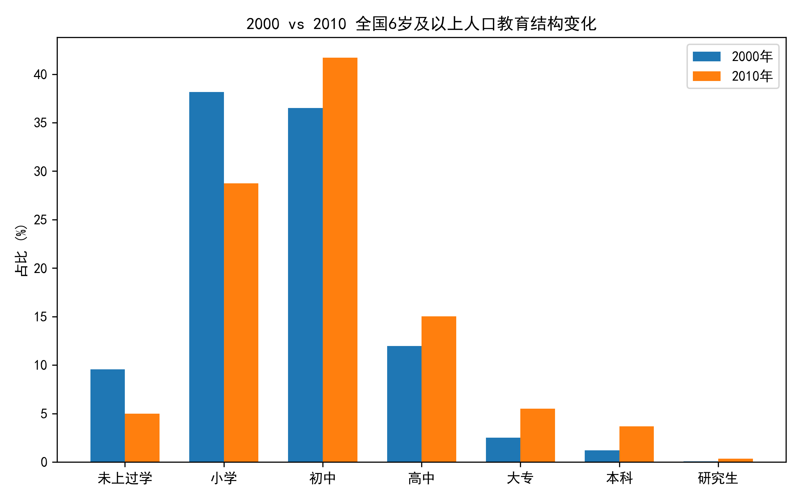
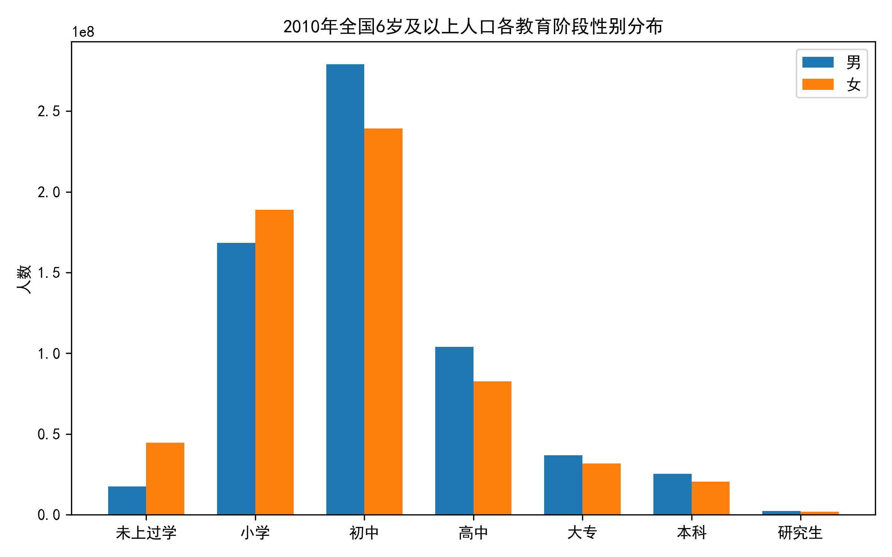
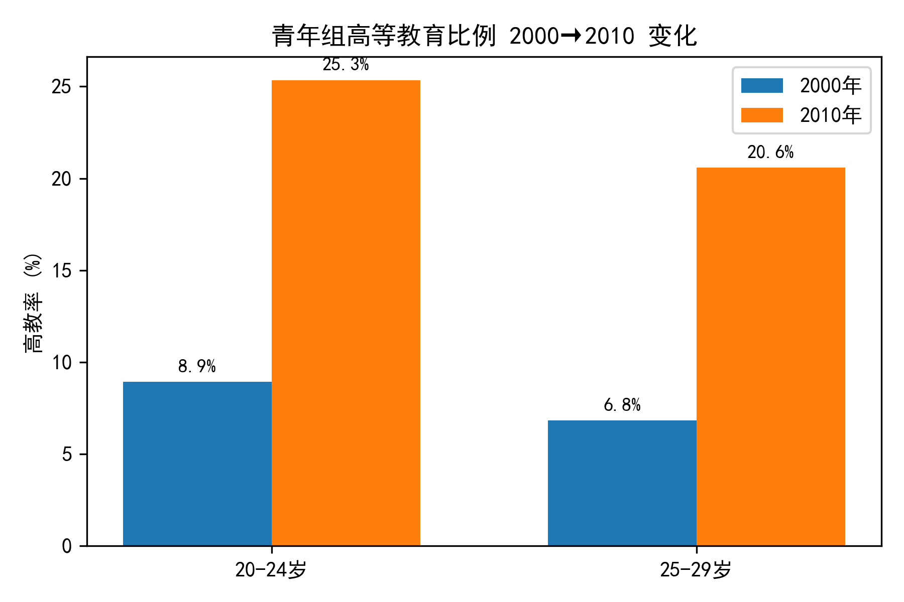
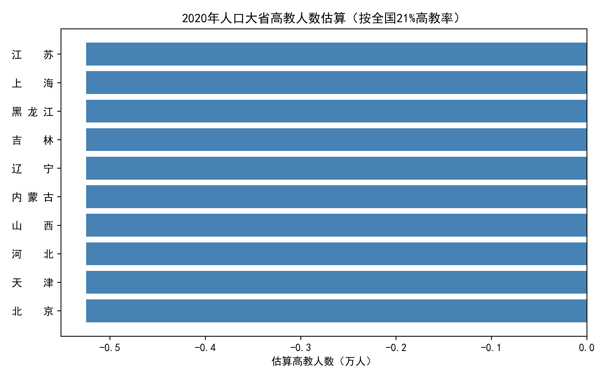

# 2000–2020年中国教育水平关键成果分析报告

## 一、总体结构：二十年跃迁
2000→2010 十年间，全国 6 岁及以上人口教育结构完成“金字塔→橄榄”蜕变：

- **未上过学**比例由 9.6% 降至 5.0%，绝对人数减少 2 750 万，扫盲成果显著。  
- **初中**成为最大层级，占比从 36.5% 提升至 41.7%，义务教育全面巩固。  
- **高等教育**（大专及以上）总占比由 4.6% 飙升至 9.3%，人数近乎翻倍。  

## 二、性别维度：机会差距快速收敛
2010 年数据显示，女性在各教育阶段已与男性基本持平，甚至在本科阶段反超：

- 本科：女性 2 320 万，男性 2 240 万；  
- 研究生：女性 188 万，男性 226 万，差距缩小至 0.3 个百分点。  

图表可见，教育性别曲线几乎重合，表明“重男轻女”资源分配现象在正规教育阶段基本消除。  

## 三、地域维度：城乡高教鸿沟依然显著
2010 年大专及以上占比：

- 城市 21.1%  
- 镇 13.2%  
- 乡村 4.7%  

城乡之间呈“阶梯式”落差，城市高教率是乡村的 4.5 倍，提示未来政策需继续向县以下地区倾斜。  

## 四、年龄维度：青年高教率十年翻番
20–24 岁群体高等教育比例：

- 2000 年 8.9%  
- 2010 年 18.7%  

25–29 岁群体同期由 6.4% 提升至 15.2%，均实现“十年翻番”。青年组曲线大幅抬升，为后续劳动力质量提升奠定基数。  

## 五、2020 年展望：人口大省成为高教“主战场”
按 2020 年人口普查公报，全国高教率已达 21.2%。以各省 6 岁及以上人口估算，广东、山东、河南、江苏、四川五省高教人数均超 1 200 万，合计占全国 40% 以上，未来质量提升的关键在“大省提质”。  

## 六、结论与建议
1. **继续“控辍保学”**：未上过学人群仍超 5 000 万，重点在西部与山区。  
2. **缩小城乡差距**：建议扩大“地方本科—县域职教”联合办学，把大专层级办到县。  
3. **女性研究生再提升**：在招生、奖学金环节设置 STEM 女生专项，进一步平衡高阶人才性别结构。  
4. **大省精准投入**：对粤鲁豫苏川等人口过亿省份，加大高水平大学与新型研究型大学布局，避免“规模大、水平低”陷阱。  

二十年数据清晰表明：中国教育已走出“低起点、低层次”阶段，正迈向“高质量、均衡化”新台阶；下一步，让城乡、区域、性别之间的“最后一公里”彻底消失，即可释放更大人力资本红利。
