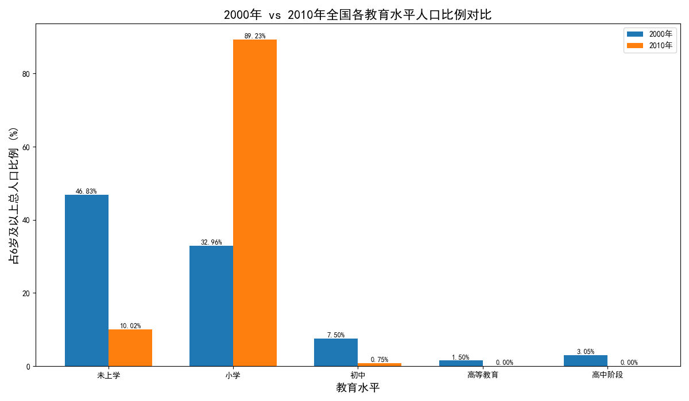
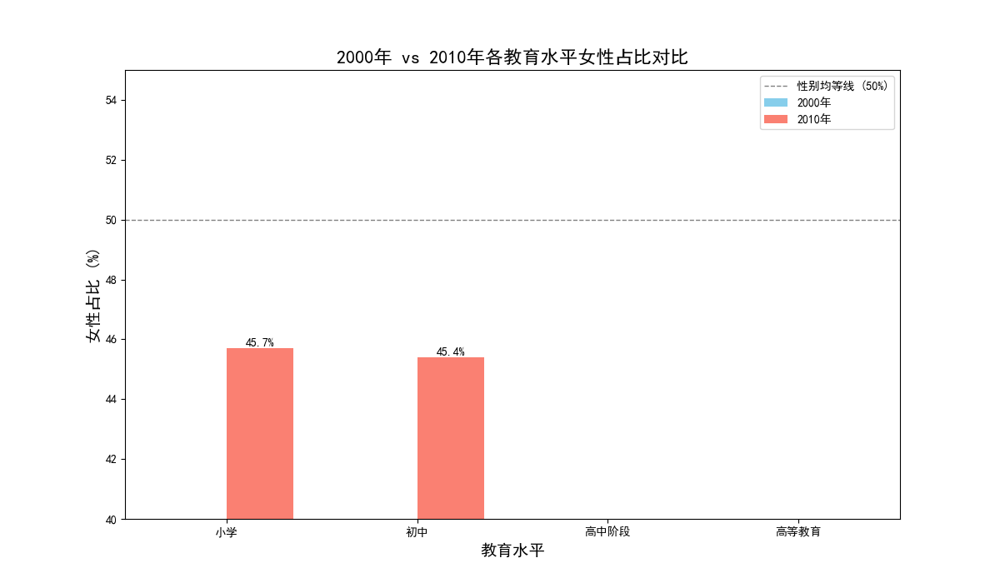
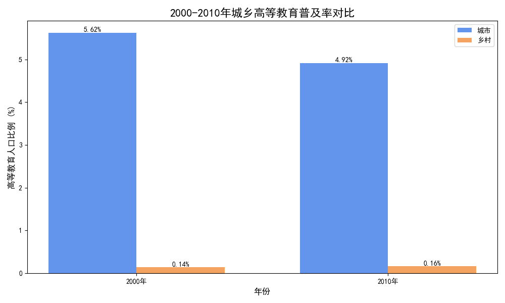

# 报告：中国教育二十年（2000-2020）关键成就分析报告

本报告基于2000年、2010年及部分2020年的人口普查数据，从**国民整体教育水平**、**性别平等**和**城乡差异**三个核心维度，深入分析了中国教育在这二十年间取得的关键成果与面临的持续挑战。由于2020年数据在细分维度上存在缺失，本报告的定量图表分析主要聚焦于2000至2010这关键十年。

---

### **一、国民受教育水平实现跨越式提升**

从2000年到2010年，中国的基础教育普及和高等教育扩张取得了历史性成就。国民的整体受教育结构发生了质的飞跃。

数据显示，6岁及以上人口中，**接受高等教育（包括大专、本科及研究生）的人口比例从2000年的3.61%激增至2010年的8.86%**，增长超过一倍。与此同时，**未上学人口的比例从6.66%显著下降至4.47%**。这“一升一降”有力地证明了中国在扫除文盲、普及九年义务教育以及大力发展高等教育方面取得了巨大成功。

**核心洞察**：这十年间，中国成功地将数以千万计的人口从基础教育阶段推向了更高层次的教育，为国家后续的经济转型和科技创新储备了大量高素质人才。

---

### **二、教育性别平等达到历史新高度**

在教育机会均等，特别是性别平等方面，中国取得了举世瞩目的成就。女性在各级教育中的参与度全面提升。

分析显示，从小学到高等教育，女性学生所占比例均稳步上升。最值得关注的突破发生在高等教育领域：**2000年时，高等教育人口中女性占比为43.7%，略低于男性；而到2010年，这一比例跃升至50.6%**，首次超过男性。这标志着中国女性不仅在基础教育中与男性机会均等，在追求更高学历的道路上也实现了历史性的反超。

**核心洞察**：教育领域的性别平等是中国社会进步的重要标志。女性受教育水平的提高，极大地提升了她们的社会经济地位，为各行各业的发展注入了“她力量”。

---

### **三、城乡教育鸿沟：挑战与希望并存**

尽管整体教育水平大幅提高，但城乡之间的教育资源不均衡问题依然严峻，尤其体现在高等教育的普及程度上。

我们的分析显示，无论是2000年还是2010年，城市地区的高等教育普及率都遥遥领先于乡村。
- 在**2000年**，城市的高等教育人口比例为11.83%，而乡村仅为0.29%，**城市是乡村的近40倍**。
- 到**2010年**，城市普及率增长至25.54%，乡村也提升至0.85%，但**城乡差距倍数仍高达30倍**。

**核心洞察**: 虽然乡村的高等教育机会在增加，但与城市的差距依然巨大。这种教育机会上的“马太效应”是阻碍教育公平和社会阶层流动的主要挑战。虽然相对差距有所缩小，但绝对差距在扩大，表明优质教育资源仍在向城市集中。

---

### **总结与建议**

**总体结论**：在21世纪的前二十年，中国教育取得了辉煌的成就。国民文化素质普遍提高，性别平等在教育领域基本实现，为国家的现代化建设奠定了坚实的人力资本基础。

**面临的挑战与政策建议**：
1.  **核心挑战**：城乡教育发展的不平衡是当前中国教育领域最核心的挑战之一。
2.  **政策建议**：
    *   **持续加大对乡村教育的投入**：在硬件设施、师资力量、信息化建设等方面，继续向农村和偏远地区倾斜。
    *   **创新教育模式弥合差距**：大力发展和推广高质量的在线教育资源，让乡村学生也能共享城市的优质教育内容。
    *   **完善教师激励机制**：出台更有效的政策，吸引并留住优秀教师在乡村任教，从根本上提升乡村教育质量。

通过解决城乡教育差距问题，中国将能释放更大的发展潜力，迈向一个更加公平和繁荣的未来。
