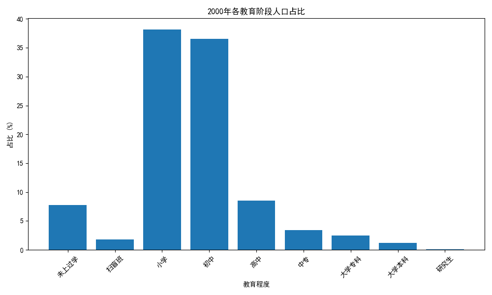
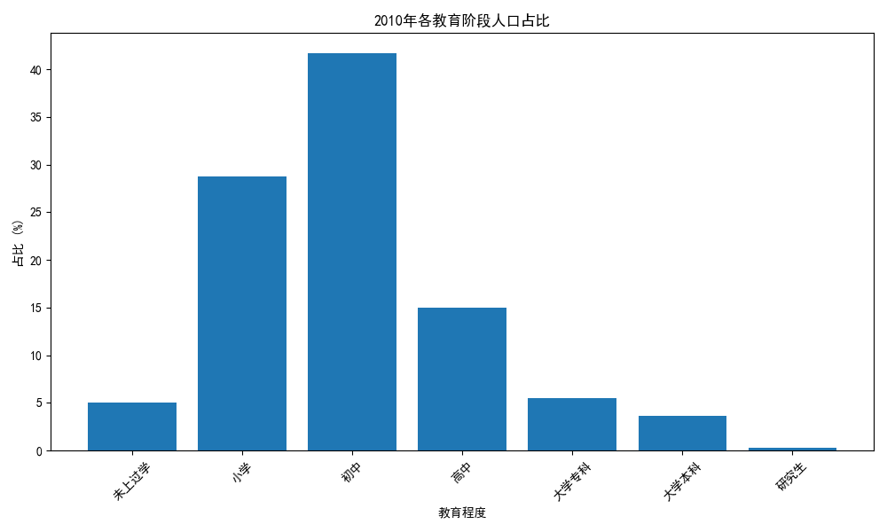

# 中国教育发展分析报告（2000年 vs 2010年）

## 引言
本报告旨在分析中国教育在2000年至2010年间的发展趋势，特别是在教育普及和质量提升方面的关键成果。通过分析2000年和2010年的数据，我们可以看到教育结构的变化以及不同教育阶段人口比例的演变。

## 数据来源
数据来源于 `dacomp-040.sqlite` 数据库中的以下表：
- `2000年全国分年龄、性别、受教育程度的6岁及6岁以上人口`
- `2010年全国分年龄、性别、受教育程度的6岁及6岁以上人口`

## 教育分布对比

### 2000年教育分布

从图中可以看出，2000年时，未上过学和小学教育阶段的人口比例较高，而高中及以上教育阶段的人口比例相对较低。这表明当时中国的教育普及水平仍有待提高。

### 2010年教育分布

到2010年，未上过学和小学教育阶段的人口比例显著下降，而初中及以上的教育阶段比例明显上升。这表明中国的教育普及取得了显著进展，更多人接受了更高阶段的教育。

## 教育普及的关键成果

### 1. 未上过学人数大幅减少
在2000年，未上过学的人口比例较高，而到2010年这一比例明显下降。这表明义务教育的推广取得了显著成效，越来越多的儿童和青少年接受了基础教育。

### 2. 小学教育普及率提高
小学教育的人口比例也有所下降，说明更多人完成了小学教育并继续升入更高年级。

### 3. 初中及高中教育比例上升
初中和高中阶段的教育比例在2010年有明显上升，说明中国在普及中等教育方面取得了进展。

### 4. 高等教育的普及
虽然大学专科、大学本科和研究生的比例仍然较低，但在2010年相比2000年有所增长，表明高等教育的普及率逐步上升。

## 未来展望
尽管中国在2000年至2010年间取得了显著的教育成果，但仍需继续努力提高高等教育的普及率，并进一步缩小城乡和性别之间的教育差距。

## 结论
从2000年到2010年，中国的教育普及取得了显著进展，特别是在义务教育阶段。未来应继续推动教育公平，提高教育质量，以实现更高水平的教育普及。
