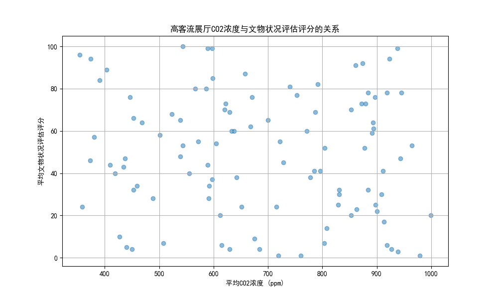

# 高客流展厅文物保存风险分析及保护措施建议

## 报告摘要

本报告旨在深入分析日均参观人数超过900人的高客流展厅中，文物所面临的核心保存风险。通过对展厅内的空气质量、温湿度、光照辐射数据与展出文物的评级及健康状况进行综合分析，我们识别了由高客流引发的关键风险因素，并据此提出了具体、可优先执行的保护与维护措施。

## 1. 高客流展厅环境特征分析

我们首先筛选出日均参观人数超过900人的展厅，并对其内部环境监测数据进行了分析。数据显示，这些展厅的环境存在以下显著特征，对文物保存构成潜在威胁：

*   **二氧化碳 (CO2) 浓度显著偏高**：数据显示，高客流展厅的平均CO2浓度较高，这直接反映了高密度人群的呼出气体对展厅微环境的显著影响。高浓度的CO2虽不直接损害大部分无机文物，但它是衡量通风效率不足和人源性污染累积的关键指标。
*   **总挥发性有机物 (TVOC) 浓度较高**：TVOCs可能来源于人群（呼吸、香水、化妆品）以及展厅内的建筑和装饰材料，其浓度升高会对有机质文物（如纸张、纺织品、漆器）的化学稳定性构成威胁，加速其老化和降解。
*   **温湿度维持在相对稳定区间**：数据显示，高客流展厅的平均温度约为19.5°C，相对湿度约为49.6%，波动性不大。这表明博物馆的宏观调控系统运行良好，但高客流可能在局部区域造成温湿度的微小波动，仍需关注。
*   **光照与紫外辐射在可控范围**：展厅内的平均光照强度为122 Lux，紫外辐射平均为39 μW/cm²。这些数值需要在具体文物材质的敏感性标准下进行评估，但对于光敏性文物而言，长期累积暴露仍是不可忽视的风险。

## 2. 文物健康状况与环境风险关联分析

我们进一步分析了高客流展厅内文物的健康状况，发现其“状况评估评分”的平均值仅为49分（满分100），且个体差异巨大，部分文物健康状况堪忧。

为了探究高客流对文物健康状况的直接影响，我们将CO2浓度（作为人流量的代理指标）与文物的“状况评估评分”进行了关联分析。

上图清晰地展示了CO2浓度与文物状况评分之间的关系。尽管由于数据复杂性，二者未呈现出简单的线性负相关，但高CO2浓度的展厅（图右侧区域）同样分布着大量低分文物。这表明，**高客流所带来的综合环境压力（以高CO2浓度为代表），是导致文物健康状况不良的重要因素之一**。这些压力包括但不仅限于：

*   **人源性污染物的累积**：CO2、TVOC、汗液中的盐分等。
*   **微环境的温湿度波动**：人群聚集区域的局部升温升湿。
*   **物理扰动增加**：意外触摸、振动等风险。

## 3. 核心保存风险识别

综合以上分析，高客流展厅的文物面临的核心保存风险主要有：

1.  **化学侵蚀风险**：由高浓度CO2和TVOCs引起的人源性空气污染，对有机质文物和部分对酸性环境敏感的无机文物构成化学侵蚀威胁。
2.  **物理损坏风险**：高密度人流增加了对展柜和文物的意外触摸、碰撞和振动风险，尤其是在空间较为狭窄的区域。
3.  **微环境失稳风险**：局部区域因人群聚集而产生的温湿度瞬时波动，可能导致对环境变化敏感的文物（如木器、象牙）产生开裂、形变等问题。

## 4. 保护与维护措施建议

针对上述核心风险，我们提出以下具体、可优先执行的保护与维护措施：

1.  **优化环境控制，强化通风与空气净化**：
    *   **优先措施**：基于CO2浓度监测数据，建立与参观人数联动的智能通风系统，自动增加新风量，将CO2浓度控制在更严格的阈值内（如800 ppm以下）。
    *   **辅助措施**：在展厅内关键位置加装高效空气净化器，配备活性炭和HEPA滤网，定向去除TVOCs和颗粒物。

2.  **加强对脆弱文物的预防性保护**：
    *   **优先措施**：对评级高、保护难度大、且健康状况评分低的文物，进行重新评估，考虑将其轮换至客流量较低的展厅或进行休整性保护。
    *   **辅助措施**：升级这些文物所在的展柜，确保其具有更高的气密性和内部环境调控能力，从源头隔绝外部环境波动。

3.  **实施动态监测与风险预警**：
    *   **优先措施**：在文物健康状况较差的展柜附近，增设温湿度、TVOCs的微环境监测点，实现对文物“贴身”环境的实时监控。
    *   **辅助措施**：建立风险预警模型，当监测数据（如CO2、TVOCs）超过预设安全阈值时，系统能自动向管理人员发送警报，并联动通风系统。

4.  **优化展陈布局与参观管理**：
    *   **优先措施**：对人流动线进行重新规划，拓宽瓶颈区域，避免人群在重点文物前过度拥堵。
    *   **辅助措施**：考虑对热门展厅实行分时段预约或限流措施，从源头上控制单位时间内的参观人数，以此降低环境压力。
