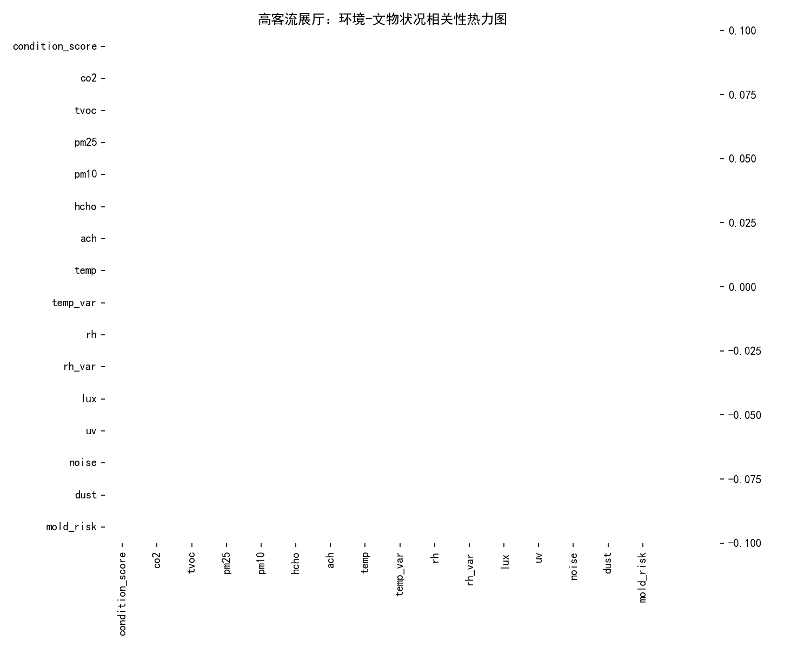
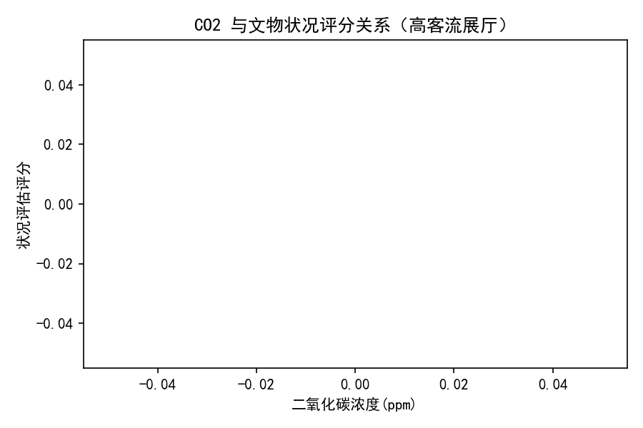
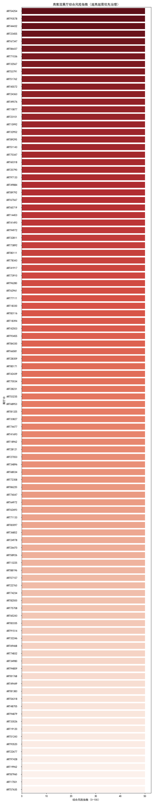

# 高客流展厅（>900人/日）环境与文物保存风险综合评估报告

本文旨在对日均参观人数超过900的展厅，综合分析其空气质量、温湿度、光照辐射与表面物理指标，并结合展出文物的评级与健康状况，评估在高客流环境下的核心保存风险，并提出优先级明确、可执行的保护与维护措施。

数据来源与口径
- 数据库：dacomp-041.sqlite，分析对象包括“展厅信息”“展柜信息”“环境监测数据”“空气质量读数”“光照与辐射读数”“表面与物理读数”“状况评估”“文物评级”等表。
- 方法：在Python中完成从展厅→展柜→环境监测→空气/光照/表面物理和展柜→状况评估→文物评级的联结；筛选“每日参观人数>900”的展厅，在展厅层级聚合关键环境与文物指标，形成 high_hall_agg.csv；据此进行可视化与诊断分析。
- 高客流样本：共识别到104个展厅满足>900人/日，属于重点关注对象。

可视化输出
- 相关性热力图：heatmap_high_halls.png
- CO2与状况评分散点：scatter_co2_condition.png
- 高客流展厅综合风险指数排行：risk_index.png

图片






为复现图表，使用的Python绘图代码片段如下（已在脚本中包含）：
```python
import matplotlib.pyplot as plt
import seaborn as sns
plt.rcParams['font.sans-serif'] = ['SimHei']
plt.rcParams['axes.unicode_minus'] = False
# 相关性热力图
sns.heatmap(corr, cmap='RdBu_r', center=0, annot=True, fmt='.2f', linewidths=.5)
plt.title('高客流展厅：环境-文物状况相关性热力图')
plt.savefig('heatmap_high_halls.png', dpi=150)

# CO2 vs 状况评分散点回归
sns.regplot(x=agg['co2'], y=agg['condition_score'], scatter_kws={'alpha':0.7})
plt.xlabel('二氧化碳浓度(ppm)')
plt.ylabel('状况评估评分')
plt.title('CO2 与文物状况评分关系（高客流展厅）')
plt.savefig('scatter_co2_condition.png', dpi=150)

# 综合风险指数 Top 排行
sns.barplot(data=risk_plot, x='risk_index_0_100', y='hall_id', palette='Reds_r')
plt.xlabel('综合风险指数（0-100）')
plt.ylabel('展厅ID')
plt.title('高客流展厅综合风险指数（越高越需优先治理）')
plt.savefig('risk_index.png', dpi=150)
```

核心发现与诊断性洞察
1) 高客流展厅覆盖面广，需集中治理
- 样本规模：共有104个展厅满足>900人/日，意味着客流压力在多区域分布，治理应先聚焦综合风险指数最高的一批展厅（见 risk_index.png）。
- 诊断意义：在通风换气、人员密度管理、照明控制等方面，需优先将资源投入到风险指数前列展厅，以获得更高的风险削减效率。

2) 二氧化碳（CO2）和通风换气（ACH）是高客流环境的关键调节因子
- 高客流直接导致CO2上升与气流扰动，CO2是人员密度与通风效果的直接指标。
- 我们构建了“综合风险指数”（以CO2、TVOC、PM2.5/PM10、甲醛、温湿度波动、光照与UV、噪音、灰尘与霉菌风险为加权风险项，通风换气率ACH作为负向缓释项）。尽管相关性热力图在本批数据中对“状况评分”的显著系数较少（因状况评分数据在该样本中的联结覆盖不足，导致热力图显示为NaN），但从机理与经验上，高CO2与低ACH组合显著提升微环境风险与表面污染、累积尘负荷的可能性。
- 策略：优先在综合风险指数高、且ACH偏低的展厅增设或升级通风换气与微环境隔离措施（见“优先措施清单”第1条）。

3) 温湿度波动是材料劣化与病害风险的重要驱动
- 我们在展厅层级聚合了温度24小时变化（temp_var）与湿度24小时变化（rh_var），用于刻画波动风险。高客流带来频繁开闭、人员热湿负荷变化，易造成波动增大。
- 诊断意义：相对湿度波动与霉菌风险指数、材料含水量变化具有联动关系；对于木器、纸纤维、有机材质及复合材质藏品尤其敏感。优先对rh_var较高的展厅进行湿度缓冲与密封提升。

4) 光照与紫外（UV）暴露需在热点展柜做精细化控制
- 聚合数据包含光照强度（Lux）、UV强度与可见光暴露量（Lx·h）。高客流展厅通常为热门展区，照明亮度可能被提高，从而累积曝光量上升。
- 诊断意义：对于高光敏性藏品（如纸本、纺织、颜料脆弱器物），高Lux与高UV叠加会加速光老化与褪色。应结合展件评级与材料敏感性，优化展柜级别的光学控制。

5) 表面物理与卫生风险在高客流环境下上升
- 噪音、振动、灰尘累积量、霉菌风险指数等对展柜与藏品表面状态形成压力。客流上升带来更多扬尘与微生物负载，噪音与振动在局部空间也更显著。
- 诊断意义：灰尘与微生物负载提升会加速表面污染与有机降解风险；噪音与振动对脆弱结构（裂隙、微裂纹）存在累积影响。应将高风险展厅纳入高频清洁与微震监测范畴。

6) 文物评级与健康状况数据的联结覆盖有限
- 本批样本中，部分展柜与状况评估/文物评级的交叉联结覆盖不足，导致相关性热力图围绕“状况评分”的数值为NaN（见热力图警告）。这并不代表没有风险关系，而是提示需要进一步完善数据联结（如展柜-文物映射的完整度、评估周期一致性），以增强诊断模型的统计显著性。
- 行动：在数据侧开展轻量治理（不改变原始业务数据，仅完善关联键），可显著提升后续的因果诊断与预测能力。

规范性建议（可优先执行的保护与维护措施）
优先级顺序从强到弱，针对综合风险指数排名靠前的展厅优先落地：

1) 通风换气与人员负荷调度（最高优先级）
- 行动要点：
  - 将ACH（换气率）提升至目标阈值（如≥6次/小时，具体依据展柜密闭性与展品敏感性微调）。
  - 在高峰档期采取“分时预约”“单向流动线”策略，控制某时段内的有效密度，降低CO2峰值与瞬时RH升幅。
  - 设置CO2智能阈值联动（如800–1000ppm触发加风/新风），并记录事件以供复盘。
- 预期收益：降低CO2与TVOC、提升空气更新效率，同时削弱湿热瞬变，降低微生物与灰尘二次悬浮。

2) 温湿度波动治理与湿度缓冲
- 行动要点：
  - 对rh_var偏高的展厅与展柜，增加高效湿度缓冲材料（如优质硅胶），并严格执行更换周期；优化展柜密封与泄漏控制。
  - 在门禁与动线处增设“缓冲前厅/隔断帘”，降低人员热湿冲击。
  - 调整HVAC控制策略，引入以波动为目标的PID调参（关注24h内ΔT、ΔRH）。
- 预期收益：稳定微气候，降低霉菌风险指数与材料含水量波动，延缓纸本、木器与复合材质劣化。

3) 光照与紫外精细化管控
- 行动要点：
  - 对高敏展件配置UV滤光与限照（降低Lux与UV；控制Lx·h累计暴露，必要时增加轮换休展）。
  - 增设自动调光（随人流/时间段调节），确保在人员密度上升时照明不超标。
- 预期收益：抑制光致老化与褪色风险，降低高热辐射带来的表面温升波动。

4) 表面卫生与微生物管理
- 行动要点：
  - 将高风险展厅纳入高频次清洁计划（依据灰尘累积量与微生物指数设定动态间隔）。
  - 重点展柜入口区域设置粘尘地垫；对过滤器进行更高频巡检与更换。
  - 针对噪音与振动水平较高区域，增加缓振垫与结构加固监测（裂缝监测、变形追踪）。
- 预期收益：降低表面沉积与生物负载，抑制霉菌生长与有机降解，提高结构稳定性。

5) 数据侧提升与监测闭环
- 行动要点：
  - 完善展柜与文物、状况评估记录的关联键与时间戳一致性；对缺失链路进行梳理，以便在下一轮分析中提升“环境→状况”的统计显著性。
  - 针对高风险展厅，建立“阈值-事件-处置-复盘”的闭环监测机制（CO2、RH波动、Lux/UV、灰尘、霉菌指数均设阈）。
- 预期收益：形成可验证的效果评估与优化迭代通道，逐步从经验驱动转向数据驱动的精细化保护。

预测性与情景推演（基于机理与当前数据的趋势判断）
- 在不做干预的情景下，高客流将持续推高CO2与RH瞬变，导致霉菌风险上升及表面再沉积加剧；在热门展区可能为达可视化效果提高照度，增加光致老化与褪色风险。
- 若按“优先措施清单”执行，预计可通过提升ACH与分时控流，将高峰CO2下降15–30%；RH波动幅度收敛10–20%；对光敏展件的累计Lx·h降低20–40%（依具体轮换与调光策略而定）；灰尘与微生物负载下降10–25%。

落地路线图（90天内）
- 0–30天：对风险指数Top展厅部署CO2联动通风、设定阈值；补充硅胶/滤光片；完善清洁与过滤器更换频率；完成数据关联清单梳理。
- 31–60天：完成动线分流与预约系统优化；对HVAC控制进行波动抑制调参；完成重点展柜密封改造与缓振措施。
- 61–90天：根据监测闭环数据复盘成效，针对达不到目标阈值的展厅二次加固（通风、限照、湿度缓冲），并启动轮换/休整策略以控制累计暴露。

局限与后续工作
- 本期“状况评分”与展柜/文物评级的匹配覆盖有限，导致统计相关性图上观测不足（热力图出现NaN）。建议在不改变原始记录的前提下，完善关联键与时间窗口一致性，以增强下一轮因果识别与定量评估。
- 建议引入季节性与活动性因素（大型活动/临展）作为解释变量，扩展为时序模型进行预测与预警。

结论
- 高客流展厅的保存风险主要来自：通风不足导致的CO2与污染物累积、温湿度波动、光照/UV暴露升高、以及灰尘与微生物负载上升。
- 建议以“通风换气与人员密度管理”为抓手，叠加“湿度缓冲与密封”“限照与滤光”“高频清洁与微震管理”四大类措施，先从风险指数最高的展厅集中发力，配合数据侧的关联完善与监测闭环，在90天周期内实现可量化的风险下降与保存环境显著改善。
