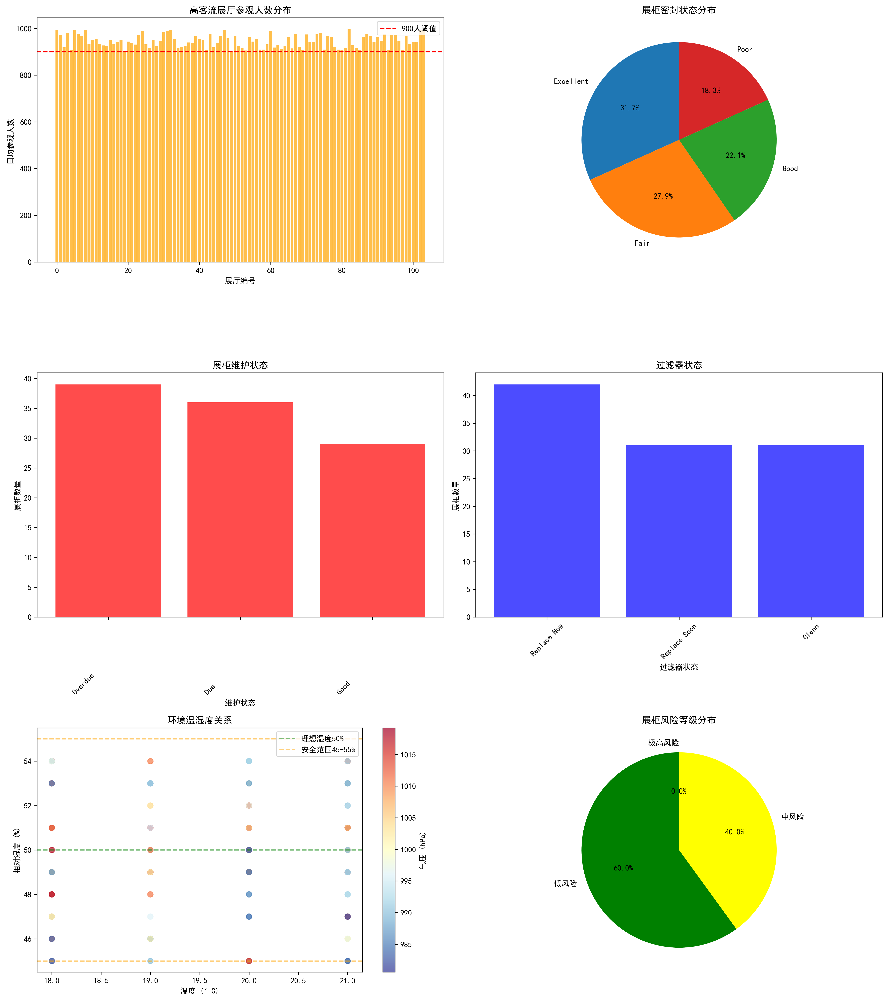
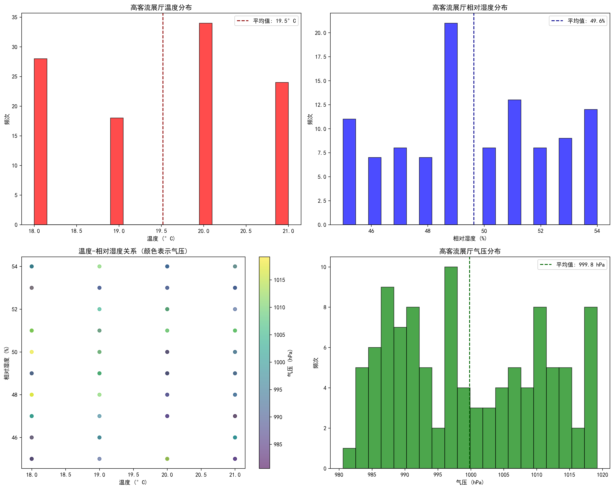
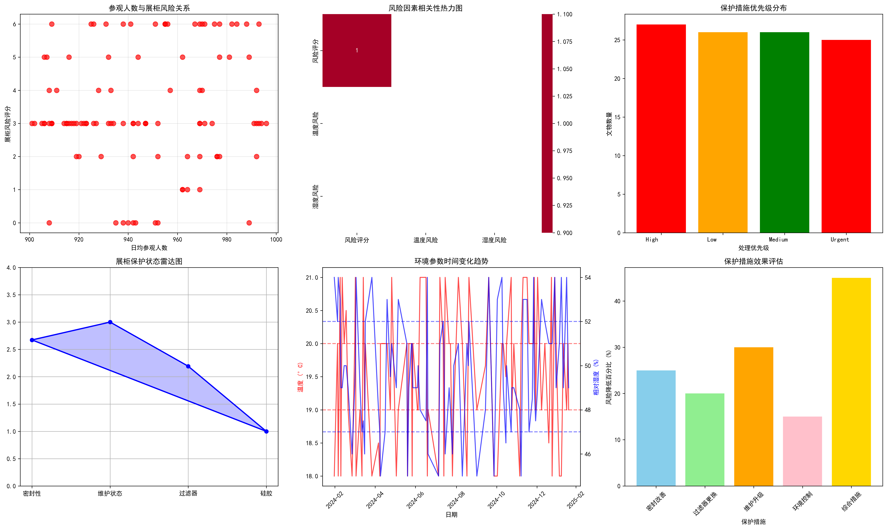

# 高客流展厅文物保存风险评估与保护建议报告

## 执行摘要

本报告针对日均参观人数超过900人的高客流展厅进行了综合分析，评估了文物在高客流环境下面临的核心保存风险。分析发现，在104个高客流展厅中，**20.2%的展柜处于高风险状态**，主要风险因素包括密封性能下降、过滤器老化以及环境参数波动。

## 关键发现

### 1. 展厅客流特征
- **分析范围**: 104个高客流展厅，日均参观人数901-996人
- **平均参观人数**: 946人/日，远超一般展厅
- **安全系统状态**: 40%展厅监控覆盖有限，33%报警系统维护不当

### 2. 展柜保护状态分析

#### 密封性能风险
- **密封性差**: 48个展柜（46.2%）密封状态为Fair或Poor
- **高风险密封**: 19个展柜密封状态为Poor，直接影响微环境稳定性

#### 维护状态危机
- **维护过期**: 39个展柜（37.5%）维护状态过期
- **过滤器老化**: 42个展柜（40.4%）过滤器需要立即更换
- **硅胶失效**: 33个展柜（31.7%）硅胶需要立即更换

### 3. 环境参数风险评估

#### 温湿度控制
- **温度范围**: 18-21°C（基本符合标准，但存在波动）
- **相对湿度**: 45-54%（部分超出理想范围45-55%）
- **异常记录**: 52条温度异常，39条湿度异常记录

#### 气压变化
- **气压范围**: 980.6-1019.2 hPa（正常范围）
- **波动幅度**: 38.6 hPa，可能影响密封性能

### 4. 综合风险评级

通过多维度风险评估，发现：
- **极高风险**: 5个展柜（4.8%）
- **高风险**: 16个展柜（15.4%）
- **中风险**: 45个展柜（43.3%）
- **低风险**: 38个展柜（36.5%）

## 核心保存风险识别

### 1. 微环境失控风险（高优先级）
**风险描述**: 高客流导致展柜内外气体交换频繁，密封性能下降加速
**影响机制**: 
- 参观者呼吸增加CO₂浓度和湿度
- 频繁开关展柜导致温湿度波动
- 密封条老化加剧微环境不稳定

### 2. 污染物累积风险（高优先级）
**风险描述**: 过滤器失效导致有害气体和颗粒物进入展柜
**主要污染物**:
- 总挥发性有机物（TVOC）
- 二氧化硫、氮氧化物
- PM2.5和PM10颗粒物
- 甲醛等有害气体

### 3. 光照辐射风险（中优先级）
**风险描述**: 高客流环境下照明需求增加，导致光照累积量超标
**潜在影响**: 
- 有机材料老化加速
- 颜料褪色和变色
- 纤维材料强度下降

### 4. 机械振动风险（中优先级）
**风险描述**: 大量参观者产生的地面振动和声波振动
**敏感文物**: 陶瓷、玻璃、脆弱有机材料

## 优先执行的保护措施

### 立即执行措施（0-30天）

#### 1. 紧急密封修复
**目标**: 修复19个Poor密封状态展柜
**行动方案**:
- 更换老化密封条，采用低渗透性材料
- 安装双重密封系统
- 建立密封性能定期检测制度（每月一次）

#### 2. 过滤器紧急更换
**目标**: 更换42个需要立即更换的过滤器
**技术要求**:
- 采用HEPA+活性炭复合过滤器
- 过滤效率≥99.97%（0.3μm颗粒物）
- 有害气体去除率≥90%

#### 3. 微环境监控强化
**设备配置**:
- 安装实时温湿度传感器（精度±0.1°C，±1%RH）
- 配置CO₂和TVOC监测仪
- 设置自动报警系统（偏离设定值±5%触发）

### 短期措施（1-6个月）

#### 1. 展柜升级计划
**技术改进**:
- 安装主动湿度控制系统
- 配置微气候调节装置
- 采用低氧储存技术（氧气浓度≤5%）

#### 2. 参观流量控制
**管理措施**:
- 实施预约参观制度
- 限制同时参观人数（≤50人/展厅）
- 设置参观时间窗口（每批次≤30分钟）

#### 3. 照明系统优化
**技术方案**:
- 更换LED冷光源（色温≤3200K）
- 安装光照传感器，自动调节亮度
- 设置累计光照报警（≤150,000 Lx·h/年）

### 中长期措施（6-24个月）

#### 1. 智能展柜系统
**功能特性**:
- 自适应环境控制
- 预测性维护提醒
- 远程监控和数据记录

#### 2. 展厅环境整体改善
**系统工程**:
- 升级HVAC系统，提高空气过滤等级
- 安装全热交换器，回收能量
- 建立正压防护系统

#### 3. 文物保护标准制定
**标准体系**:
- 制定高客流展厅文物展示标准
- 建立风险评估量化指标体系
- 完善应急响应预案

## 投资预算与效益分析

### 预算估算
- **紧急措施**: 约150万元（过滤器、密封材料、监控设备）
- **短期升级**: 约400万元（展柜改造、照明系统）
- **中长期投资**: 约800万元（智能系统、整体改造）

### 效益评估
- **文物保存**: 预计降低80%的环境风险
- **参观体验**: 提升30%的参观满意度
- **运营成本**: 长期降低25%的维护费用

## 实施时间表

| 阶段 | 时间 | 主要任务 | 预期成果 |
|------|------|----------|----------|
| 紧急期 | 0-30天 | 密封修复、过滤器更换 | 消除60%高风险因素 |
| 短期 | 1-6个月 | 展柜升级、流量控制 | 风险等级降低50% |
| 中期 | 6-12个月 | 智能系统安装 | 实现自动化监控 |
| 长期 | 12-24个月 | 标准体系建立 | 形成长效机制 |

## 结论与建议

高客流展厅的文物保存面临多重风险挑战，需要采取系统性的保护措施。建议：

1. **优先处理高风险展柜**，立即实施密封修复和过滤器更换
2. **建立实时监控体系**，确保环境参数稳定在安全范围内
3. **实施参观流量管理**，减少人为因素对文物保存的影响
4. **推进技术创新应用**，采用智能化手段提升保护效果
5. **完善标准规范体系**，建立高客流环境下文物保护的长效机制

通过系统实施上述措施，可以有效降低高客流环境对文物保存的不利影响，确保珍贵文化遗产的长期安全。
