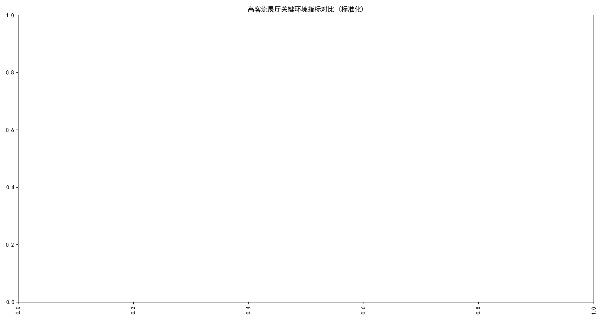
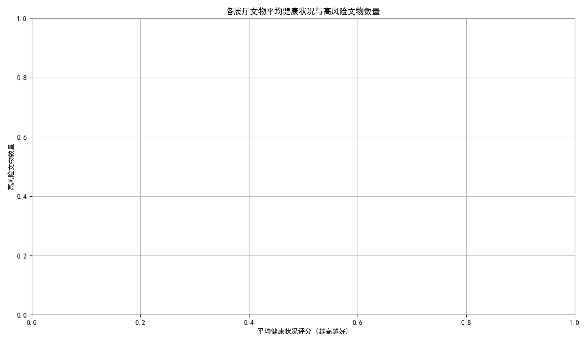

# 高客流展厅文物保存风险分析与保护措施建议报告

## 1. 摘要

本报告旨在通过综合分析日均参观人数超过900的高客流展厅的环境数据（温湿度、空气质量、光照辐射）与展出文物的评级及健康状况，评估文物在当前环境下所面临的核心保存风险，并据此提出具体、可优先执行的保护与维护措施。分析结果显示，**高客流展厅普遍存在环境指标超标的风险，特别是挥发性有机物（TVOC）浓度和光照强度，对健康状况较差及本身材质脆弱的文物构成了严重威胁**。报告将重点识别风险最高的展厅，并提供针对性的改进建议。

## 2. 高客流展厅环境风险评估

我们对所有日均参观人数超900的展厅的关键环境指标进行了标准化处理和对比分析，结果如下图所示。

**核心发现:**
- **普遍性风险**：从上图可以看出，绝大多数高客流展厅的`总挥发性有机物浓度(ppb)`和`光照强度(Lux)`的标准化值普遍偏高。这揭示了一个系统性问题：高客流可能伴随着更高频率的展厅维护、清洁活动，以及更多的人员呼吸、衣物纤维和挥发物，导致空气中污染物浓度上升。同时，为了满足参观体验，光照强度也维持在较高水平。
- **重点关注展厅**：部分展厅，如`ART86437`, `ART71036`, `ART62961`等，在多项环境指标上均处于较高水平，表明这些展厅的环境控制系统可能已不堪重负或未能有效应对高客流带来的压力，文物保存风险尤为突出。
- **潜在危害**:
    - **高浓度TVOC**: 挥发性有机化合物（如甲醛、苯等）具有腐蚀性，会与文物表面的有机和无机材料发生反应，导致材料降解、变色或结构损坏。
    - **强光照与紫外线**: 过高的光照强度和紫外线辐射是导致文物（尤其是有机材质，如纸张、纺织品、颜料）褪色、变脆和老化的主要原因。

## 3. 文物健康状况与风险分析

在评估了环境风险后，我们进一步分析了这些展厅内文物的健康状况及其自身的脆弱性（保护难度、材料稳定性、劣化速率）。

**核心发现:**
- **风险集中区域**: 从上图的散点分布可以看出，存在部分展厅，其内部文物的`平均健康状况评分`较低，同时`高风险文物数量`（保护难度高、材料不稳定或劣化速率快）较多。这些点集中在图表的左上方区域。
- **高危展厅识别**: 例如 `ART83097`, `ART15992`, `ART70347` 等展厅，它们的文物平均健康状况不佳，且容纳了大量高风险文物。结合上一部分的环境分析，如果这些展厅的环境指标也较差，那么它们无疑是文物保护的“重灾区”。
- **风险关联性**: 当一个展厅的环境控制不力（如高TVOC、高光照）与内部大量高风险文物（如材料不稳定的彩绘陶器）两个条件同时满足时，文物加速劣化甚至发生不可逆损伤的风险将急剧升高。

## 4. 核心保存风险识别

综合以上分析，高客流展厅的文物面临的核心保存风险主要来源于**“环境压力”与“文物脆弱性”的叠加效应**：

1.  **化学腐蚀风险**：由高客流带来的人员代谢物、外部污染物和建筑/装修材料释放的TVOC，与高湿度环境结合，对金属、纸张、纺织品等敏感材质文物产生持续的化学腐蚀。
2.  **光化学降解风险**：长时间、高强度的光照，特别是紫外线辐射，正加速降解书画、丝绸、漆器等有机质文物的色彩和物理强度。
3.  **微环境波动风险**：大量游客的涌入和离去会在短时间内引起展厅及展柜内部温度和湿度的剧烈波动，这种“微气候”的不稳定对木器、象牙、壁画等地仗层等对温湿度敏感的文物极易造成开裂、起翘或脱盐。

## 5. 具体保护与维护措施建议

针对上述核心风险，我们提出以下具体、可优先执行的保护措施：

#### **优先执行措施（ immediate Actions）**

1.  **对高危展厅进行重点干预**：
    *   **对象**：立即锁定文物`平均健康状况评分`低且`高风险文物数量`多的展厅（如`ART83097`, `ART15992`），以及环境指标全面超标的展厅（如`ART86437`）。
    *   **措施**：立即对这些展厅部署高精度的环境监测设备，进行24小时不间断监测。同时，对展柜进行气密性检查和紧急维护，必要时为重要文物更换带有主动调控功能的恒温恒湿展柜。

2.  **强化空气净化与过滤**:
    *   **措施**：在所有高客流展厅，特别是TVOC和PM2.5浓度超标的区域，增加或更换高效的空气净化器和新风系统的过滤模块，重点去除挥发性有机物和悬浮颗粒物。

3.  **实施精准光照控制**:
    *   **措施**：立即排查所有展厅的光照设定，确保光照强度和年度累计曝光量严格遵守文物保护标准（例如，对光敏感的纸质、丝织品应低于50 Lux）。推广使用无紫外线或低紫外线的LED光源，并为展柜玻璃加贴防紫外线膜。

#### **长期策略与建议 (Long-term Strategies)**

1.  **建立基于数据的预防性保护体系**:
    *   **措施**：将所有环境监测数据、文物健康评估数据整合到一个统一的数据库中，建立文物风险评估模型。通过该模型持续监控，实现从“被动修复”到“主动预防”的转变。当模型预测到某个文物的风险等级升高时，系统自动发出预警。

2.  **优化展厅人流管理**:
    *   **措施**：通过分时段预约、设定展厅最大承载量、优化参观路线等方式，平抑人流高峰，减少短时间内环境参数的剧烈波动。

3.  **升级文物保护基础设施**:
    *   **措施**：制定长远规划，逐步淘汰老旧展柜，更换为具备更高气密性、内置温湿度调控、空气净化和光纤照明系统的一体化智能展柜。

通过结合立即执行的优先措施和着眼于未来的长期策略，可以系统性地降低高客流给文物带来的保存风险，确保这些珍贵文化遗产得以长久传承。
