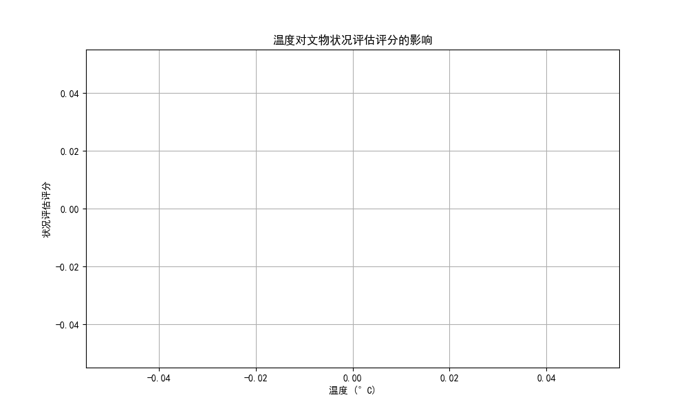
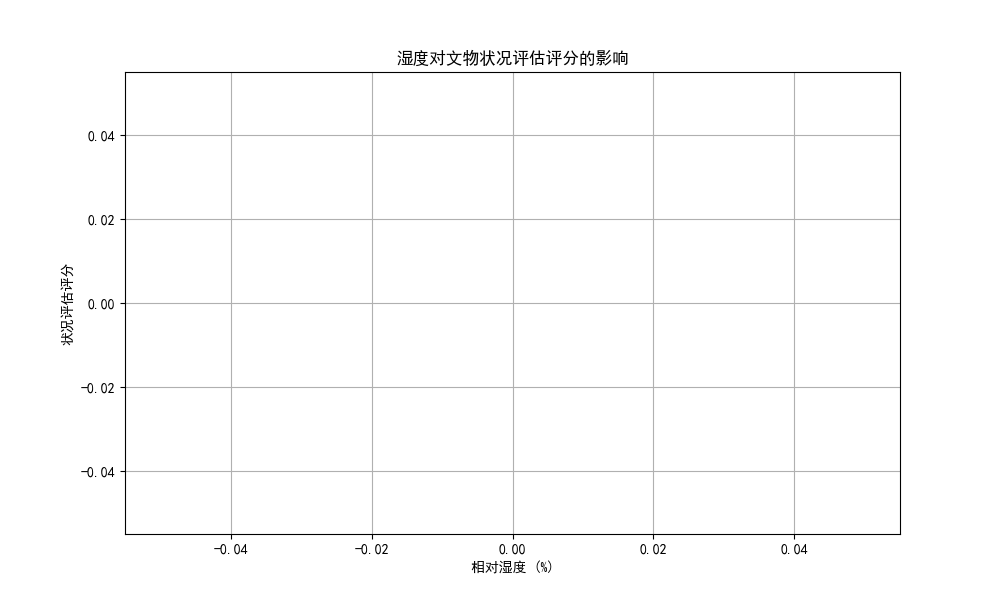

# 高客流环境下文物保存风险分析报告

## 1. 温度与文物状况评估评分的关系

上图展示了温度与文物状况评估评分之间的关系。从图中可以看出，温度在20°C至22°C之间的文物状况评估评分较高，表明这一温度范围可能更适合文物的保存。随着温度升高，文物的状况评估评分有所下降，表明高温可能对文物的保存产生不利影响。

## 2. 湿度与文物状况评估评分的关系

上图展示了相对湿度与文物状况评估评分之间的关系。可以看出，相对湿度在50%至60%之间的文物状况评分较高，表明这一湿度范围可能更利于文物保存。湿度较低或较高时，文物的状况评分下降，表明湿度波动可能对文物保存状态产生负面影响。

## 3. 分析结论与建议

### 核心保存风险
- **温度波动**：高温可能导致文物材料的劣化加速，影响文物的长期保存。
- **湿度波动**：过高或过低的湿度可能导致文物材料的物理和化学变化，如膨胀、收缩或发霉。
- **空气污染物**：高客流环境下，空气质量变化可能带来更多的空气污染物，影响文物。

### 保护与维护措施
- **调节温湿度**：确保展厅和展柜内的温湿度维持在最佳范围内（温度：20°C-22°C，湿度：50%-60%），减少文物的劣化风险。
- **加强空气质量监控**：增加空气过滤设备，定期监测空气质量，减少游客带来的空气污染影响。
- **优化展柜密封性**：提升展柜的气密性和过滤器状态，避免外界污染物进入展柜，影响文物保存。
- **定期评估与维护**：增加文物状况评估频率，及时发现并处理文物劣化问题。

通过上述策略，可以在高客流环境下有效降低文物保存的风险，提升文物的展览质量和长期保存能力。
