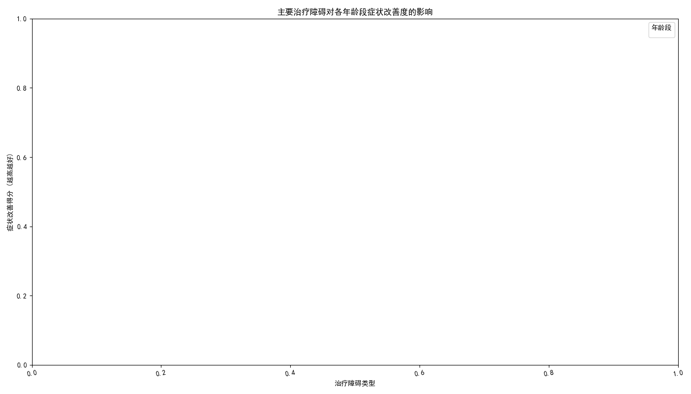

# 基于年龄分层的患者治疗依从性障碍分析及干预策略报告

## 1. 分析背景与目标

为了提升患者的治疗效果，理解并克服治疗过程中的障碍至关重要。不同年龄段的患者面临的生活挑战、生理状况和认知水平各不相同，导致其在治疗依从性上遇到的困难也千差万别。

本次分析旨在深入探索**不同年龄阶段（青年、中年、老年）的患者在治疗依从性上的主要障碍因素**，量化这些障碍对其**症状改善度的影响**，并基于此提出**具有针对性的干预策略与可量化的监测指标**。

---

## 2. 核心发现

### 2.1. 各年龄段的主要治疗障碍因素

我们通过对患者就诊记录的分析，识别出了不同年龄群体在治疗过程中最常遇到的障碍。如下图所示，不同障碍在各年龄段的分布存在显著差异。

**核心洞察:**

*   **青年患者 (18-44岁)**: **“缺乏动机”** 是最突出的障碍，远超其他年龄段。这可能与该群体对疾病的认知不足、生活重心在于事业发展和社交活动、以及对长期治疗的必要性感受不强有关。其次，**“经济限制”** 和 **“对治疗的矛盾心态”** 也较为常见。

*   **中年患者 (45-59岁)**: **“忘记服药”** 成为首要障碍，显著高于青年和老年群体。这可能归因于中年人通常承担着家庭和工作的双重压力，生活节奏快，容易在繁忙中疏忽。同时，**“家庭/工作压力”** 也明确地成为一个重要障碍。

*   **老年患者 (60岁以上)**: **“认知障碍”** 是老年群体最独特的且占比最高的障碍，这与年龄增长带来的记忆力、理解能力下降直接相关。此外，**“缺乏支持”**（尤其指社会和家庭支持）和 **“交通问题”** 也成为他们坚持治疗的巨大阻力，反映了老年人社会连接减弱和行动不便的困境。

### 2.2. 治疗障碍对症状改善度的负面影响

为了评估不同障碍对治疗效果的实际影响，我们分析了存在特定障碍的患者其“症状改善得分”（得分越高，改善越明显）。

**核心洞察:**

*   **“缺乏动机”的影响具有普遍性**: 在所有年龄段中，“缺乏动机”都与较低的症状改善得分相关联，这表明内在的治疗意愿是康复的基础。对青年和中年患者的影响尤为显著。

*   **“认知障碍”对老年患者是致命的**: 在老年患者中，存在“认知障碍”的群体其症状改善得分的中位数显著低于没有此障碍的群体，是所有障碍中影响最严重的。这证实了认知问题是阻碍老年患者康复的关键瓶颈。

*   **“忘记服药”的影响不容小觑**: 对于中年患者而言，“忘记服药”不仅发生频率高，其对症状改善的负面影响也十分明显，得分中位数显著降低。

---

## 3. 针对性干预策略与监测指标

基于以上发现，我们为不同年龄段的患者设计了独特的干预策略，以期精准解决其核心痛点。

### 3.1. 青年患者 (18-44岁) - 策略核心：激励与便捷

*   **挑战**: 缺乏动机、经济限制、矛盾心态。
*   **干预策略**:
    1.  **引入数字化激励工具**: 开发或合作推出一款移动应用（App），集成游戏化任务（如按时服药打卡）、健康知识挑战和基于目标的正面反馈系统，以提升治疗的趣味性和参与感。
    2.  **提供同伴支持与心理咨询**: 在App或合作平台上建立线上同伴支持社区，由康复良好的“学长”分享经验。同时，提供便捷的线上心理咨询入口，帮助他们处理矛盾心态和污名感。
*   **可量化监测指标 (KPIs)**:
    *   **App用户活跃度**: 每周至少使用3次App的患者比例。
    *   **用药依从性**: 通过App记录的按时服药率对比未使用App的患者提升幅度（目标提升20%）。
    *   **咨询参与率**: 接受线上心理咨询的患者比例，并追踪其治疗中断率。

### 3.2. 中年患者 (45-59岁) - 策略核心：整合与分担

*   **挑战**: 忘记服药、家庭/工作压力。
*   **干预策略**:
    1.  **推广智能用药管理方案**: 推荐使用带提醒功能的智能药盒或与手机联动的用药提醒服务，并将家庭成员（如配偶）纳入提醒系统，共同分担监督责任。
    2.  **提供家庭治疗与压力管理工作坊**: 定期举办线上或线下的家庭会议，向家人普及疾病知识，争取理解与支持。同时，开设针对压力管理的短期工作坊。
*   **可量化监测指标 (KPIs)**:
    *   **错过用药次数**: 使用智能方案后，患者每月“忘记服药”的报告次数下降率（目标下降40%）。
    *   **家庭支持度**: 采用家庭支持量表（FSS）进行前后测，评分平均提升值。
    *   **预约失约率**: 衡量因工作压力导致的预约取消或未到的比率是否下降。

### 3.3. 老年患者 (60岁以上) - 策略核心：简化与扶助

*   **挑战**: 认知障碍、缺乏支持、交通不便。
*   **干预策略**:
    1.  **实施“用药简化”与“视觉辅助”计划**: 医生复诊时主动评估并简化用药方案（如使用长效剂或复合制剂）。药剂师提供大字体、图文并茂的用药说明卡片或分格药盒服务。
    2.  **建立社区“一对一”支持伙伴关系**: 联动社区服务中心或招募志愿者，为有需要的老年患者提供定期的上门探视、提醒用药、协助预约及陪同就医服务。
*   **可量化监测指标 (KPIs)**:
    *   **用药方案复杂度**: 患者平均每日服药次数和种类的变化。
    *   **用药错误事件**: 因认知障碍导致的用药错误报告数量的下降率（目标下降50%）。
    *   **社区服务覆盖率**: 接受“一对一”支持服务的老年患者占目标人群的比例，并追踪其孤独感量表（UCLA）得分的变化。

---

## 4. 结论

本次分析清晰地揭示了不同年龄段患者在治疗依从性方面面临的障碍差异。**一刀切的干预措施效率低下，必须转向更加精准、个性化的策略。** 通过为青年提供激励，为中年人分担压力，为老年人简化流程并提供扶助，医疗服务可以更有效地克服治疗障碍，从而显著提升患者的症状改善程度和整体生活质量。建议立即启动试点项目，以验证上述策略的有效性。
