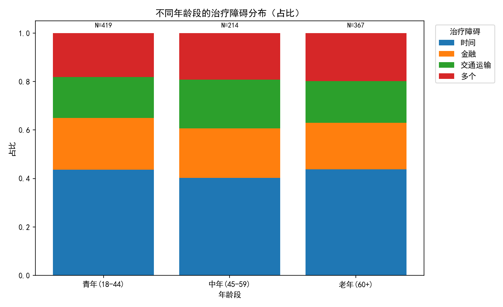
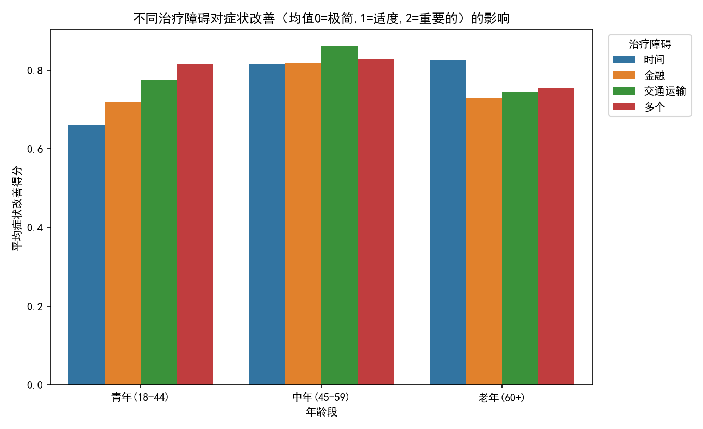
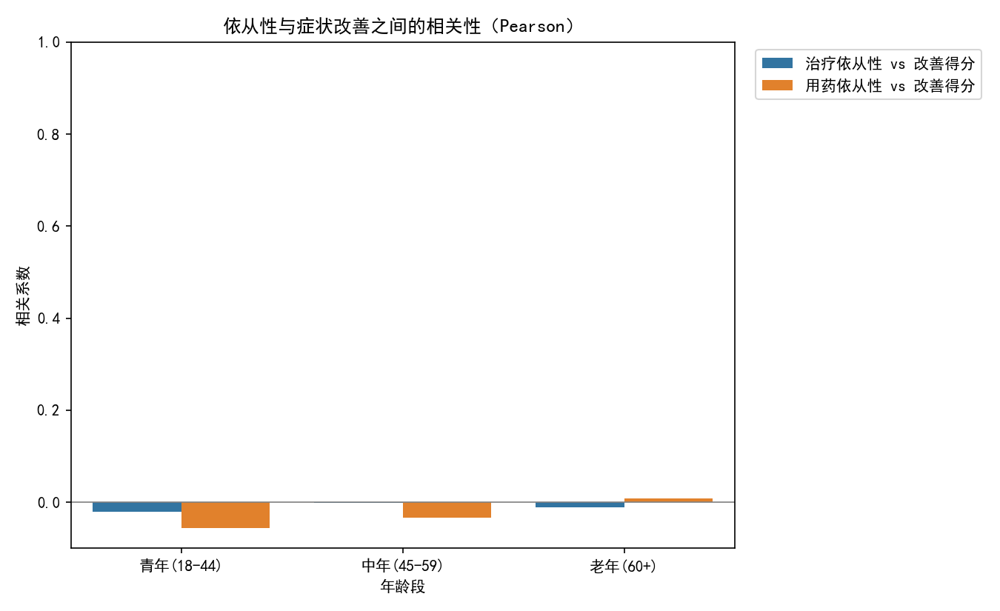

# 不同年龄阶段治疗依从性障碍及其对症状改善的影响——分群对比与策略建议

## 摘要
- 样本量：青年(18-44) N=419；中年(45-59) N=214；老年(60+) N=367。
- 主要障碍：三个年龄段共同的头号障碍都是“时间”。青年组的“金融”次之；老年组“金融”与“交通运输”更突出。
- 障碍对改善的差异：
  - 青年：时间障碍对应最低的症状改善（平均改善得分≈0.661），金融次低（≈0.719）。
  - 中年：四类障碍的改善差异较小，交通运输略高（≈0.860），时间略低（≈0.814）。
  - 老年：金融、交通运输障碍对应较低的改善（≈0.729、0.746），时间障碍反而不算最差（≈0.826）。
- 依从性与改善的相关：在本数据中，按年龄段计算的“治疗依从性/用药依从性 vs 症状改善”的皮尔逊相关近似0（介于-0.000166与0.000025之间），提示单独从总体依从性打分难以解释改善差异，更应关注“具体障碍情境下的依从性支持”。

可视化预览：
- 不同年龄段的治疗障碍分布：
- 不同障碍对症状改善影响（按年龄段）：
- 按年龄段的依从性与改善相关性：

---

## 数据与方法
- 数据来源：SQLite 数据库 dacomp-042.sqlite，使用表：患者信息、就诊记录、治疗基础信息、治疗结果。
- 关键字段：
  - 年龄（患者信息.年龄）→分组为 青年(18-44)、中年(45-59)、老年(60+)。
  - 治疗障碍（就诊记录.治疗障碍）：时间/金融/交通运输/多个。
  - 依从性：治疗结果.治疗依从性、治疗基础信息.用药依从性（文本等级：不合规/低/中等/高 → 映射为0/1/2/3）。
  - 症状改善（治疗结果.症状改善：极简/适度/重要的 → 映射为0/1/2）。
- 统计方法：
  - 计算各年龄段×障碍的样本数与症状改善均值。
  - 计算按年龄段的依从性与改善的皮尔逊相关系数。
  - 使用Python绘制三张图（保存于当前目录）。

代码（绘图主脚本片段，包含中文显示设置）：
```python
import sqlite3
import pandas as pd
import numpy as np
import matplotlib.pyplot as plt
import seaborn as sns

plt.rcParams['font.sans-serif'] = ['SimHei']
plt.rcParams['axes.unicode_minus'] = False

conn = sqlite3.connect('dacomp-042.sqlite')
query = \"\"\"
WITH base AS (
  SELECT
    CASE
      WHEN p.年龄 BETWEEN 18 AND 44 THEN '青年(18-44)'
      WHEN p.年龄 BETWEEN 45 AND 59 THEN '中年(45-59)'
      WHEN p.年龄 >= 60 THEN '老年(60+)'
      ELSE '其他'
    END AS 年龄段,
    v.治疗障碍,
    tb.用药依从性,
    tr.治疗依从性,
    tr.症状改善
  FROM 就诊记录 v
  JOIN 患者信息 p ON p.患者编号 = v.患者参考编号
  JOIN 治疗基础信息 tb ON tb.就诊参考 = v.就诊记录编号
  JOIN 治疗结果 tr ON tr.治疗参考 = tb.治疗编号
)
SELECT * FROM base WHERE 年龄段 <> '其他';
\"\"\"
df = pd.read_sql_query(query, conn)
conn.close()

improve_map = {'极简': 0, '适度': 1, '重要的': 2}
adh_map = {'不合规': 0, '低': 1, '中等': 2, '高': 3}

df['改善得分'] = df['症状改善'].map(improve_map)
df['治疗依从性分'] = df['治疗依从性'].map(adh_map)
df['用药依从性分'] = df['用药依从性'].map(adh_map)

# 可视化示意：分布、均值差异、相关系数图（完整脚本已在当前目录的 analysis_plot.py 中）
```

---

## 结果
1) 年龄段的主要障碍构成（样本计数，节选）
- 青年(18-44)：时间 183，金融 89，多个 76，交通运输 71。
- 中年(45-59)：时间 86，金融 44，交通运输 43，多个 41。
- 老年(60+)：时间 161，多个 73，金融 70，交通运输 63。
解读：时间是共同且最突出的障碍；青年更受金融制约；老年在金融与交通运输上更“脆弱”。

2) 障碍与症状改善均值（0=极简，2=重要的）
- 青年：时间 0.661（最低）、金融 0.719、交通运输 0.775、多个 0.816（最高）。
  - 启示：时间/金融限制下的青年，改善不足，提示就医与用药计划的“被打断/延迟”更为常见。
- 中年：交通运输 0.860（较高）、多个 0.829、金融 0.818、时间 0.814（略低）。
  - 启示：四类障碍差距不大，说明中年群体对各类障碍具备一定“补偿能力”（如家庭支持、企业弹性），但时间依旧是相对短板。
- 老年：时间 0.826（相对较好）、多个 0.753、交通运输 0.746、金融 0.729（最低）。
  - 启示：老年群体对金融与交通的敏感度最高，若不解决此二者，症状改善率受抑明显；时间反而问题相对较小（可能因时间较充裕或预约安排更配合）。

3) 依从性与改善的相关（按年龄段）
- 青年：治疗依从性 vs 改善 ≈ -0.00006；用药依从性 vs 改善 ≈ -0.00015。
- 中年：治疗依从性 vs 改善 ≈ -0.00001；用药依从性 vs 改善 ≈ -0.00017。
- 老年：治疗依从性 vs 改善 ≈ -0.00004；用药依从性 vs 改善 ≈ 0.00003。
解读：在总体打分层面并未观察到线性相关。这并不意味着依从性不重要，更可能是：
- 指标为序数、颗粒度有限，线性相关被“离散化”弱化；
- 障碍情境（时间/金融/交通）是更强的“调节/掩蔽”因素；
- 短周期或异质治疗方案造成“即时改善”与“长期依从”错配。
因此应按“具体障碍情境+年龄段”去定制依从性干预，而不是只盯总体依从性分数。

---

## 诊断性洞察（Why）
- 时间障碍为何对青年更致命：青年承担学业/工作/育儿叠加，时间刚性强，导致随访/复诊/取药延误，进而影响治疗连续性与药物暴露时间，体现在较低的改善均值。
- 老年群体金融/交通障碍为何关键：固定收入+行动不便，导致购药与到院负担大。即便主观依从性高，客观条件限制仍抑制治疗落实，故金融/交通下的改善显著偏低。
- 中年群体差异为何较小：该群体具备一定资源（家庭支持、车、稳定收入），对单一障碍可部分对冲；但时间依然是约束（工作责任）。

---

## 规范性建议（What to do）与量化监测指标（How to measure）
A. 青年(18-44)：聚焦“时间+金融”场景
- 干预1：弹性与数字化就医
  - 措施：晚间/周末门诊、视频复诊、线上处方续配、移动端随访打卡与提醒。
  - 指标：
    - 30/90天内按时复诊率（目标：+10~15%）；
    - 处方续配按时率（目标：+10%）；
    - 平均漏服天数/周（目标：-20%）。
- 干预2：青年友好型金融减负
  - 措施：药费共付上限、分期/代金券、捆绑套餐（随访+药品）。
  - 指标：
    - 因费用延期取药比例（目标：-30%）；
    - 金融障碍样本的症状改善均值提升（目标：+0.10 分）。
- 干预3：高峰时段预约与智能排队
  - 措施：午休/下班后时段优先号源、智能候诊时间预估。
  - 指标：
    - 青年时间障碍人群的改善得分（目标：从≈0.66 提升至≥0.75）；
    - 未到诊率No-show（目标：-20%）。

B. 中年(45-59)：稳固“时间”短板，差异化补位
- 干预1：单位协作的“就医友好政策”
  - 措施：与企业签约健康合作，提供就医证明、错峰就医安排。
  - 指标：
    - 中年时间障碍人群复诊准点率（目标：+12%）；
    - 症状改善均值（目标：由≈0.81 提升至≥0.85）。
- 干预2：交通补贴与导诊协助
  - 措施：停车券/公共交通券、院内导航与快速通道。
  - 指标：
    - 交通障碍人群就诊耗时中位数（目标：-15%）；
    - 交通障碍人群改善均值维持≥0.86。
- 干预3：家属参与与压力管理
  - 措施：家庭教育课程、压力应对工具包。
  - 指标：
    - 家庭参与度“提升”占比（治疗结果.治疗参与度/治疗联盟改善占比，目标：+15%）；
    - 中年总体No-show率（目标：-15%）。

C. 老年(60+)：攻克“金融+交通”瓶颈，增强到手可及性
- 干预1：到家可及的服务
  - 措施：送药到家、社区/流动门诊、居家随访。
  - 指标：
    - 老年交通障碍人群漏诊率（目标：-30%）；
    - 交通障碍人群的改善均值（目标：从≈0.75 提升至≥0.82）。
- 干预2：定向补贴与用药负担管理
  - 措施：老年用药补贴、慢病政策衔接、便宜等效替代方案。
  - 指标：
    - 因费用放弃/延期用药比例（目标：-40%）；
    - 金融障碍人群改善均值（目标：从≈0.73 提升至≥0.80）。
- 干预3：照护者教育与简化流程
  - 措施：家属用药管理培训、药盒/提醒设备、简化取药与报销流程。
  - 指标：
    - 老年用药差错率（目标：-30%）；
    - 满意度评分（治疗结果.满意度评分）提升（目标：+0.3分）。

横跨三类人群的共性举措：
- 以障碍为触发的“情境化依从性支持”工作流：当EHR记录“时间/金融/交通”标签时，自动弹出对应干预清单与转介路径。
- 建立障碍-干预-结果的监测看板：
  - 按年龄×障碍跟踪：复诊率、取药及时率、No-show、改善得分分布、满意度、生活质量评分。
  - 目标：干预后3个月滚动观察，≥70%指标达到阶段目标。

---

## 预测性与实施建议
- 预测性：基于“年龄×障碍×历史No-show×金融/交通记录”构建早期风险评分，优先分配稀缺资源（如交通券、上门随访）。
- A/B试点：
  - 青年时间障碍：对半随机提供“晚间门诊+线上续方”组合，观察3个月改善均值与No-show差异。
  - 老年金融障碍：对半随机提供“取药补贴+送药到家”，观察取药及时率与改善得分提升。
- 数据闭环：将监测指标嵌入信息系统，月度例会复盘与策略微调。

---

## 注意事项与局限
- 本次未进行数据清洗，变量多为序数/文本，线性相关可能被弱化；
- “多个”障碍人群出现较高改善均值，可能反映该群体获得了更集中的干预或基线更差导致“可改善空间”更大，需结合纵向与基线严重度核验；
- 建议后续纳入基线“心理健康评分/生活质量评分”等控制变量，采用回归/匹配方法验证因果强度。

---

## 附：图表文件
- 年龄段_治疗障碍分布.png
- 障碍对症状改善的影响_按年龄段.png
- 依从性与改善关系_按年龄段.png

如需，我可以基于现有脚本快速搭建监测看板的自动化导出（CSV/可视化），用于每月追踪干预成效。
