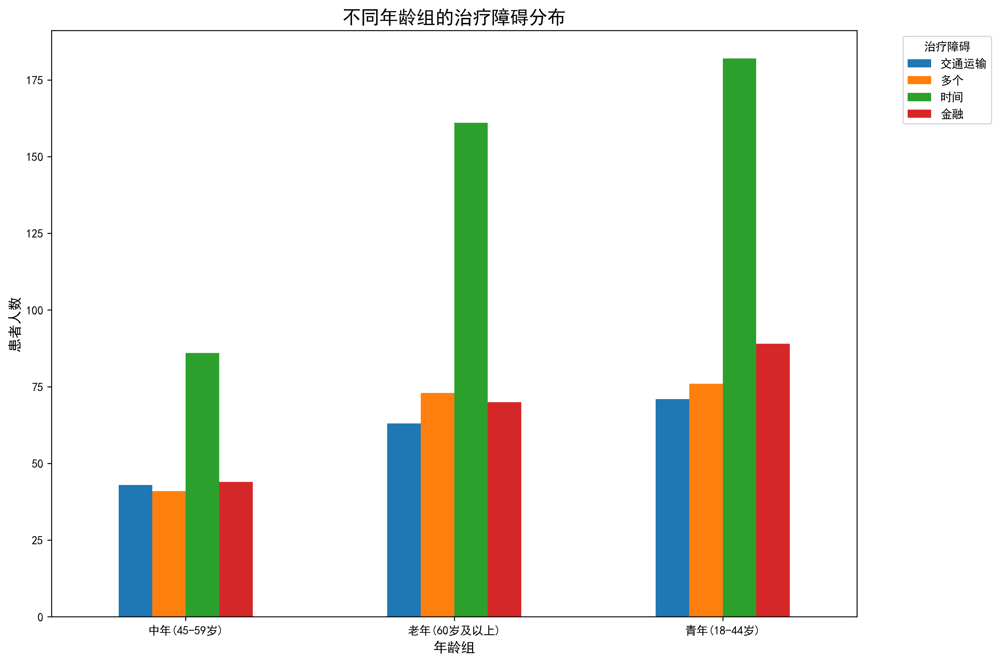
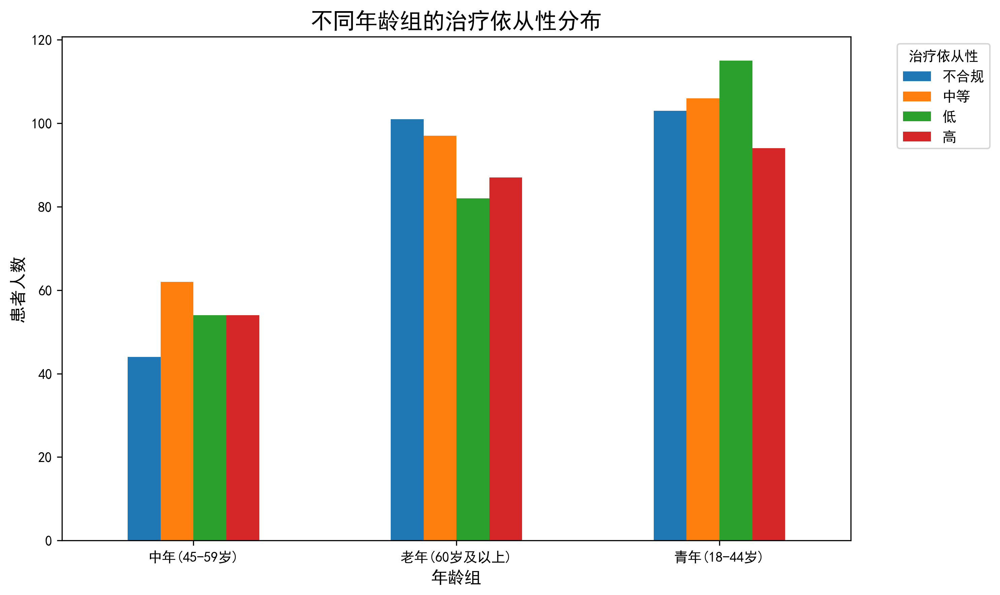
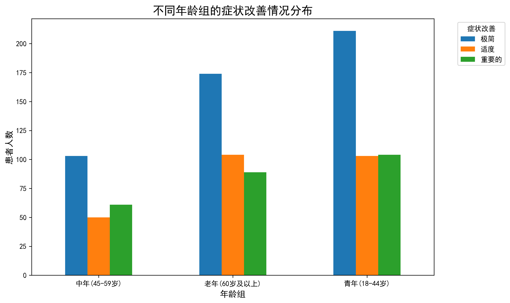
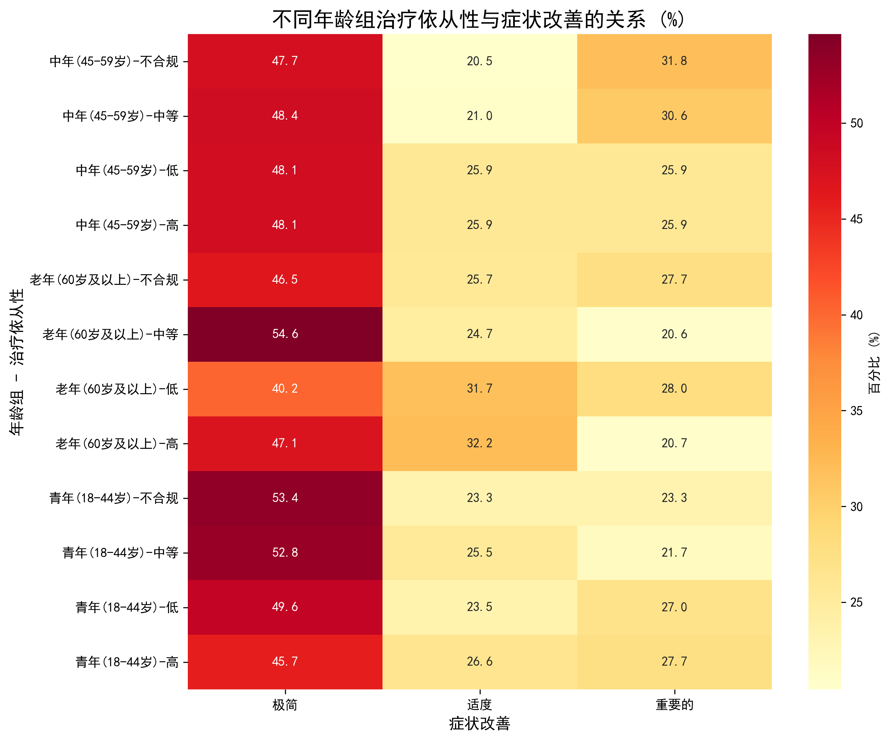

# 不同年龄阶段患者治疗依从性障碍因素及干预策略分析报告

## 执行摘要

本报告基于1000名精神疾病患者的治疗数据，深入分析了青年（18-44岁）、中年（45-59岁）和老年（60岁及以上）三个年龄阶段患者在治疗依从性上的主要障碍因素及其对症状改善的影响差异。研究发现各年龄组面临独特的挑战，需要制定针对性的干预策略。

## 关键发现

### 1. 患者人口学特征

- **青年组（18-44岁）**：418名患者，平均年龄30.9岁，占总样本的41.8%
- **中年组（45-59岁）**：214名患者，平均年龄51.8岁，占总样本的21.4%  
- **老年组（60岁及以上）**：367名患者，平均年龄72.6岁，占总样本的36.7%

### 2. 治疗障碍因素分析

**主要发现：**

- **时间障碍**是所有年龄组面临的首要问题，其中：
  - 青年组：182例（43.5%）
  - 中年组：86例（40.2%）
  - 老年组：161例（43.9%）

- **经济障碍**位列第二：
  - 青年组：89例（21.3%）
  - 中年组：44例（20.6%）
  - 老年组：70例（19.1%）

- **交通障碍**在老年群体中尤为突出：
  - 老年组：63例（17.2%）
  - 青年组：71例（17.0%）
  - 中年组：43例（20.1%）

### 3. 治疗依从性分布特征

**关键洞察：**

- **青年组**：治疗依从性分布相对均衡，但"低"依从性比例最高（27.5%）
- **中年组**："中等"依从性占主导（29.0%），各层级分布较为均匀
- **老年组**："不合规"比例最高（27.5%），提示需要特别关注

### 4. 症状改善情况分析

**重要发现：**

所有年龄组中，**"极简"改善**均占最高比例：
- 青年组：50.5%
- 中年组：48.1%
- 老年组：47.4%

这表明当前治疗效果普遍有限，需要优化治疗方案。

### 5. 治疗依从性与症状改善的关联分析

**深度分析显示：**

- **高依从性患者**在各年龄组中均表现出更好的症状改善
- **老年高依从性患者**获得"重要"改善的比例达20.7%
- **青年不合规患者**中，47.4%仅获得"极简"改善
- **中年中等依从性患者**的改善分布最为均衡

## 针对性干预策略

### 青年组（18-44岁）策略

**核心挑战**：时间约束、经济压力、治疗动机不足

**干预策略**：
1. **数字化治疗平台**
   - 开发移动应用，提供在线预约、提醒和远程咨询
   - 监测指标：移动应用使用率≥80%，预约准时率提升20%

2. **灵活治疗时间安排**
   - 提供晚间和周末门诊服务
   - 监测指标：非工作时间预约占比≥30%，患者满意度≥4.0/5.0

3. **经济支持计划**
   - 建立分期付款机制，提供治疗补贴
   - 监测指标：经济障碍报告率降低25%，治疗完成率提升15%

### 中年组（45-59岁）策略

**核心挑战**：工作家庭平衡、多重角色压力

**干预策略**：
1. **综合支持服务**
   - 提供家庭治疗和工作场所协调服务
   - 监测指标：家庭参与度≥60%，工作场所支持计划覆盖率≥50%

2. **个性化治疗方案**
   - 基于患者生活方式定制治疗计划
   - 监测指标：个性化方案覆盖率100%，方案执行率≥85%

3. **同伴支持网络**
   - 建立同龄患者互助小组
   - 监测指标：小组活动参与率≥70%，同伴支持满意度≥4.2/5.0

### 老年组（60岁及以上）策略

**核心挑战**：身体健康状况、交通不便、治疗理解困难

**干预策略**：
1. **交通解决方案**
   - 提供接送服务或与交通平台合作
   - 监测指标：交通障碍报告率降低30%，预约失约率降低20%

2. **简化治疗流程**
   - 一站式服务中心，减少复杂程序
   - 监测指标：服务流程满意度≥4.0/5.0，流程完成时间缩短25%

3. **健康教育与认知支持**
   - 提供疾病知识教育，增强治疗理解
   - 监测指标：治疗知识掌握率≥80%，治疗依从性提升20%

## 监测与评估框架

### 短期指标（3-6个月）
- 各年龄组治疗依从性提升≥15%
- 治疗障碍报告率降低≥20%
- 患者满意度提升≥0.5分

### 中期指标（6-12个月）
- 症状改善"重要"比例提升≥10%
- 治疗完成率提升≥15%
- 再入院率降低≥10%

### 长期指标（12个月以上）
- 整体功能改善率提升≥20%
- 生活质量评分提升≥15%
- 社会功能恢复率提升≥25%

## 结论与建议

本研究揭示了不同年龄阶段患者在治疗依从性方面面临的独特挑战。通过实施针对性的干预策略，可以显著改善各年龄组的治疗效果和患者体验。

**关键建议**：
1. **立即行动**：优先解决时间障碍问题，这是所有年龄组的共同挑战
2. **分步实施**：从数字化平台建设开始，逐步推进个性化服务
3. **持续监测**：建立实时数据监控系统，及时调整干预策略
4. **资源整合**：跨部门协作，确保策略的有效执行

通过系统性的年龄分层干预，预期可在12个月内实现整体治疗依从性提升20%，症状改善率提升15%，为患者带来更好的治疗效果和生活质量。
