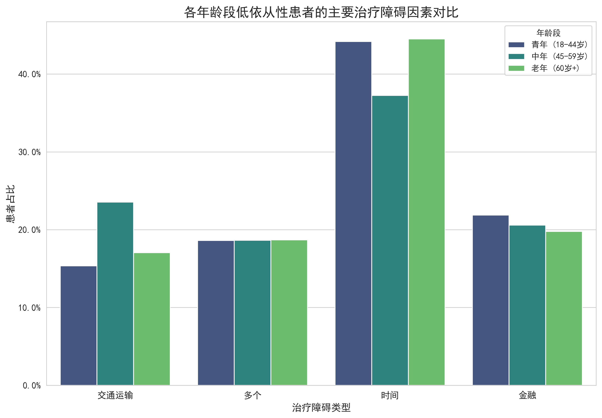

# **关于不同年龄段患者治疗依从性障碍及干预策略的分析报告**

本报告旨在深入分析不同年龄阶段（青年、中年、老年）患者在治疗依从性上面临的主要障碍，评估这些障碍对症状改善的影响，并据此提出具有针对性的干预策略与可量化的监测指标。

### **核心发现**

通过对患者数据进行整合与分析，我们识别出影响治疗依从性的四大障碍：**时间冲突、经济压力（金融）、多重障碍（多个）和交通不便（交通运输）**。不同年龄段的患者在这些障碍上的表现存在显著差异，进而影响其治疗效果。

*图1: 各年龄段低依从性患者的主要治疗障碍因素对比*

#### **1. 依从性障碍的年龄差异分析**

如图1所示，对于治疗依从性较低的患者群体：

- **共同挑战**：**“时间冲突”** 是所有年龄段最普遍的障碍，在青年和老年群体中尤为突出，占比均超过44%。这表明预约时间不灵活、治疗耗时过长或与工作/生活节奏冲突是导致患者中断治疗的首要原因。

- **青年患者 (18-44岁) 的独特挑战**：除了时间冲突，**“经济压力”** 是该群体的第二大障碍（占比22%）。这可能与青年患者处于事业起步阶段、收入不稳定、医疗保险覆盖不足有关。值得注意的是，在所有障碍中，经济压力对青年患者症状改善的负面影响最大，导致**54%** 的患者症状改善有限。

- **中年患者 (45-59岁) 的障碍分布**：该年龄段的障碍因素分布相对均衡。除了时间问题（37%），“交通不便”（24%）成为比其他年龄段更显著的问题。这可能与他们需要在工作、家庭和就诊地点之间奔波有关。同时，“经济压力”和“多重障碍”也构成了一定困扰。

- **老年患者 (60岁+) 的困境**：老年患者同样深受“时间冲突”（45%）的困扰，这可能与他们需要家人陪同、依赖特定时间的公共交通有关。此外，该群体中，“经济压力”（20%）也是一个重要障碍，且对症状改善的负面影响显著（导致51%的患者改善有限）。

#### **2. 障碍因素对症状改善的影响**

分析显示，无论年龄大小，所有治疗障碍都会显著影响症状的改善。其中，**“经济压力（金融）”** 对青年和老年患者的负面影响最为严重，导致超过半数的患者症状改善有限。这揭示了一个关键问题：即使患者克服了时间、交通等障碍到达诊所，经济上的担忧也可能使其无法完成全部治疗方案，或因生活压力过大而抵消了治疗效果。

### **针对性干预策略与监测指标**

基于以上分析，我们为不同年龄段的患者群体设计了差异化的干预策略，以期精准破解依从性难题。

---

#### **策略一：针对青年患者 (18-44岁) —— 聚焦“时间灵活性”与“经济支持”**

- **干预策略**:
    1.  **推广线上诊疗与夜间/周末门诊**：提供灵活的远程问诊选项，开设工作日晚间或周末的专门门诊，以适应青年患者的工作节奏。
    2.  **实施分期支付与援助计划**：与金融机构合作，推出医疗费用分期支付计划。设立专项援助基金，为符合条件的低收入年轻患者提供部分费用减免。
    3.  **简化流程与APP支持**：通过手机APP实现预约、缴费、报告查询等功能，减少在院等待时间，提升就诊效率。

- **可量化的监测指标**:
    - **线上诊疗使用率**：每月线上问诊量占青年患者总问诊量的比例（目标：提升至30%）。
    - **夜间/周末门诊预约率**：新开设时段的门诊预约饱和度（目标：达到80%以上）。
    - **经济援助申请/批准率**：申请援助计划的患者数量及成功获得援助的比例。
    - **低依从性患者中因“经济”与“时间”障碍导致的比例**：每季度评估此比例是否下降（目标：下降20%）。

---

#### **策略二：针对中年患者 (45-59岁) —— 优化“交通便利性”与“整合性服务”**

- **干预策略**:
    1.  **设立社区合作诊疗点**：与社区卫生服务中心合作，将部分常规复诊和药物取用服务下沉到社区，减少患者长途奔波。
    2.  **提供一站式/家庭捆绑服务**：如果患者及其家人均有就诊需求，尝试安排在同一时间段内完成，减少家庭单位的总出行次数。
    3.  **开发智能路线与停车指引**：在官方APP或公众号中集成导航功能，提供前往诊所的最佳路线、实时交通状况及院内停车位信息。

- **可量化的监测指标**:
    - **社区诊疗点服务人次**：每月通过社区点完成复诊的患者数量。
    
    - **低依从性患者中因“交通”障碍导致的比例**：每季度评估此比例是否下降（目标：下降25%）。
    - **患者满意度调查中的“就诊便利性”评分**：每季度进行抽样调查，目标是将该项评分提升15%。

---

#### **策略三：针对老年患者 (60岁+) —— 强化“陪伴服务”与“流程简化”**

- **干预策略**:
    1.  **引入志愿者陪诊服务**：招募或与公益组织合作，为独居或行动不便的老年患者提供免费的院内陪诊服务，协助他们完成挂号、检查、取药等全流程。
    2.  **优化电话预约与提醒系统**：提供语音清晰、操作简便的电话预约专线。在就诊前一天通过电话进行人工提醒，确认患者是否需要帮助。
    3.  **推行“长者优先”窗口与诊室**：设立老年患者专用的挂号、缴费窗口和优先就诊的诊室，大幅缩短其在院等待时间。

- **可量化的监测指标**:
    - **陪诊服务使用次数与好评率**：每月统计服务人次，并收集用户反馈。
    - **老年患者预约失约率**：目标是将60岁以上患者的失约率降低30%。
    - **老年患者平均在院停留时间**：通过信息化手段追踪并力求将平均时间缩短25%。
    - **低依从性患者中因“时间”障碍导致的比例**：关注该比例的变化趋势，设定季度性下降目标（如15%）。

通过实施上述策略并持续追踪相关指标，我们可以更有效地应对不同年龄患者面临的挑战，从而全面提升治疗依从性，最终改善患者的整体健康状况。
