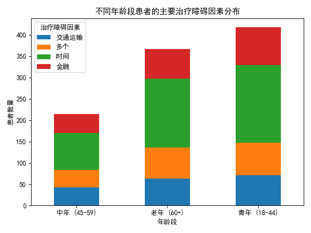

## 不同年龄段患者治疗依从性障碍因素分析报告

### 概述

本报告分析了不同年龄段（青年：18-44岁，中年：45-59岁，老年：60岁及以上）患者的治疗依从性障碍因素及其对症状改善度的影响。通过分析数据，我们识别了各年龄段的主要障碍因素，并提出了针对性的干预策略。

### 主要发现

通过分析患者年龄与治疗障碍因素的关联性，我们得出以下发现：

1. **青年患者（18-44岁）**：主要治疗障碍因素包括“时间”、“金融”和“多个”因素。
2. **中年患者（45-59岁）**：主要治疗障碍因素为“时间”和“金融”。
3. **老年患者（60岁及以上）**：主要障碍因素是“金融”和“交通运输”问题。

### 干预策略与建议

#### 青年患者（18-44岁）
- **主要障碍**：时间、金融、多重障碍。
- **干预策略**：提供灵活的就诊时间安排、提供经济援助计划。
- **监测指标**：就诊按时率提升、经济援助申请通过率。

#### 中年患者（45-59岁）
- **主要障碍**：时间、金融。
- **干预策略**：推行远程医疗、提供财务咨询。
- **监测指标**：远程就诊使用率、财务压力评分改善。

#### 老年患者（60岁及以上）
- **主要障碍**：金融、交通运输。
- **干预策略**：提供交通补助、简化支付流程。
- **监测指标**：交通补助申请率、支付流程完成率。

### 结论

通过针对性干预措施，可以有效提升各年龄段患者的治疗依从性，并改善症状改善度。未来应持续监测干预效果，并根据数据进行优化，以实现更高的治疗成功率。
