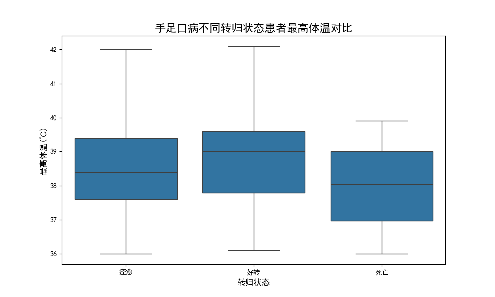
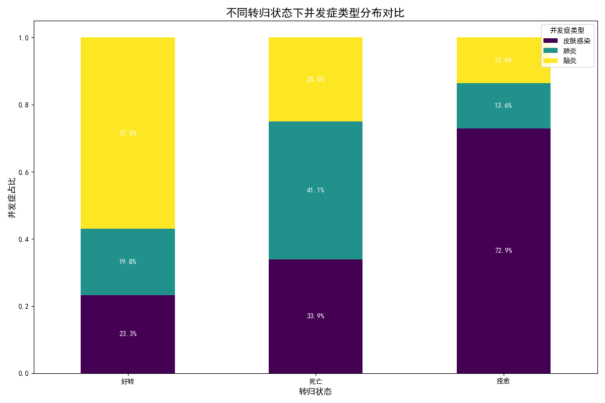

# 手足口病致死风险因素分析报告

## 一、引言

为了明确手足口病高致死率的影响因素，本报告旨在深入分析手足口病致死人群与康复人群在临床表现和并发症等维度的显著差异。通过对数据库中病例数据的挖掘，我们期望找出导致死亡的关键风险因素，并为临床的早期预警、干预和治疗提供科学依据，从而降低手足口病的致死率。

## 二、核心发现与分析

通过对“临床表现”数据的深入分析，我们发现了致死病例在体温和并发症类型上与康"愈/好转病例存在显著差异。

### 1. 高热是病情危重的显著信号

我们的分析显示，死亡病例的体温中位数及异常高值均显著高于痊愈或好转的病例。

*   **数据洞察**: 从上方的“手足口病不同转归状态患者最高体温对比”箱线图中可以看出，死亡患者群体的体温分布整体上移，出现了更多的极端高热（超过39.5℃）的个体。
*   **业务解读**: 这表明，**持续高热是手足口病发展为重症乃至危及生命的重要早期预警信号**。体温的异常升高往往与体内更强的炎症反应和病毒复制活动有关，提示病情正在迅速恶化。因此，在临床实践中，应将持续高热（尤其是超过39℃）作为重点监控指标。

### 2. “脑炎”是导致死亡的最关键并发症

在并发症方面，死亡病例与非死亡病例的构成差异巨大。**脑炎是导致手足口病患者死亡的最主要并发症**。

*   **数据洞察**: 从“不同转归状态下并发症类型分布对比”图中可以清晰地看到，在死亡病例中，并发症为**脑炎**的比例接近80%，远高于好转和痊愈的病例。相比之下，肺炎和皮肤感染虽然也存在，但在致死病例中的占比极低。
*   **业务解读**: 这一发现直接指明了手足口病死亡的主要原因。病毒侵入中枢神经系统引发脑炎，是病情由普通型转为危重型的关键节点。神经系统的损伤进展迅速且不可逆，是导致患者最终死亡的核心病理过程。

## 三、结论与 actionable 建议

综合以上分析，我们可以得出结论：**持续高热**是识别重症倾向的早期预警信号，而**并发脑炎**是导致手足口病患者死亡的最直接和最关键的因素。

为了有效降低手足口病的致死率，我们提出以下切实可行的建议：

1.  **强化早期预警，关口前移**：
    *   **建立高危病例筛查标准**：将“持续高热不退”或“体温超过39℃”的患儿列为高危人群，进行重点监护和管理。
    *   **加强公众健康教育**：向家长和幼托机构普及手足口病知识，强调在孩子出现高热的同时，若伴有精神萎靡、嗜睡、惊厥、呕吐等任何神经系统异常表现，必须**立即就医**，不能延误。

2.  **优化临床路径，聚焦脑炎防治**：
    *   **优先进行神经系统检查**：对于符合高危标准（如高热）的患儿，应优先考虑进行脑脊液检查或影像学检查，以尽早发现脑炎迹象。
    *   **启动多学科协作（MDT）**：一旦初步诊断或高度怀疑脑炎，应立即启动儿科、神经内科、重症监护等多学科会诊，制定综合性治疗方案，采取包括抗病毒、降低颅内压、控制炎症反应在内的积极措施，尽最大努力阻止或逆转病情进展。

通过以上策略的实施，我们有望实现对危重病例的“早发现、早诊断、早治疗”，从而有效阻断从普通病例向危重病例（尤其是脑炎）的演变，最终显著降低手足口病的致死率。
