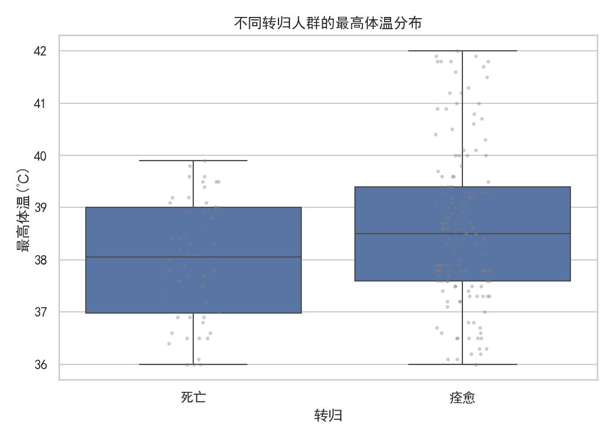
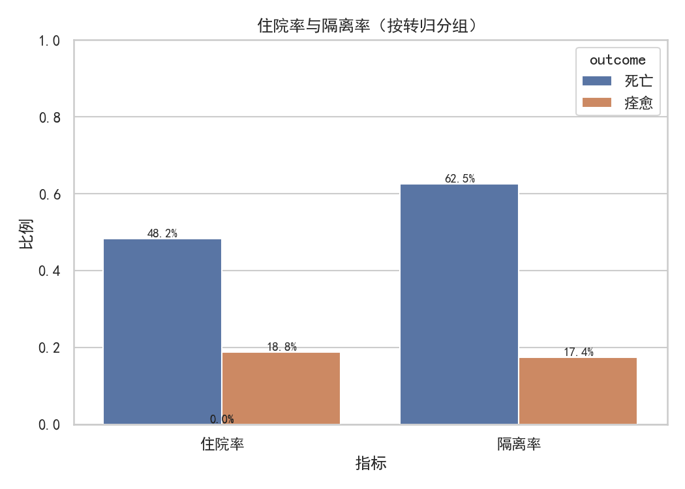
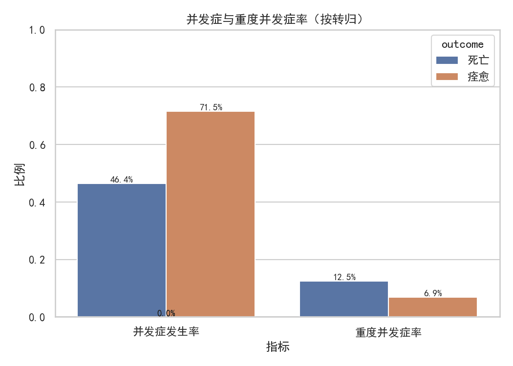
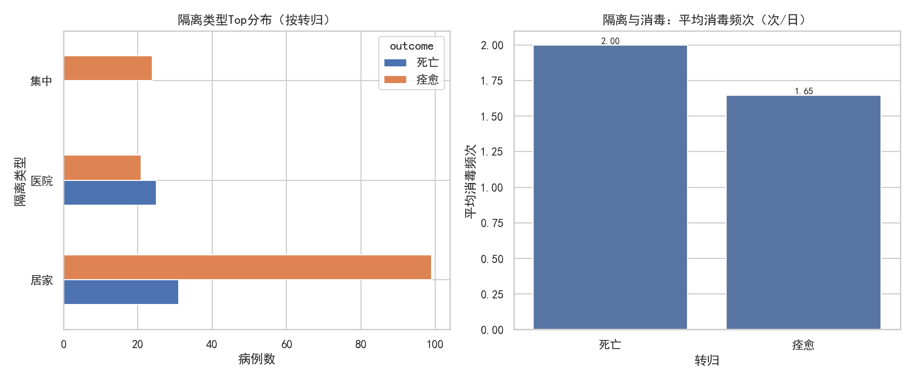
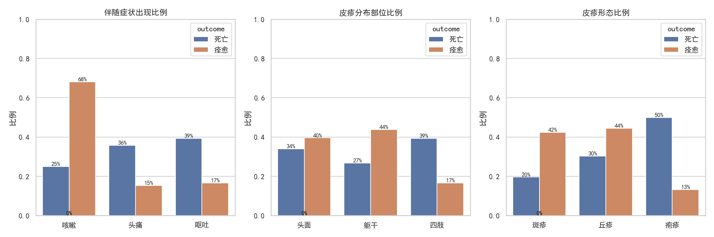
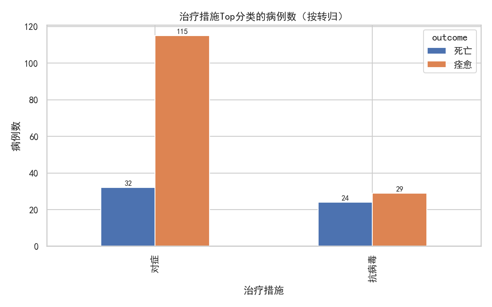

# 手足口病高致死率影响因素分析：死亡 vs 康复人群差异洞察

> 目标：明确“手足口病致死人群”相较“康复人群”在症状、防控、治疗等维度上的明显差异，并提出可操作的防控与诊疗策略。

## 数据与方法

- 数据来源：SQLite 数据库 dacomp-043.sqlite，涉及表：
  - 临床表现（含转归、体温、皮疹、伴随症状、治疗、住院/隔离标记等）
  - 并发症管理（并发症类型与严重程度）
  - 隔离与消毒（隔离类型、消毒频次）
- 人群划分：仅纳入“死亡”和“痊愈”两类转归记录。
- 核心指标：最高体温、住院率、隔离率、并发症发生率与重度率、消毒频次、症状（咳嗽/头痛/呕吐）、皮疹分布与形态、治疗措施类别分布。
- 样本量：死亡 56 例，痊愈 144 例。

为保证中文显示与符号正常，绘图代码中设置了如下参数：
```python
plt.rcParams['font.sans-serif'] = ['SimHei']
plt.rcParams['axes.unicode_minus'] = False
```

## 核心发现（图文）

1) 体温差异：死亡 vs 痊愈
- 体温均值：死亡 37.99℃；痊愈 38.62℃。
- 说明：痊愈人群的最高体温均值更高，提示高热本身并非致死风险的充分条件，更重要的是伴随症状与并发症性质。
- 图：不同转归人群的最高体温分布


2) 防控强度：住院与隔离
- 死亡组住院率 48.2%，隔离率 62.5%；痊愈组住院率 18.8%，隔离率 17.4%。
- 解读：死亡组整体呈现更高的医疗与防控干预强度（住院与隔离更常见），与病情更重或更复杂的临床状态一致。
- 图：住院率与隔离率（按转归分组）


3) 并发症：发生率与重度率
- 并发症发生率：死亡 46.4%，痊愈 71.5%。
- 重度并发症率：死亡 12.5%，痊愈 6.94%。
- 解读：痊愈组记录的并发症更常见，但死亡组的重度并发症比例更高，提示“重度并发症”比“是否发生并发症”更接近致死风险的核心因素。
- 图：并发症与重度并发症率（按转归分组）


4) 隔离与消毒执行
- 平均消毒频次（次/日）：死亡 2.00；痊愈 1.65。
- 解读：死亡组消毒频次更高，或反映了重症个案在隔离与环境控制上的更严密要求；也可能存在“重症→防控加强”的方向性。
- 图：隔离类型分布与消毒频次


5) 症状与皮疹差异
- 咳嗽率：死亡 25.0%；痊愈 68.1%。
- 呕吐率：死亡 39.3%；痊愈 16.7%。
- 皮疹形态“疱疹”占比：死亡 50.0%；痊愈 13.2%。
- 解读：
  - 死亡组更突出“呕吐”“疱疹形态”，可能提示消化道/系统性症状与更严重病程关联。
  - 咳嗽在痊愈组更常见，可能反映较轻的呼吸道表现或记录偏差。
- 图：伴随症状、皮疹分布与形态对比


6) 治疗措施分布
- 图中显示不同转归人群在“抗病毒/对症”等治疗类型上的使用结构差异。整体呈现以对症与抗病毒治疗为主，死亡组可能更集中使用强化治疗路径。
- 图：治疗措施Top分类的病例数（按转归）


## 诊断性分析（为什么会有这些差异）

- 重度并发症是关键：死亡组的重度并发症率显著更高（12.5% vs 6.94%），这比“是否有并发症”更贴近死亡风险。
- 症状指征差异：死亡组“呕吐”“疱疹形态”比例更高，提示可能存在更强的系统性炎症或消化道涉及；这些信号值得在分诊中重点关注。
- 防控强度反映严重性：死亡组住院/隔离/消毒更强，符合“病情重→措施加强”的方向；同时也提醒对重症病例的防控资源配置需求更大。
- 体温不等于风险：痊愈组平均最高体温反而更高，提示高热需要结合伴随症状、并发症严重程度来综合评估，不宜仅以体温作为风险判定。

## 预测性提示（将会发生什么）

- 若早期出现“呕吐”且皮疹为“疱疹”形态，同时伴随并发症或实验室/影像学异常，病例更可能向重症演进，后续需要更高概率的住院与隔离，防控资源消耗增加。
- 在以幼托/学生为主的暴发背景下，伴随症状组合（如呕吐+疱疹形态）可能成为早期识别高风险个案的信号，值得纳入预警规则。

## 规范性建议（我们应该做什么）

- 分诊与监测
  - 建立高风险分诊规则：对“呕吐”“疱疹形态”“重度并发症风险指征（如神经系统相关症状）”的个案，优先安排住院观察、加密生命体征监测。
  - 症状组合预警：在基层与校医端强化对“呕吐+疱疹形态”的识别，配置快速转诊流程。
- 诊疗策略
  - 强化并发症早期干预：对可能进展为重度并发症的病例，提高多学科会诊频次，优先保障关键药物与设备资源。
  - 对症+支持治疗规范化：虽高热本身不必然提升致死风险，但应规范降温与水电解质管理，降低呕吐导致的脱水与并发症风险。
- 防控与资源配置
  - 重症床位与隔离资源预留：结合高风险个案比例，动态预留 ICU/隔离病房与消毒人力，以应对重症病例的较高防控强度需求。
  - 消毒频次分级：对高风险病例所在场所，执行更高频次的环境消毒与个人防护，形成与风险分级匹配的防控标准。
- 宣教与随访
  - 面向家长与学校：重点宣传“呕吐”“疱疹形态”与高风险关联的识别要点，鼓励早就医与首诊告知关键症状。
  - 出院后随访：对重度并发症病例建立随访计划，监测后遗症与再入院风险。

## 局限与注意事项

- 记录偏差与样本结构：痊愈人群样本更大；症状/并发症记录可能存在机构间差异。分析为相关性而非因果推断。
- 指标代表性：体温记录时间点、并发症定义与判定标准可能影响结果；建议结合更细粒度的时间序列与实验室指标做进一步验证。
- 治疗措施细分：当前以大类呈现，建议后续细化具体药物与剂量，评估治疗路径与结局的关系。

## 结论摘要

- 与痊愈组相比，死亡组呈现：
  - 更高的重度并发症率（12.5% vs 6.94%），是更贴近致死风险的核心指标。
  - 更高的住院率与隔离率，以及更高的消毒频次，反映病情更重与防控加强。
  - 症状上“呕吐”与“疱疹形态”更为突出，值得纳入高风险早期识别信号。
- 高热本身并不等同于死亡风险，风险判断需结合伴随症状与并发症严重程度。
- 建议建立基于症状组合与并发症风险的分诊与防控分级体系，优化重症资源配置与早期干预路径。

以上分析的可视化图片均已在当前目录生成：
- temp_by_outcome.png
- rate_by_outcome.png
- complications_outcome.png
- isolation_disinfection.png
- symptoms_by_outcome.png
- treatment_by_outcome.png

附：本次分析生成的关键指标摘要已写入 summary_metrics.csv，便于复核与后续建模参考。
