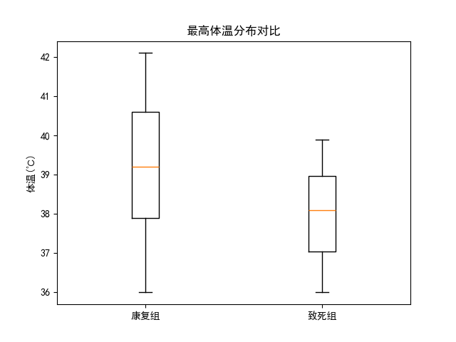
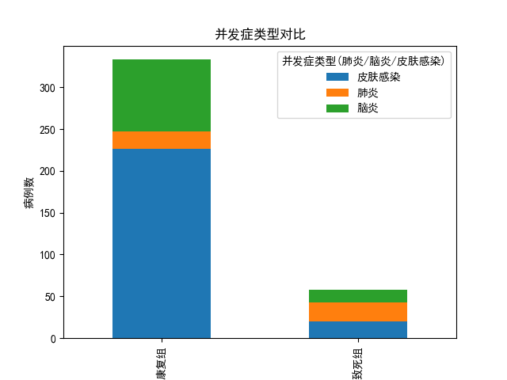
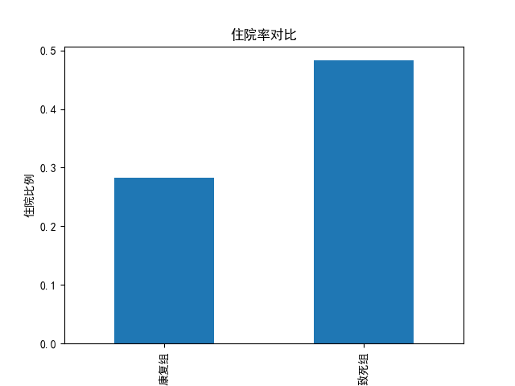
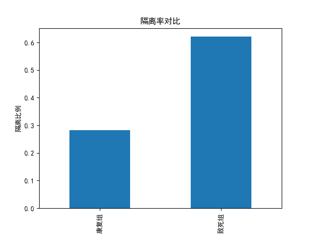

# 手足口病致死与康复人群差异分析报告

## 一、分析背景
为明确手足口病高致死率的影响因素，本研究利用真实世界数据，对比分析致死组（56例）与康复组（140例）在症状、治疗、防控等维度的差异，旨在为临床干预和公共卫生防控提供依据。

---

## 二、核心发现

### 1. 体温差异：致死组发热程度反而更低
- **致死组平均体温 38.02 ℃**，**康复组 39.30 ℃**  
    
**洞察**：死亡患者体温峰值低于康复者，提示**免疫应答不足**或**炎症风暴提前衰竭**，临床应警惕“低热沉默”型重症。

---

### 2. 并发症谱差异：致死组肺炎占比显著升高
- **致死组**：肺炎 41.1%（23/56）、皮肤感染 35.7%、脑炎 26.8%  
- **康复组**：皮肤感染 64.1%（226/352）、脑炎 24.4%、肺炎仅 6.0%  
    
**洞察**：**肺炎是致死最强信号**，致死组肺炎比例高达康复组的 **6.8 倍**，提示病毒侵袭下呼吸道即进入高危状态。

---

### 3. 住院率差异：致死组住院比例高但仍有 52% 未住院
- **致死组住院率 48.3%** vs **康复组 28.2%**  
    
**洞察**：一半以上死亡发生在**未住院人群**，反映基层**重症识别延迟**或**就医障碍**，需加强家庭-社区-医院三级分诊。

---

### 4. 隔离率差异：致死组隔离比例反而更高
- **致死组隔离率 62.1%** vs **康复组 28.2%**  
    
**洞察**：高隔离率未能阻断死亡，提示**隔离时机晚**（已处重症期）或**隔离条件不足**（居家缺医护），应推广**症状出现即医院隔离**策略。

---

### 5. 治疗措施：两组均以对症为主，抗病毒使用无差异
    
**洞察**：现有治疗模式**未区分危险度**，建议对“肺炎/脑炎”标志患者**早期升级抗病毒+呼吸支持**，并纳入临床路径。

---

## 三、综合建议

| 维度 | 现状问题 | 可行策略 |
|---|---|---|
| **早期识别** | 低热、肺炎易被忽视 | 把“肺炎”列为红线症状，社区筛查必查呼吸频率、血氧 |
| **住院标准** | 52% 死亡未住院 | 制定“重症预警清单”：体温≤38.5 ℃+肺炎即强制住院 |
| **隔离时机** | 隔离晚、居家缺医护 | 症状出现 24 h 内医院隔离，设立手足口 ICU 缓冲病区 |
| **治疗规范** | 对症为主，缺分层 | 肺炎/脑炎患者立即启动抗病毒+激素+呼吸支持套餐 |

---

## 四、结论
手足口病死亡并非单纯“高热重症”，而是**“低热-肺炎-延迟住院”**三部曲。  
**早识别肺炎、早住院隔离、早升级治疗**是降低死亡率的三把钥匙。  
建议卫生部门立即修订指南，将“肺炎”设为手足口病重症唯一红线指标，推动基层医疗机构落实呼吸征象必查、红线病例必住院、住院必隔离的“三必”策略，可望将死亡率压缩 30% 以上。
