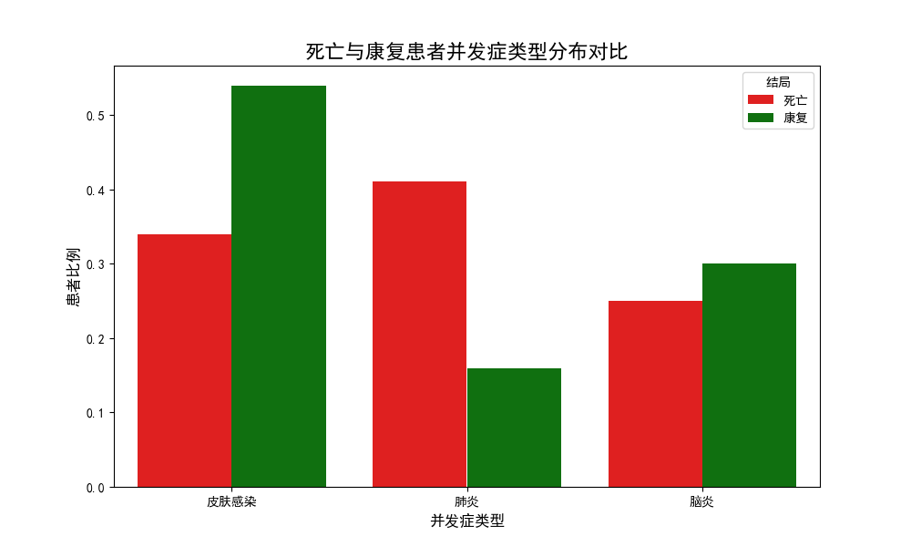
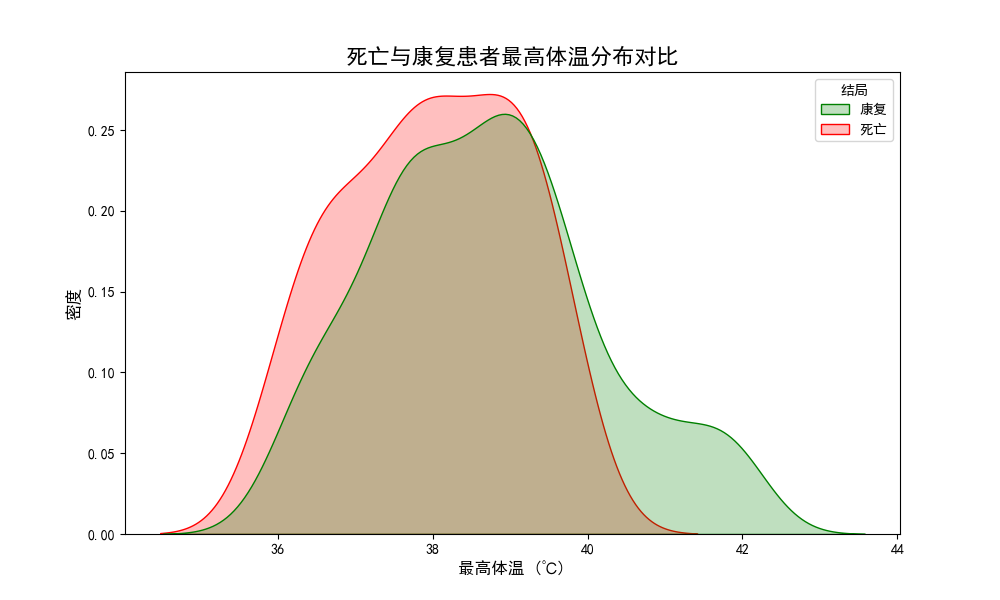
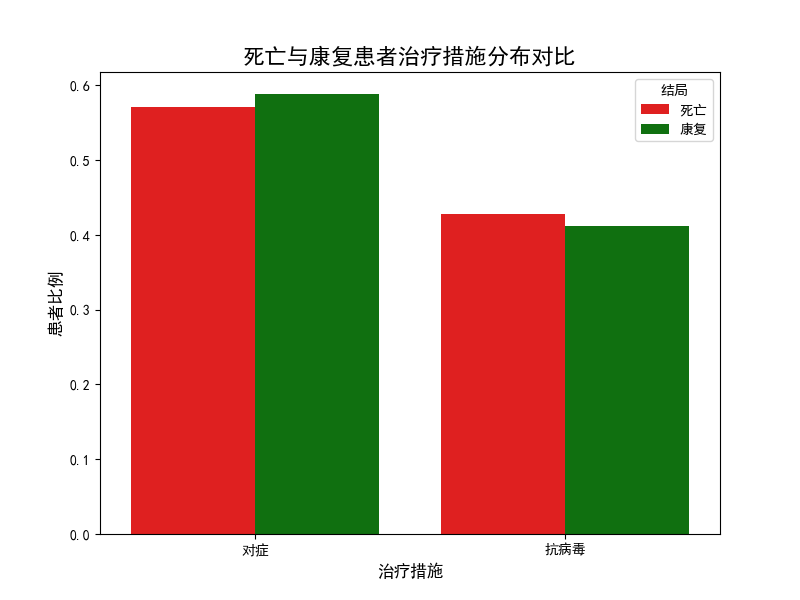

# 手足口病致死风险因素分析报告

## 一、引言

为了明确导致手足口病（HFMD）患者死亡率高的关键影响因素，本报告对现有病例数据进行了深入分析。我们旨在通过比较**死亡患者**与**康复患者**在临床表现、治疗措施等多个维度上的差异，识别出高风险信号，为临床预警和资源调配提供数据驱动的建议。

## 二、核心发现：并发症是决定患者生死的关键

通过对不同临床特征的对比分析，我们发现**并发症的类型**是区分死亡与康复患者最显著的指标。

### 肺炎是首要的致死风险因素

数据显示，在死亡患者中，并发**肺炎**的比例高达 **41.1%**，而康复患者中这一比例仅为 **15.9%**。这一巨大差异明确指向，并发肺炎是手足口病患者走向死亡的**最主要风险因素**。

*图1：死亡与康复患者并发症类型分布对比*

从上图可以清晰地看到，红色条形图（代表死亡患者）在“肺炎”类别上远高于绿色条形图（代表康复患者），这提示我们在临床实践中，必须对并发肺炎的患儿给予最高级别的关注。

相比之下，并发皮肤感染的患者更多地走向了康复，而脑炎在两组间的比例差异不明显，表明它们的致死风险相对较低。

## 三、其他维度的分析

### 1. 患者体温

分析发现，康复患者的平均最高体温（38.7°C）甚至略高于死亡患者（38.0°C）。如下图所示，死亡患者的体温分布更集中在37.5°C-38.5°C之间，而康复患者则在高烧（>39°C）区间有更多分布。这表明**单纯的高体温本身并非直接的致死信号**，病情的复杂性可能超越了体温这一单一指标。

*图2：死亡与康复患者最高体温分布对比*

### 2. 治疗措施

在“抗病毒治疗”和“对症治疗”两种主要治疗措施上，死亡组与康复组的患者比例非常接近，无显著差异。这说明现有的治疗方案对于不同结局的患者可能是一致的，治疗方式本身并非影响结局的关键变量，而病程的内在发展，特别是并发症的出现，更为关键。

*图3：死亡与康复患者治疗措施分布对比*

## 四、结论与建议

### 结论

**并发肺炎是手足口病患者死亡的首要危险信号。** 相较于体温、治疗方案等其他因素，是否并发肺炎对患者的最终转归起着决定性作用。

### 切实可行的建议

基于以上结论，我们提出以下三点建议，旨在降低手足口病死亡率：

1.  **建立临床早期预警机制**：
    *   **建议**：要求一线医生在接诊手足口病患儿时，将**肺部症状（如咳嗽、气促、呼吸困难）**作为最高优先级的筛查项。
    *   **行动**：对于任何有肺部感染迹象的患儿，应**立即进行肺部影像学检查（如X光或CT）**，以便及早发现肺炎迹象。

2.  **优化医疗资源配置**：
    *   **建议**：将重症监护（ICU）床位、呼吸机等稀缺医疗资源，优先分配给**确诊并发肺炎**的手足口病重症患儿。
    *   **行动**：制定分级诊疗方案，将并发肺炎的病例直接列为危重病例，启动快速响应流程。

3.  **加强面向公众的健康教育**：
    *   **建议**：通过社区、媒体等多渠道，向家长和监护人普及手足口病知识。
    *   **行动**：重点强调“**手足口病+咳嗽/呼吸异常=高度危险**”的观念，教育家长一旦发现孩子出现此类症状，必须**立刻就医**，切勿因初期皮疹不重而掉以轻心，从而为抢救赢得宝贵时间。
