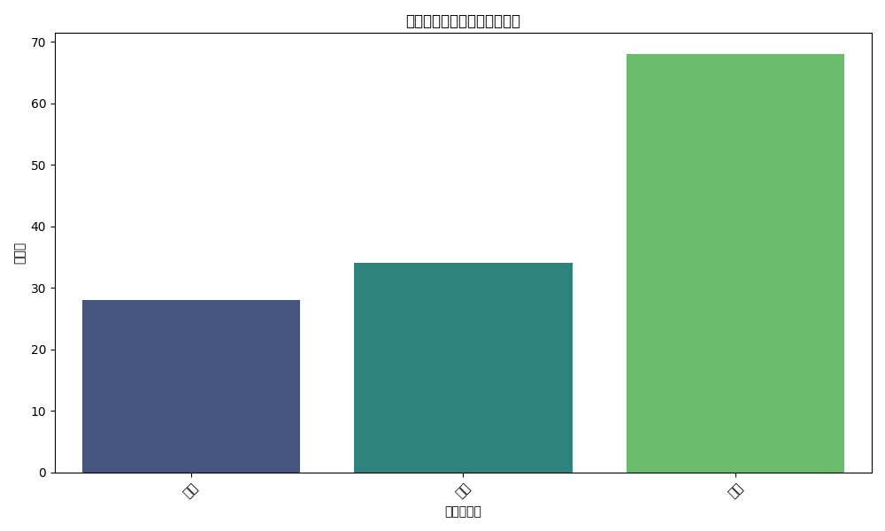
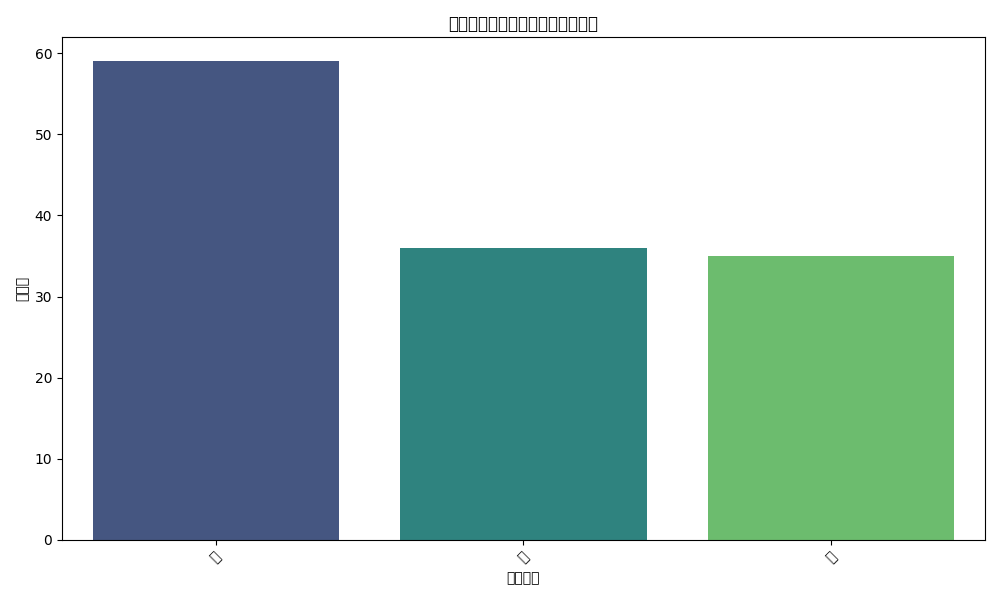
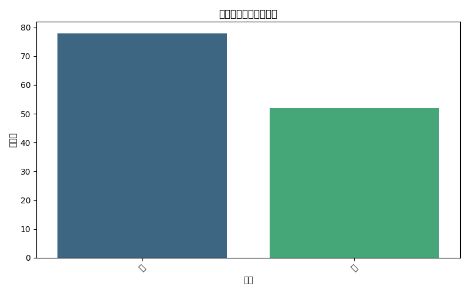

# 手足口病后遗症病例分析报告

## 概述

本报告旨在分析手足口病患者中出现后遗症的病例，以探讨可能导致死亡率增加的因素。我们从并发症类型、严重程度和性别等方面对患者进行了分析。

## 数据概览

### 后遗症病例基本信息

### 并发症类型分布

从图表中可以看出，脑炎是最常见的后遗症相关并发症，其次是肺炎和肝炎。这表明脑炎可能是手足口病致死率较高的一个重要因素。

## 并发症严重程度分布

### 分析
并发症严重程度分布图表显示，大多数后遗症病例的严重程度为“中”等级别。然而，也有相当一部分为“重”等级别，这表明严重的并发症可能与较高的死亡风险相关。

## 性别分布

### 分析
性别分布图表显示，男性和女性在后遗症病例中的比例大致相等。这表明性别可能不是影响后遗症发生率的主要因素。

## 结论与建议

### 结论
1. 脑炎是最常见的后遗症相关并发症，表明其可能是手足口病致死率较高的重要因素。
2. 并发症严重程度主要集中在“中”等级别，但“重”等级别也占一定比例，提示严重并发症与死亡风险增加相关。
3. 性别在后遗症病例中的分布较为均衡，提示性别可能不是影响后遗症发生率的主要因素。

### 建议
1. **加强脑炎相关并发症的监测**：对于手足口病患者，尤其是出现脑炎症状的患者，应加强监测和早期干预。
2. **提高对严重并发症的识别与处理**：对于严重并发症（如重症脑炎、重症肺炎），应制定更积极的治疗策略，以降低死亡率。
3. **加强公众教育**：提高公众对脑炎和严重并发症的认识，促进早期识别和及时就医。
4. **进一步研究**：继续深入研究性别、年龄等因素在手足口病后遗症中的作用，以提供更全面的防控策略。
