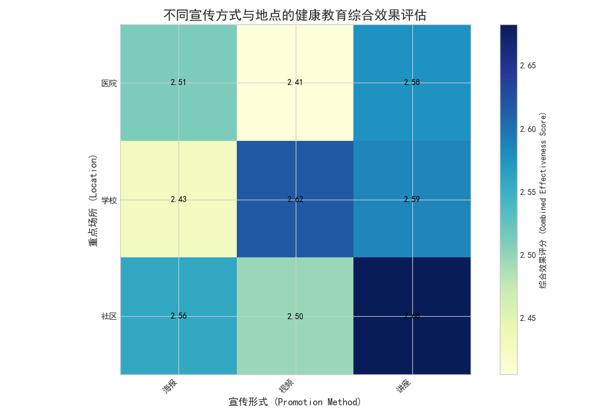

# 健康教育宣传方式与地点的有效性分析报告

## 一、 分析背景与目标

为了有效提升学生的健康意识和促进行为改变，本次分析旨在通过对现有健康教育数据的深入挖掘，找出**兼具长期效果和行为改善能力的健康教育宣传方式与地点**，并为未来的健康教育策略提供数据驱动的建议。

## 二、 分析过程与发现

我们主要分析了“健康教育”数据表，重点关注`宣传形式`、`重点场所`、`行为改变评估`和`教育效果追踪`等关键指标。通过将评估结果（如“显著”、“一般”）进行量化处理（显著=3, 一般=2, 微弱=1, 无变化=0），我们计算了不同宣传方式和地点组合的**综合效果评分**（行为改变与长期效果的平均分）。

上图的热力图直观展示了不同组合的有效性。颜色越深，代表综合效果越好。

**核心发现如下：**

1.  **“讲座”是最高效的宣传形式**：在所有地点中，“讲座”的综合得分均名列前茅。特别是在社区（2.68分）和学校（2.59分），效果尤为显著。这表明互动性强、能深入解读的讲座形式，最能促进听众的知识吸收和行为转变。

2.  **“社区”和“学校”是最佳宣传地点**：
    *   **社区**配合**讲座**（2.68分）是效果最佳的组合。这说明在居民生活的核心区域开展深入的健康教育活动，能实现最好的长期效果。
    *   **学校**是另一个高效的教育场所。在学校，**视频宣传**（2.62分）和**讲座**（2.59分）的效果均非常出色。这符合学生群体乐于接受多媒体和互动形式信息的特点。

3.  **“视频”形式在特定场景下表现优异**：虽然讲座整体效果最好，但“视频”宣传在校园内的表现几乎与讲座持平，远优于海报。这提示我们宣传形式的选择需要因地制宜。

## 三、 结论与建议

基于以上分析，我们得出以下结论，并提出切实可行的策略建议：

**结论：**

对学生而言，兼具长期效果和行为改善能力的健康教育宣传方式主要是在 **学校** 开展的 **视频宣传** 和 **健康讲座**。如果将范围扩大到更广泛的年轻人群体，那么在 **社区** 组织 **健康讲座** 也是一个黄金组合。

**策略建议：**

1.  **聚焦核心阵地，优先投入“学校”和“社区”**：
    *   **针对学生群体**：应将资源重点倾斜于在**学校**开展健康教育。建议采用**“视频 + 讲座”**的混合模式。可以定期播放生动有趣的健康知识短视频，引发学生兴趣，再辅以专家讲座进行深度解读和互动答疑，形成“线上吸引 + 线下深化”的教育闭环。
    *   **针对社区青年/家庭**：在**社区**大力推广**健康讲座**。可邀请医疗专家或健康达人，结合社区高发或居民关心的健康问题（如季节性流感预防、慢性病管理等）开展专题讲座，以增强参与感和实用性。

2.  **优化宣传形式，以“讲座”和“视频”为核心**：
    *   **提升讲座质量**：设计互动环节，如现场问答、小组讨论、案例分析等，避免单向灌输，提升参与度和知识转化率。
    *   **丰富视频内容**：制作符合年轻人审美的短视频、动画、Vlog等形式的内容，通过社交媒体和校园渠道进行传播，扩大覆盖面和影响力。
    *   **逐步减少“海报”等传统形式的投入**：鉴于海报宣传的综合效果评分普遍偏低，建议将其作为辅助宣传手段，而非主要方式。

通过采纳以上建议，我们可以更精准、更高效地进行健康教育投入，从而在学生及年轻人群体中取得更持久的健康行为改善效果。
