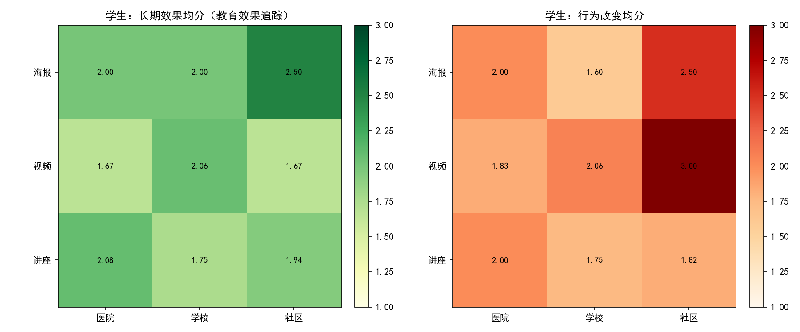
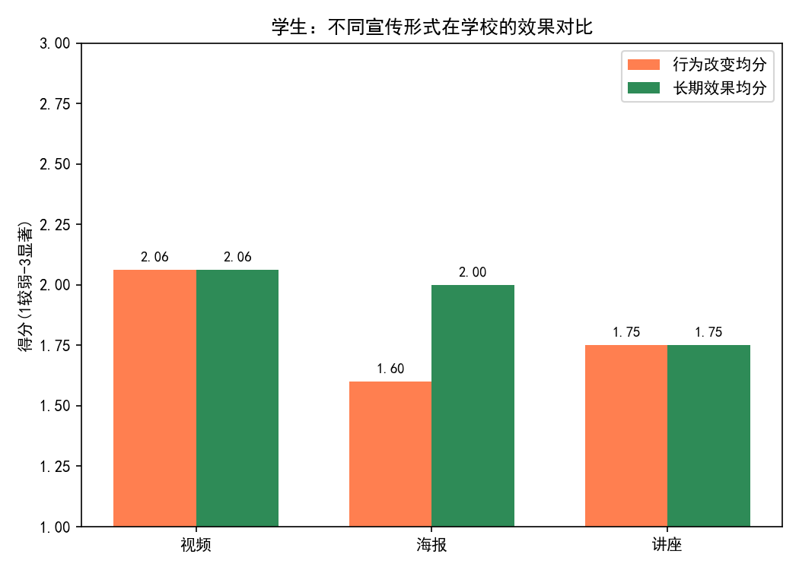
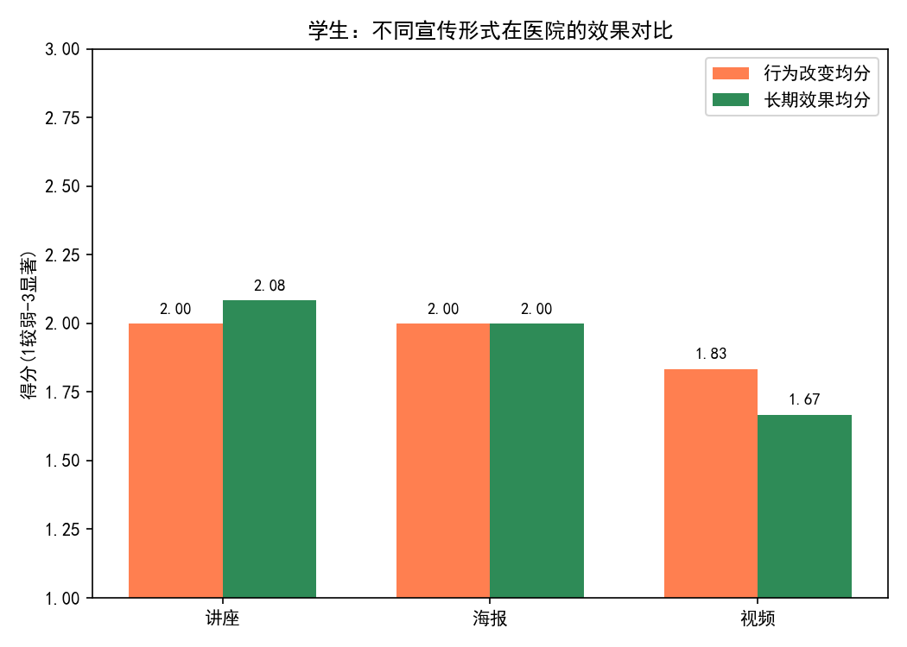
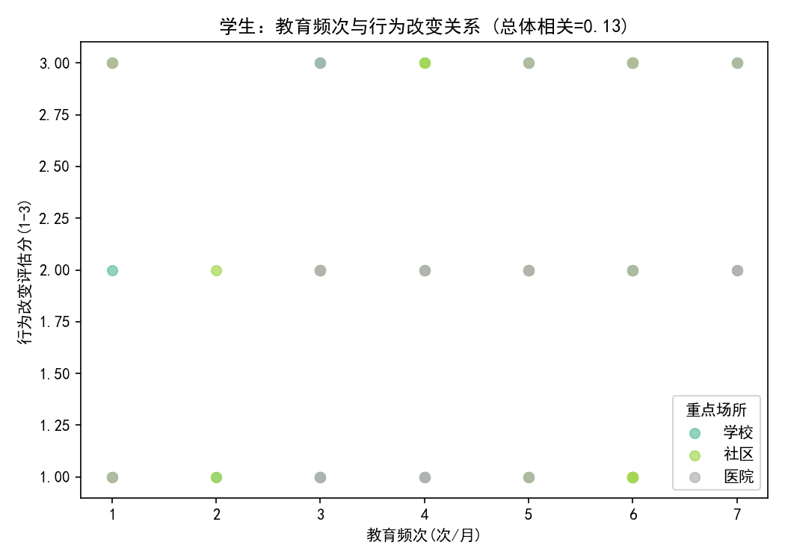

# 面向学生的健康教育：兼具长期效果与行为改善的宣传方式与地点建议

本文基于SQLite数据库中“健康教育”表（筛选覆盖人群包含“学生”）的75条记录，对宣传方式（海报/视频/讲座）与重点场所（学校/医院/社区）组合在“行为改变评估”和“教育效果追踪（长期效果）”两个维度进行了量化评估，并补充教育频次与效果的关系分析，产出图表与可执行建议。

- 研究对象：覆盖“学生”的健康教育项目
- 关键指标：
  - 行为改变评估（较弱/一般/显著→评分1/2/3）
  - 教育效果追踪（“长期效果”）（较弱/一般/显著→评分1/2/3）
  - 知晓率、知识掌握度（转换为比例）
  - 教育频次（次/月）、发放量、新媒体阅读/转发
- 总体样本量：75

---

## 关键发现（图文）

1) 宣传方式×地点：长期效果与行为改变热力图（评分越高越好）



解读要点：
- 海报-社区：在“长期效果”和“行为改变”两项均为高位（均分=2.5），综合领先。
- 视频-学校：两项均为中上水平（均分≈2.06），且样本量较大（记录数=16），可扩展性较好。
- 讲座-医院：行为与长期效果均为2.0上下（综合≈2.04），稳定且在医疗情境下说服力较强。

2) 按地点看，不同宣传形式的效果对比（两指标并列）：

- 学校场景



- 医院场景



- 社区场景


解读要点：
- 学校：视频整体优于海报与讲座，属于更契合校园环境的形式。
- 医院：讲座略优，借助医务人员权威、即时互动，能兼顾理解与记忆。
- 社区：海报综合最佳，视频的“行为改变”高但“长期效果”明显偏弱（行为≈3.0，长期≈1.67），需要强化巩固策略。

3) 频次与效果（散点）与相关系数



- 总体相关：
  - 教育频次 vs 行为改变：0.133（弱正相关）
  - 教育频次 vs 长期效果：0.207（弱正相关）
- 分地点：
  - 学校：频次-行为改变 0.313；频次-长期 0.202（在学校提升频次的回报较明确）
  - 医院：频次-行为改变 0.245；频次-长期 0.310（医院中提高频次也能换来更明显的长期收益）
  - 社区：频次-行为改变 -0.095；频次-长期 0.140（社区频次过高可能对“即时行为改变”产生边际递减甚至疲劳效应）

4) 综合效果TOP组合（同时兼顾长期效果与行为改变，取两者均分）
- 海报-社区：综合2.50（记录数=6），知晓率≈0.898、掌握度≈0.800、阅读≈5486、转发≈288
- 视频-社区：综合2.33（记录数=3），行为高（3.0）但长期偏低（1.67）
- 视频-学校：综合2.06（记录数=16），知晓率≈0.783、掌握度≈0.821、阅读≈4557、转发≈319
- 讲座-医院：综合2.04（记录数=12），知晓率≈0.750、掌握度≈0.817、阅读≈5406、转发≈232

（来源：学生_组合TOP10.csv）

---

## 诊断性解读（为什么）

- 社区-海报为何综合最佳：社区接触面广且“场景留存时间长”，海报形成“环境提醒”，对习惯与行为的日常化更友好；同时成本低、渗透面广，长期效果、行为改变兼得。
- 学校-视频为什么好用：学生对多媒体内容接受度高，视觉/情节带来的记忆与参与度较高；再结合学校固定作息，适度提高频次能稳步提升行为改变（学校频次-行为改变相关=0.313）。
- 医院-讲座为何稳健：专业背书与现场互动提高理解深度，配合病例/实例能促进长记忆的形成（医院频次-长期相关=0.310）。
- 社区-视频的“短期冲击强、长效偏弱”：视频刺激强带来即时行动，但缺乏重复接触与环境提醒，导致长期留存不足；需要与“海报/提醒式载体”联动以巩固记忆与行为。

---

## 规范性建议（我们应该做什么）

1) 场景-方法匹配的“主力组合”
- 社区：以“海报”为主，保持点位覆盖与更新频率；若使用“视频”，务必叠加“海报/贴士卡/打卡墙”等巩固载体，提升长期效果。
- 学校：以“视频”为主，必要时搭配“互动讲座”（每月一次）或“微海报”（走廊/班级角）作为强化。
- 医院：以“讲座”为主，结合“案例化视频/短片”在候诊区播放，强化行为规范操作（如洗手、咳嗽礼仪）。

2) 频次策略（结合相关系数与边际效应）
- 学校：提升频次能带来更明显的行为改变收益（建议每月3-5次的短时视频/班会微单元），配合月度/季度复盘巩固长期效果。
- 医院：适度提升频次能改善长期效果（讲座每月1-2次+候诊区循环短片）。
- 社区：控制视频频次，避免“信息疲劳”；将主要频次投向海报的更新与点位质量（例如每月2-3次小规模替换/更新），视频以专项主题/节点化投放。

3) 混合触达与强化机制
- “强刺激（视频/讲座）+ 环境提醒（海报）+ 行动框架（打卡/承诺卡）”的闭环组合，以提升即时行动并稳固成习惯。
- 在线内容与线下触点联动：视频末尾添加二维码引导到“行为清单/挑战打卡”，社区与学校张贴海报同步二维码，形成多触点重复暴露。

4) 内容与评估
- 内容上提高“可操作性”与“场景化细节”（例如校园卫生角、宿舍卫生清单），并针对学生年龄段优化语言与呈现。
- 指标上持续跟踪“行为改变评估、教育效果追踪、知晓率/掌握度”，按“宣传形式×地点”做季度复盘，对低长期效果的组合（如社区视频）重点加装巩固措施。

---

## 方法与数据说明
- 数据来源：/workspace/dacomp-044.sqlite → 表“健康教育”，筛选覆盖人群包含“学生”。
- 评分口径：将“较弱/一般/显著”映射为1/2/3，对“行为改变评估”与“教育效果追踪”分别计算均分，并取均值作为“综合均分”。
- 可视化：使用Python matplotlib 绘制热力图、对比条形图与散点图，文件已保存在当前目录。
- 总体记录数：75。

核心绘图代码片段（含字体设置）：
```python
import pandas as pd
import numpy as np
import matplotlib.pyplot as plt

plt.rcParams['font.sans-serif'] = ['SimHei']
plt.rcParams['axes.unicode_minus'] = False

# 读取并打分
df = pd.read_csv('student_education.csv')
score_map = {'较弱':1, '一般':2, '显著':3}
for col in ['行为改变评估', '教育效果追踪']:
    df[col + '_分'] = df[col].map(score_map)

# 组合聚合
combo = df.groupby(['宣传形式', '重点场所']).agg(
    行为改变均分=('行为改变评估_分', 'mean'),
    长期效果均分=('教育效果追踪_分', 'mean')
).reset_index()

# 热力图
pivot_long = combo.pivot(index='宣传形式', columns='重点场所', values='长期效果均分')
pivot_behavior = combo.pivot(index='宣传形式', columns='重点场所', values='行为改变均分')
fig, axes = plt.subplots(1, 2, figsize=(12, 5))
im1 = axes[0].imshow(pivot_long.values, cmap='YlGn', vmin=1, vmax=3)
im2 = axes[1].imshow(pivot_behavior.values, cmap='OrRd', vmin=1, vmax=3)
plt.tight_layout()
plt.savefig('学生_宣传形式×地点_效果热力图.png', dpi=150)
```

---

## 结论（面向学生的优先组合与打法）
- 首推：社区-海报（综合均分=2.50）。成本效益高、长期与行为兼顾；建议作为社区触达的“主力阵地”。
- 次优：学校-视频（综合≈2.06，样本量大、可扩展），配合提高频次与月度巩固单元，提升行为改变与长期留存。
- 医院-讲座适合作为“科普权威场景”的重点形态（综合≈2.04），配合候诊短片提升记忆巩固。
- 对“社区-视频”，建议与海报/提醒载体联动，控制频次，避免疲劳，补齐长期效果短板。

以上建议均得到图表与相关系数的支持，适合在校园、医院与社区对学生群体开展分场景、分形式的健康教育精细化投放与迭代。
