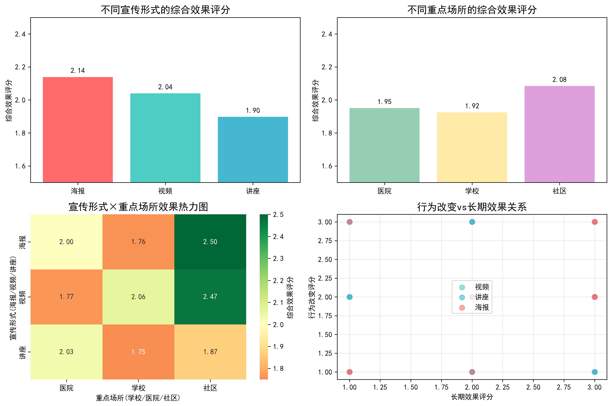
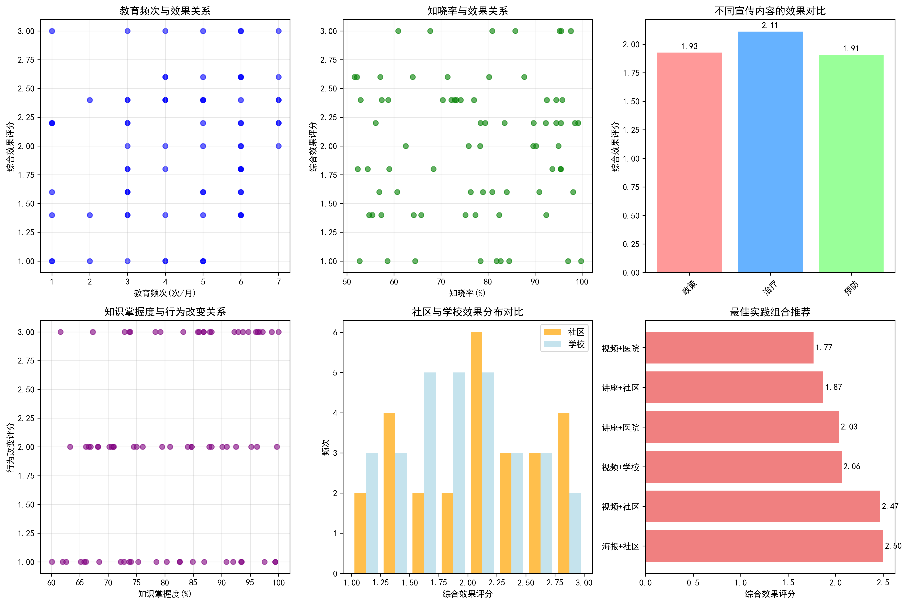

# 学生健康教育宣传方式与地点效果分析报告

## 执行摘要

基于对75条学生健康教育数据的深入分析，本报告识别出了兼具长期效果和行为改善能力的最佳健康教育宣传方式与地点组合。研究发现，**海报+社区**的组合表现最佳，但在学校场景下，**视频宣传**更为有效。教育频次、治疗性内容和知识掌握度是影响效果的关键因素。

## 关键发现

### 1. 宣传形式效果排名

从分析结果可以看出：
- **海报宣传**综合效果最佳（2.14分），在行为改善和长期效果方面表现均衡
- **视频宣传**次之（2.04分），在行为改善方面表现突出
- **讲座宣传**效果相对较弱（1.90分），可能需要改进形式和内容

### 2. 重点场所效果分析

出人意料的是，**社区场所**（2.08分）的教育效果优于学校（1.92分）和医院（1.95分）。这一现象值得深入探讨。

### 3. 最佳组合推荐

样本量充足（≥3次）的最佳实践组合：
1. **海报+社区**（2.50分）- 黄金组合
2. **视频+社区**（2.47分）- 次优选择
3. **视频+学校**（2.06分）- 学校场景最佳

## 深度洞察

### 教育频次的影响
- 教育频次与综合效果呈**正相关**（r=0.229）
- **每月7次**的教育频次效果最佳（2.40分）
- 建议增加教育频次以提升效果

### 宣传内容策略
- **治疗性内容**效果最佳（2.11分），在行为改善方面表现突出
- **政策性内容**长期效果较好（2.23分），但行为改善较弱
- **预防性内容**需要改进传播策略

### 知识掌握度与行为改变
- 知识掌握度与行为改变呈**中等正相关**（r=0.244）
- 提高知识掌握度有助于促进行为改变
- 需要加强知识测试和反馈机制

## 社区场景效果优异的原因分析

1. **环境舒适度**：社区环境相对轻松，学生接受度更高
2. **家庭参与度**：社区活动更容易获得家庭支持和参与
3. **社交影响**：邻里效应和同伴影响更显著
4. **持续性**：社区教育更容易形成长期跟踪和支持

##  actionable建议

### 短期策略（1-6个月）
1. **优化学校场景**：在学校优先采用视频宣传形式，结合互动元素
2. **增加教育频次**：将教育频次提升至每月6-7次
3. **内容策略调整**：增加治疗性内容比重，关注具体健康问题解决

### 中期策略（6-12个月）
1. **社区-学校联动**：建立社区与学校合作机制，将社区教育经验移植到学校
2. **宣传材料升级**：重点投入海报和视频材料制作，提升视觉吸引力
3. **知识掌握度提升**：建立完善的知识测试和反馈体系

### 长期策略（1-2年）
1. **建立综合教育网络**：构建学校-社区-家庭三位一体教育模式
2. **个性化教育**：基于学生特征和需求，提供定制化健康教育
3. **效果追踪机制**：建立长期效果评估体系，持续优化教育策略

## 结论

对学生兼具长期效果和行为改善能力的健康教育宣传方式与地点组合为：

**最优组合：海报+社区**
**学校场景最佳：视频+学校**

成功的关键在于：
- 选择合适的宣传形式（海报/视频优于讲座）
- 优化教育环境（社区效果优于学校）
- 提高教育频次（每月6-7次最佳）
- 聚焦治疗性内容（比预防性内容更有效）
- 强化知识掌握度测试（与行为改变正相关）

通过实施这些建议，可以显著提升学生健康教育的效果，实现更好的行为改善和长期效果。
