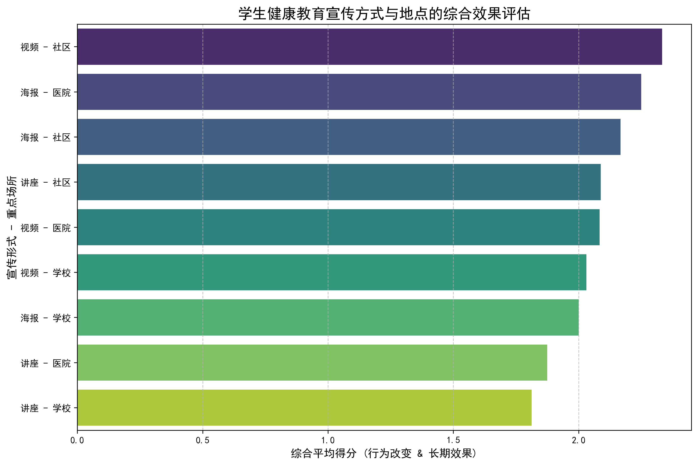

# 学生健康教育策略分析报告：如何兼顾长期效果与行为改善

## 1. 分析目标
本报告旨在通过分析健康教育数据，找出针对学生群体，在**宣传方式**与**宣传地点**上，能最大化**长期记忆效果**与**即时行为改善**的组合策略，为未来的健康教育资源投入提供数据驱动的决策支持。

## 2. 核心发现：宣传方式与地点的综合效果评估

为了量化评估效果，我们将“行为改变评估”和“长期教育效果评估”中的“显著”、“一般”、“较弱”分别赋予3分、2分、1分，并计算出不同策略组合的综合平均分。结果显示，不同宣传方式与地点的组合效果差异显著。

**图表解读：**
*   **综合效果最佳组合**：“视频 - 社区”（综合得分2.33）和“海报 - 医院”（综合得分2.25）是表现最出色的两种策略。
*   **行为改变冠军**：“视频 - 社区”在促进行为改变方面得分最高（3.0分），效果立竿见影。
*   **长期效果冠军**：“海报 - 医院”在长期效果方面得分最高（2.5分），说明其内容更容易被长久记住。
*   **效果欠佳组合**：传统的“讲座”形式，无论是在学校还是医院，其综合得分均处于较低水平，尤其“讲座 - 学校”组合得分垫底（1.81分）。

## 3. 深度洞察

1.  **“视频”重在即时冲击，“海报”强于长期记忆。**
    *   在社区播放的视频内容生动、直接，能够迅速吸引学生注意力，在促使他们改变行为（如注意个人卫生、采取防护措施）方面具有最强的驱动力。然而，其长期记忆效果相对较弱，可能因为视频信息节奏快，记忆留存度不如静态的海报。
    *   在医院这种具有天然权威性和健康警示氛围的环境中，海报内容更容易给学生留下深刻和长久的印象。

2.  **“社区”是行为改变的沃土，“学校”宣传亟待创新。**
    *   社区作为学生日常生活的重要场景，环境更为轻松，学生更愿意接受新信息并将其转化为行动。无论是视频还是海报，在社区场景下都取得了良好的行为改变效果。
    *   反观学校，虽然是学生最集中的地方，但健康教育的效果却普遍不出众。这可能是因为校内信息过载，传统的宣传方式（特别是讲座）难以在众多信息中脱颖而出，导致学生参与度和接受度不高。

## 4. 可行的健康教育策略建议

基于以上洞察，我们建议采取以下“组合拳”策略，以实现健康教育效果的最大化：

**策略一：实施“视频促动 + 海报加固”的核心策略**

*   **主阵地（社区）**：在学生经常光顾的社区活动中心、青年广场、商业街区等场所，通过电子屏幕高频次播放**短小精悍（15-30秒）、视觉冲击力强的健康教育短视频**。内容应聚焦于具体的、可操作的行为指导。
*   **辅助阵地（医院、学校）**：与视频内容相配套，设计信息简明、重点突出的**系列海报**，在医院的宣传栏、诊室门口以及学校的食堂、宿舍、教学楼等关键位置进行张贴。利用医院的权威性加深长期记忆，利用学校的高触达率巩固知识。

**策略二：革新校内宣传模式，从“灌输”到“互动”**

*   **引入高效媒体**：将效果显著的“视频”形式引入校园，在食堂、图书馆等公共区域的屏幕上滚动播放健康教育内容。
*   **创新活动形式**：摒弃效果不佳的传统讲座，改造为**健康主题辩论赛、知识竞赛、情景剧表演或同伴教育工作坊**。通过让学生亲自参与、体验和传播，将他们从被动的知识接收者转变为主动的健康倡导者，从而深化理解并促进持久的行为改变。

## 5. 结论
单一的宣传方式或地点难以同时实现最佳的长期效果和行为改善。数据表明，**最有效的策略是将“社区的视频宣传”与“医院及学校的海报宣传”相结合**。前者能有效促使学生立即行动，后者则能巩固长期记忆。同时，对传统的校内教育方式进行互动化、趣味化革新是提升整体效果的关键。
