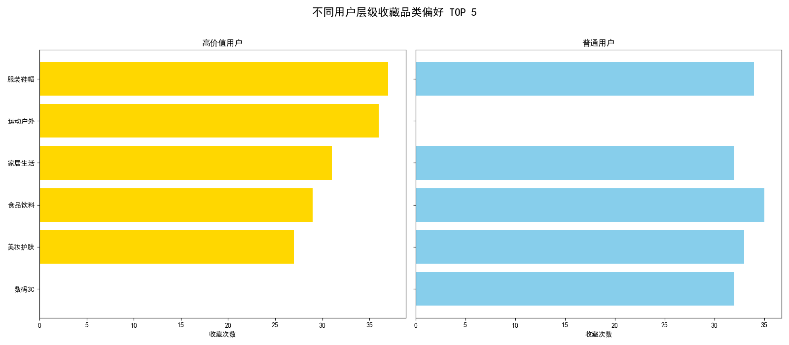
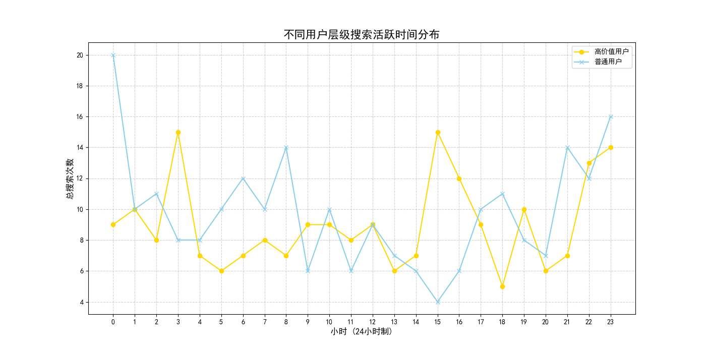

# 用户行为差异分析报告：高价值用户 vs. 普通用户

## 一、项目背景

为提升平台用户粘性和整体营收，深入理解不同价值层级用户的行为模式至关重要。本项目旨在通过对比高价值用户（钻石/白金会员）与普通用户在品类偏好及活跃时间上的差异，挖掘潜在机会点，并为精细化用户运营和商品推荐提供数据驱动的策略支持。

## 二、核心分析洞察

通过对用户收藏行为和搜索活跃时间的深度分析，我们发现了两类用户群体之间显著的行为模式差异。

### 1. 收藏品类偏好：高价值用户更关注“家”，普通用户更偏爱“美”

我们分析了不同用户层级收藏商品的品类分布，结果显示出清晰的偏好分化：

*   **高价值用户**：其收藏偏好显著集中在 **家居生活** 和 **家用电器** 两大品类上。这表明他们对提升生活品质、改善家居环境有强烈的需求和兴趣。此外，他们对 **手机数码** 产品也表现出较高的关注度。
*   **普通用户**：他们的收藏则更多地聚焦于 **美妆护肤**、**服装鞋帽** 等与个人形象相关的快消品类。这反映出普通用户群体更关注个人外在和时尚潮流。

**业务洞察**：高价值用户的消费心智更偏向于“投资家庭”，而普通用户则更倾向于“投资自己”。这种差异为品类运营和交叉营销提供了明确的方向。

### 2. 搜索活跃时间：高价值用户呈现“午高峰”与“深夜档”特征

对用户搜索行为的时间分布分析揭示了不同用户群体活跃时段的差异：

*   **高价值用户**：他们的搜索活跃度在 **午间13-14点** 出现一个明显的波峰，并在 **夜晚22点至凌晨1点** 维持一个较高的活跃水平。这可能与其工作节奏和生活习惯有关，即利用午休和睡前时间进行购物决策。
*   **普通用户**：其活跃曲线与常规电商平台的整体用户活跃规律基本一致，主要集中在 **晚间19点至22点** 的黄金时段。

**业务洞察**：高价值用户拥有独特的、更集中的购物决策时间窗口。针对这些特定时段进行精准触达，有望获得更高的转化效率。

## 三、策略与建议

基于以上洞察，我们提出以下用户分层运营策略和商品推荐优化方案：

### 1. 精细化用户运营策略

*   **针对高价值用户的“尊享家庭生活”系列活动**：
    *   **内容营销**：在午间和深夜时段，通过App Push、站内信等渠道，定向推送高品质家居、智能家电相关的评测文章、生活美学内容或新品资讯，激发其购买兴趣。
    *   **品类日/专场活动**：定期举办“智能生活节”、“家装焕新季”等主题活动，联合相关品牌为高价值用户提供专属折扣、新品优先购或大额优惠券，强化其尊贵感。
    *   **交叉销售**：在用户购买或收藏了大家电后，智能推荐相关的配件（如洗衣机罩、电视防尘罩）或场景化商品（如购买烤箱后推荐烘焙工具）。

*   **针对普通用户的“潮流美妆时尚”激励计划**：
    *   **热点追踪**：在晚间黄金时段，结合社交媒体热点，推送潮流穿搭、美妆教程等内容，并附上相关商品链接，促进冲动消费。
    *   **低门槛互动**：设计“签到领美妆蛋”、“集赞换口红”等低门槛裂变活动，利用普通用户对快消品价格敏感的特点，提升其活跃度和参与感。
    *   **满减与优惠券**：重点在服装鞋帽和美妆护肤品类发放满减券、折扣券，刺激其完成首次购买或提升客单价。

### 2. 商品推荐系统优化方案

*   **引入用户层级与时间双重权重**：
    *   **“千人千时千面”推荐**：在现有推荐算法的基础上，加入“用户层级”和“时间段”作为重要的权重因子。例如，在午间和深夜时段，为高价值用户优先推荐其偏好的家居、家电类目下的高客单价、高品质商品。
    *   **动态调整推荐池**：对于普通用户，在晚间流量高峰期，加大美妆、服饰等热销和潮流单品的曝光权重，并结合实时搜索热词进行动态调整，提升推荐的即时性和相关性。

*   **优化关联推荐与场景化推荐**：
    *   **高价值用户场景包**：围绕“客厅”、“厨房”、“卧室”等家庭场景，为高价值用户构建商品推荐组合（e.g., 购买沙发后推荐地毯、靠枕和落地灯）。
    *   **普通用户潮流搭配**：围绕“约会穿搭”、“通勤妆容”等时尚场景，为普通用户提供“一键购全套”的搭配推荐，简化决策路径，提升连带率。

## 四、总结

通过本次分析，我们清晰地描绘出高价值用户与普通用户的行为画像差异。高价值用户是“家庭品质的追求者”，拥有独特的活跃时段；而普通用户是“个人时尚的关注者”，行为模式更贴近大众。后续运营应摒弃“一刀切”的模式，转向基于用户分层的精细化、场景化和动态化的策略，从而有效提升用户粘性、促进消费转化，最终实现平台整体营收的增长。
