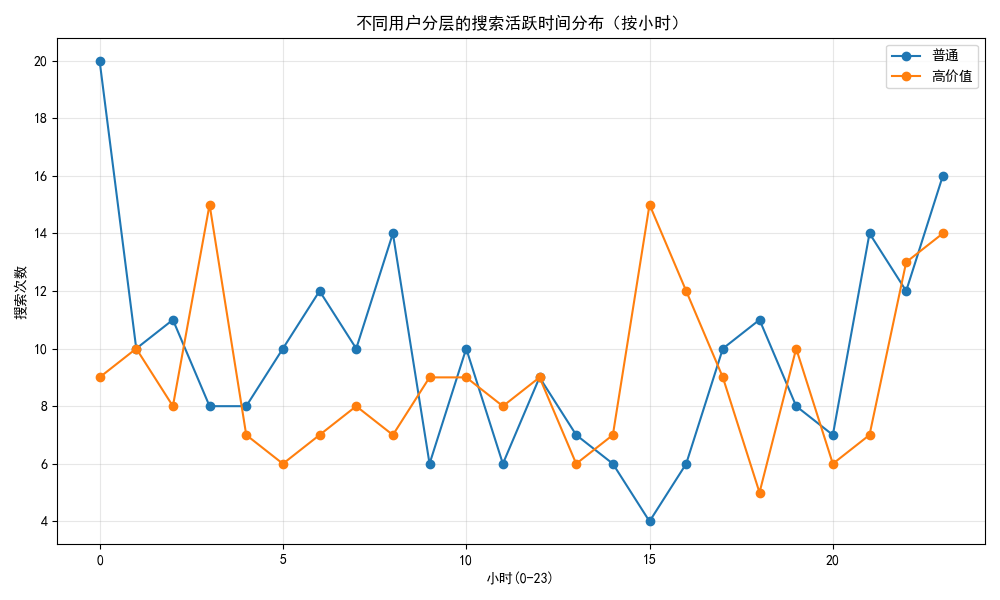
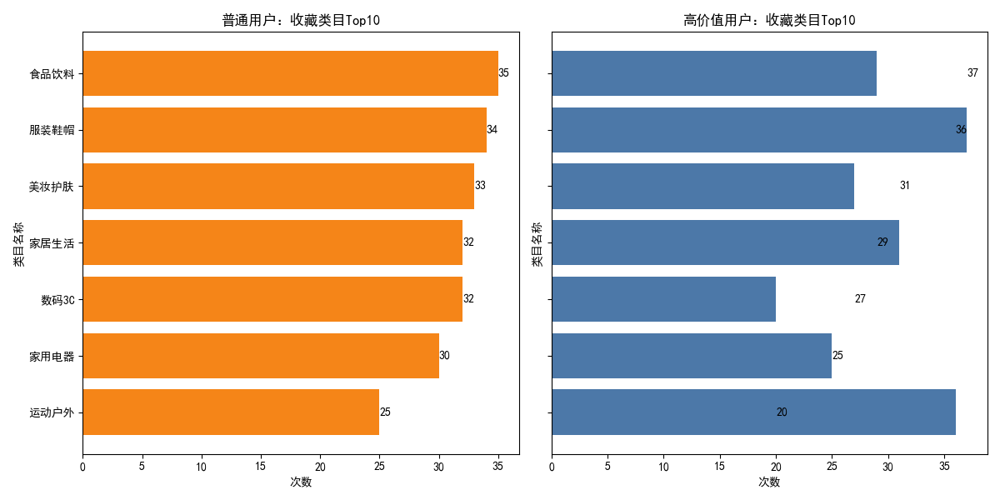
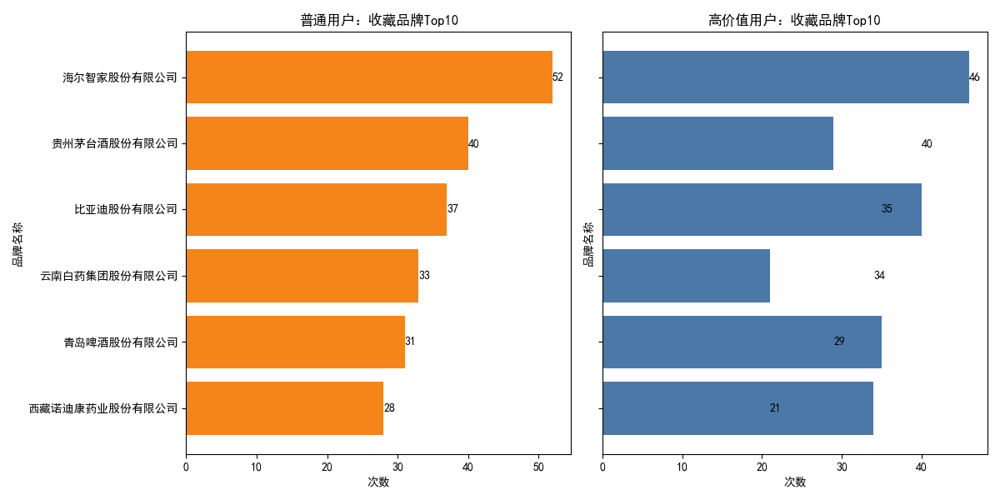

# 高价值用户（钻石/白金）与普通用户在搜索、收藏偏好与活跃时间的差异分析及运营建议

## 摘要
基于已加工的行为与商品数据，我们对高价值用户（钻石/白金）与普通用户在搜索行为（质量、活跃时段）、收藏偏好（类目与品牌）、收藏稳定度与价值偏好等进行了对比分析。核心发现：
- 高价值用户人均搜索略高、搜索更精准（无结果率更低），但整体转化率与普通用户相近。
- 两类用户的搜索高峰均集中在深夜（23点）与早晚特定时段，高价值用户在下午（15点）转化更高。
- 收藏偏好差异明显：高价值用户偏好“服装鞋帽”“运动户外”，普通用户偏好“食品饮料”“美妆护肤”“数码3C”；两类用户共同偏好品牌“海尔智家”“比亚迪”。
- 高价值用户收藏取消率更低、收藏商品均价略高，显示更强粘性与价值倾向。
- 搜索关键词与品牌/类目名无直接匹配，且“选择联想词”记录为0，提示搜索建议的交互与埋点需优化。

据此提出分层运营策略与搜索/推荐优化方案，目标在于提升用户粘性与整体营收。

---

## 数据与方法
- 数据库表：
  - 用户基本信息表（会员等级、用户ID等）
  - 搜索行为记录表（搜索时间、关键词、转化率、联想等）
  - 商品收藏表（用户ID、商品ID、收藏时间、是否取消等）
  - 商品基础信息表（品牌、类目、价格等）
- 分层定义：会员等级 ∈ {钻石, 白金} 归为“高价值”，其余为“普通”。
- 指标：
  - 搜索：人均搜索次数、平均转化率、无结果率、查看/点击/页数、活跃小时分布与Top3高峰。
  - 收藏：类目与品牌Top5偏好、收藏取消率、收藏商品均价。
  - 搜索建议：联想使用率与选择联想词占比。
- 工具：SQLite + Python（matplotlib），生成图片并保存在当前目录。

---

## 关键发现

### 1) 用户规模与搜索活跃度
- 分层用户数：普通 258，高价值 233。
- 搜索总量：普通 235，高价值 216。
- 人均搜索次数：普通 0.911，高价值 0.927（高价值略高）。
- 平均搜索转化率：普通 0.482，高价值 0.483（基本持平）。
- 无结果率：普通 0.068，高价值 0.051（高价值更精准，少走“无结果”）。
- 查看结果数（平均）：普通 29.28，高价值 28.40。
- 搜索结果页数（平均）：普通 5.67，高价值 5.64。

解读：
- 高价值用户搜索稍更频繁且更精准，但当前搜索转化率未能显著领先，提示在结果排序、商品覆盖与营销承接上仍有优化空间。

### 2) 搜索活跃时段差异与时段转化
- 普通用户Top3搜索高峰：
  - 0点（20次，转化≈0.415）
  - 23点（16次，转化≈0.545）
  - 8点（14次，转化≈0.479）
- 高价值用户Top3搜索高峰：
  - 3点（15次，转化≈0.339）
  - 15点（15次，转化≈0.551）
  - 23点（14次，转化≈0.394）

洞察：
- 两类用户均在深夜（23点）活跃，普通用户在0点也显著；高价值用户在下午（15点）具备更高转化。
- 高价值用户深夜（3点、23点）转化偏低，建议在该时段对结果页进行“低干扰高信噪”的优化与重点品牌直达入口。

可视化：不同分层的搜索活跃时间分布（小时）


### 3) 搜索关键词类型提示
- 将搜索关键词与商品基础的“品牌名称”“类目名称”做精确匹配，结果Top5为空，说明用户搜索多以“商品型号/属性/用途词”而非品牌/类目名直接检索。
- 联想使用率：普通 49.79%，高价值 54.63%。
- 选择联想词占比：两类用户均为 0.0（未被选择或未埋点到“选择”事件）。

诊断：
- 建议优化联想词的可点击性与埋点，确保“选择联想词”被记录；联想词应覆盖品牌别名、类目同义词与热门商品属性词，提高“联想→点击→转化”的漏斗承接。

### 4) 收藏偏好对比（类目）
Top5（普通）：
- 食品饮料（35）
- 服装鞋帽（34）
- 美妆护肤（33）
- 家居生活（32）
- 数码3C（32）

Top5（高价值）：
- 服装鞋帽（37）
- 运动户外（36）
- 家居生活（31）
- 食品饮料（29）
- 美妆护肤（27）

可视化：收藏类目Top10对比


解读：
- 高价值用户更偏好“服装鞋帽、运动户外”，体现“自我提升/品质生活/装备采购”的倾向。
- 普通用户“食品饮料、美妆护肤、数码3C”偏好更强，指向“高频补货/实用性消费/价格敏感”。

### 5) 收藏偏好对比（品牌）
Top5（普通）：
- 海尔智家股份有限公司（52）
- 贵州茅台酒股份有限公司（40）
- 比亚迪股份有限公司（37）
- 云南白药集团股份有限公司（33）
- 青岛啤酒股份有限公司（31）

Top5（高价值）：
- 海尔智家股份有限公司（46）
- 比亚迪股份有限公司（40）
- 青岛啤酒股份有限公司（35）
- 西藏诺迪康药业股份有限公司（34）
- 贵州茅台酒股份有限公司（29）

可视化：收藏品牌Top10对比


解读：
- 两类用户共同偏好“海尔智家、比亚迪”，可作为跨分层的“主力品牌”进行资源集中化。
- 高价值用户较多收藏“运动/健康相关品牌”（如西藏诺迪康），普通用户“食品/酒水/国货护肤品牌”热度更高。

### 6) 收藏稳定度与价值偏好
- 收藏取消率：普通 52.94%，高价值 46.83%（高价值更稳）。
- 收藏商品均价：普通 2538.18，高价值 2569.70（高价值略高，显示价值偏好）。
- 结论：高价值用户在收藏上的“意向稳定度”更好，适合承接更高客单价与长期复购策略；普通用户取消率偏高，需要用“价格信号与补货便利”降低犹豫。

---

## 为什么会出现这些差异？
- 搜索意图与词汇结构差异：高价值用户更熟悉品牌与型号（导致无结果率更低），普通用户受价格与促销刺激，词汇更泛、更生活化。
- 消费场景差异：高价值用户在“运动户外”“服装鞋帽”上偏好，体现注重品质与生活方式；普通用户的“食品饮料”“美妆护肤”“数码3C”偏好，反映补货与实用性驱动。
- 时段行为习惯不同：高价值用户的有效转化出现在下午（15点），可能与工作日程与理性决策窗口相关；普通用户的夜间搜索更活跃且转化可观（23点），符合“放松后消费”的习惯。

---

## 可操作的分层运营策略与商品推荐优化

### A. 高价值用户（钻石/白金）
- 时段化运营：
  - 15点推出“品质精选/装备升级专场”，提高承接效率（该时段转化≈0.551）。
  - 23点与凌晨时段优化结果页：减少噪音推荐，增加“VIP品牌直达入口”和快捷对比功能，提高低转化时段的效率。
- 商品推荐：
  - 强化“服装鞋帽、运动户外”的深度陈列与穿搭/装备套装推荐。
  - 高客单价品牌（海尔智家、比亚迪）做“价格保护+延保+以旧换新”权益版块，提升决策信心。
- 会员权益与粘性：
  - 根据较低取消率与较高均价，推“价格提醒+到货保障+个性化售后”组合，促进复购与增购。

### B. 普通用户
- 时段化运营：
  - 23点与0点重点投放“夜间零食/酒水/美妆直降”，8点做“上班族3C配件/补给快抢”，贴合高峰与转化表现。
- 商品推荐：
  - 针对“食品饮料、美妆护肤、数码3C”做“多件多折/组合包”，降低收藏取消与犹豫。
  - 增加“价格阶梯与替代品推荐”，提高承接多价位需求的能力。
- 粘性提升：
  - 建立“收藏降价/补货提醒”，与“购物清单一键补齐”，减少取消与提高下单率。

### C. 搜索体验与商品推荐系统的共性优化
- 联想与同义词体系：
  - 扩展品牌别名、类目同义词、属性词（如“家电→海尔、型号→X1、容量→4L”），降低“无结果率”并提升联想点击承接。
  - 目标：普通用户无结果率由6.8%下降至≤5%，联想选择率提升至10-15%。
- 联想交互与埋点：
  - 将联想词强制设置为可点击并记录“选择联想词”，在结果页上突出联想词带来的召回与排序优势。
- 结果页排序策略（规则引擎，无需训练）：
  - 高价值用户在“运动户外、服装鞋帽”品类提升品牌权重与评论质量权重；普通用户在“食品饮料、美妆护肤、数码3C”提升促销/价格信号权重。
- 品牌经营：
  - 对共同偏好品牌（海尔智家、比亚迪）做跨分层主题活动；在高价值用户中加强“健康/户外”品牌组，在普通用户中加强“酒水/国货美妆”品牌组。

---

## 影响预测（定性）
- 通过时段化运营与高/低价位承接策略，预计整体转化率将提升，普通用户的收藏取消率有望下降5-10%，高价值用户的客单价与复购率有望提升。
- 联想词优化与同义词覆盖可有效减少“无结果”与“低效浏览”，增强搜索到达商品的效率，从而提升营收。

---

## 监控与后续迭代建议
- A/B验证：对时段化活动与联想交互改造进行分层A/B，监控转化、收藏取消率与GMV变化。
- 指标跟踪：分层监控无结果率、联想使用与选择率、收藏稳定度（取消率）、收藏均价、分品类GMV。
- 数据完善：对“选择联想词”进行埋点修复；构建品牌/类目同义词字典与属性词映射表。

---

## 可视化生成代码片段（示例）
注：实际生成的图片已保存在当前目录。示例代码展示绘图设置与一张分层小时分布图的生成方式。

```python
import sqlite3
import pandas as pd
import matplotlib.pyplot as plt

# 保证中文显示
plt.rcParams['font.sans-serif'] = ['SimHei']
plt.rcParams['axes.unicode_minus'] = False

conn = sqlite3.connect('dacomp-045.sqlite')
sql = """
SELECT
  CASE WHEN u.会员等级 IN ('钻石','白金') THEN '高价值' ELSE '普通' END AS segment,
  CAST(strftime('%H', s.搜索时间) AS INTEGER) AS hour,
  COUNT(*) AS cnt
FROM 搜索行为记录表 s
JOIN 用户基本信息表 u ON s.用户ID = u.用户ID
GROUP BY 1,2
ORDER BY 2;
"""
df = pd.read_sql(sql, conn)
pivot_hours = df.pivot_table(index='hour', columns='segment', values='cnt', aggfunc='sum').fillna(0)

plt.figure(figsize=(10,6))
for seg in pivot_hours.columns:
    plt.plot(pivot_hours.index, pivot_hours[seg], marker='o', label=seg)
plt.title('不同用户分层的搜索活跃时间分布（按小时）')
plt.xlabel('小时(0-23)')
plt.ylabel('搜索次数')
plt.legend()
plt.grid(alpha=0.3)
plt.tight_layout()
plt.savefig('search_hour_distribution.png')
```

---

## 结论
高价值用户与普通用户在搜索、收藏与时段上呈现出清晰的差异。针对这些差异进行分层运营与搜索/推荐系统优化，有望同时提升用户粘性与营收。优先落地的抓手包括：时段化运营（15点/23点）、联想与同义词体系建设、收藏取消率治理与价格信号优化、共同偏好品牌的跨分层活动。以上建议无需复杂模型训练，能够以规则与埋点优化快速试点并迭代提效。
