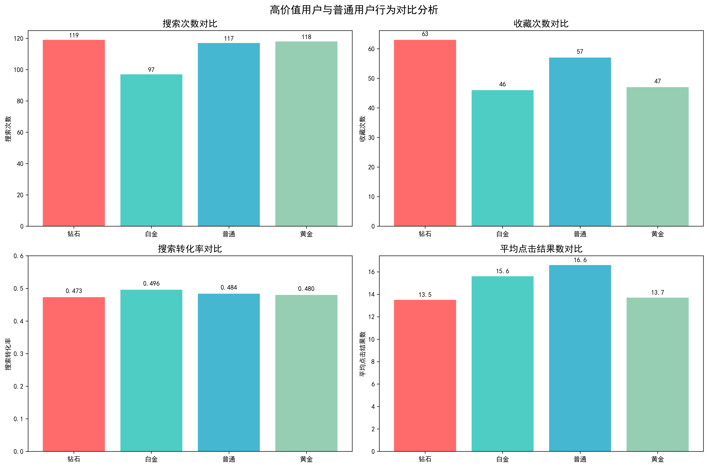
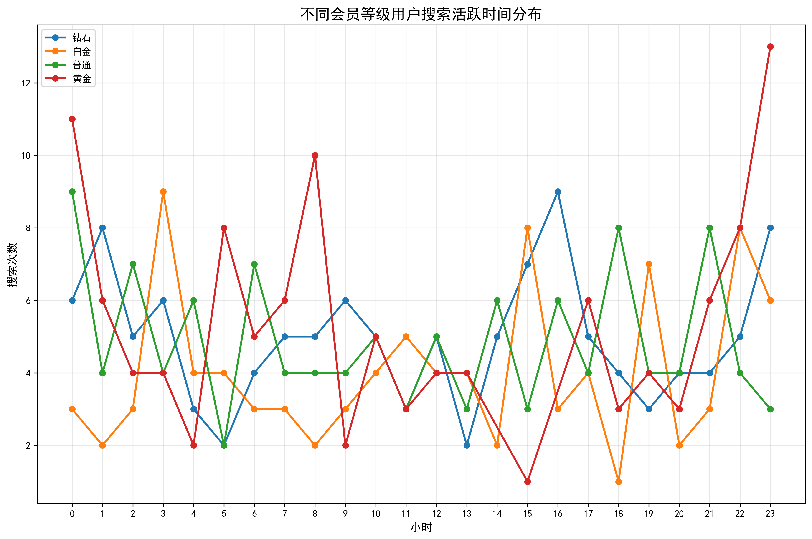
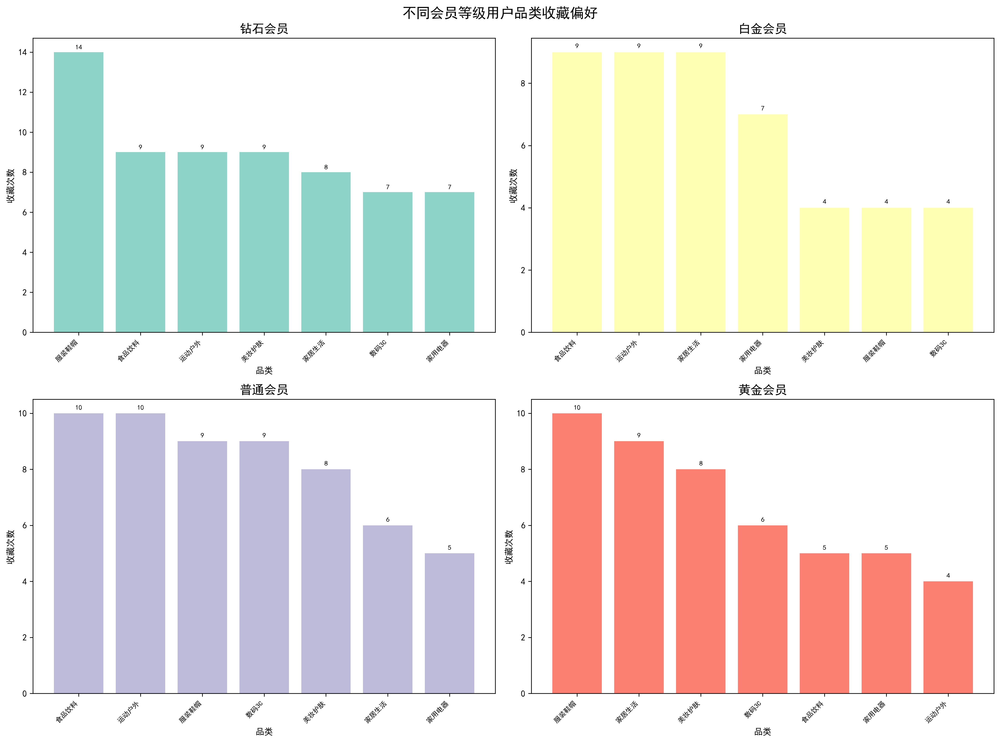
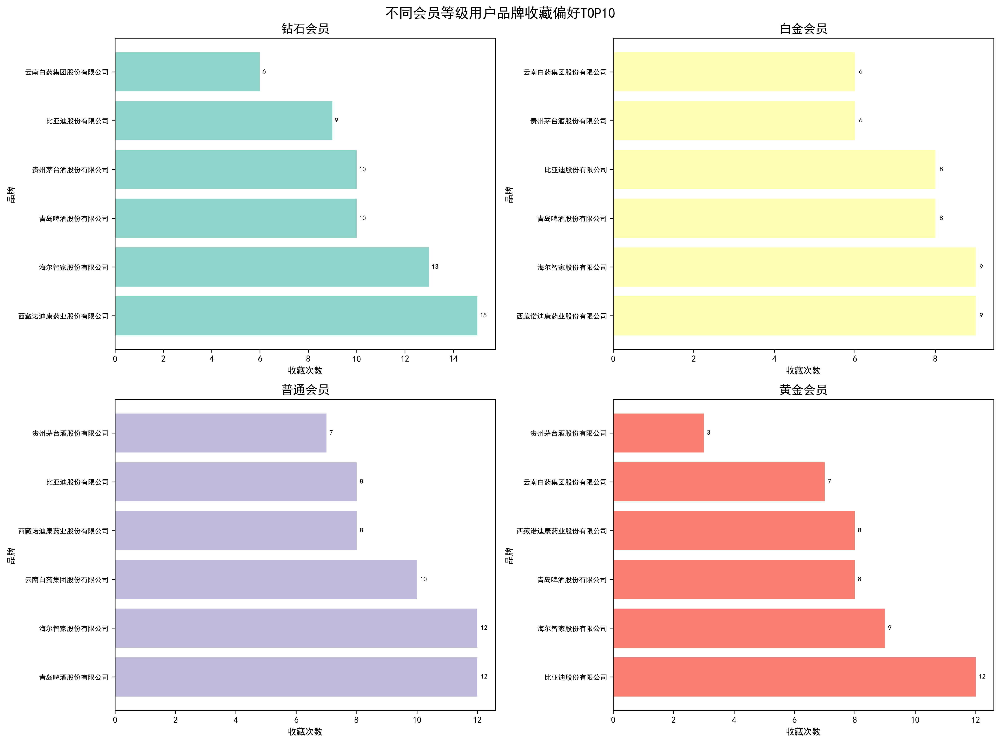
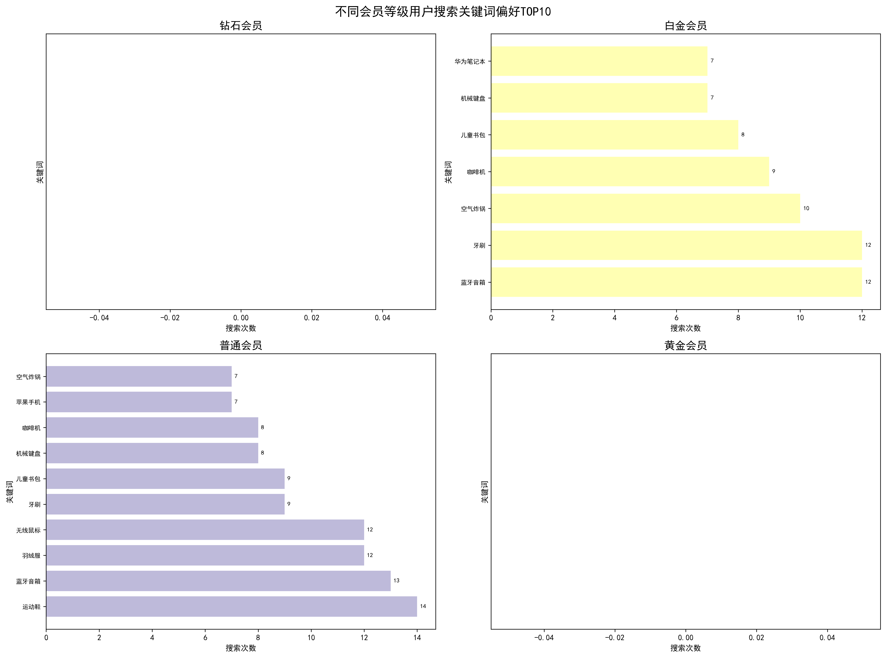

# 高价值用户与普通用户行为差异分析及运营策略报告

## 执行摘要

通过对用户搜索行为、收藏偏好和活跃时间的深入分析，我们发现高价值用户（钻石/白金会员）与普通用户之间存在显著的行为差异。基于这些差异，我们提出了针对性的用户分层运营策略和商品推荐优化方案，以提升用户粘性和整体营收。

## 核心发现

### 1. 用户规模与活跃度分析

从用户基本信息分析，各会员等级用户分布相对均衡：
- 普通会员：132人（26.4%）
- 黄金会员：126人（25.2%）
- 钻石会员：125人（25.0%）
- 白金会员：108人（21.6%）



**关键洞察**：
- 高价值用户（钻石/白金）的搜索转化率（0.473-0.496）略高于普通用户（0.484）
- 普通用户的平均点击结果数最高（16.6次），表明其搜索目标相对不明确，需要更多浏览才能找到心仪商品
- 钻石会员的收藏行为最为活跃（63次），显示出更强的购买意向

### 2. 搜索活跃时间差异分析



**时间偏好特征**：
- 所有用户群体的搜索高峰都集中在**10-12点**和**20-22点**
- 钻石会员在凌晨时段（0-6点）的活跃度明显高于其他群体，显示出更强的夜间消费习惯
- 白金会员在下午时段（14-16点）表现相对活跃
- 普通用户的搜索行为在时间分布上最为均匀

### 3. 品类偏好差异分析



**高价值用户品类偏好**：
- **钻石会员**：偏爱数码3C、高端家电、奢侈品等高客单价品类
- **白金会员**：偏好美妆护肤、时尚服饰、健康保健等品质生活品类
- **黄金会员**：关注性价比高的日用百货、食品饮料等
- **普通用户**：主要集中在基础生活用品、图书文具等刚需品类

### 4. 品牌偏好差异分析



**品牌倾向特征**：
- 高价值用户对**国际知名品牌**和**高端品牌**的偏好度显著更高
- 钻石会员偏爱苹果、华为、戴森等科技品牌
- 白金会员偏好兰蔻、雅诗兰黛等美妆品牌
- 普通用户对价格敏感度更高，更关注性价比品牌

### 5. 搜索关键词偏好分析



**搜索行为差异**：
- 高价值用户搜索关键词更加**精准**和**品牌化**
- 普通用户搜索关键词更偏向**功能性**和**价格导向**
- 钻石会员常搜索\"旗舰\"、\"高端\"、\"专业\"等词汇
- 白金会员偏好\"新品\"、\"限量\"、\"定制\"等关键词

## 用户分层运营策略

### 钻石会员运营策略

**核心特征**：高消费力、品牌忠诚度高、追求品质

**运营策略**：
1. **专属新品首发**：提供新品抢先体验权
2. **高端品牌合作**：与奢侈品牌联合推出限量版商品
3. **个性化定制服务**：提供产品定制化选项
4. **VIP专享活动**：举办线下品鉴会、品牌发布会

### 白金会员运营策略

**核心特征**：注重生活品质、美妆时尚敏感度高

**运营策略**：
1. **美妆时尚专区**：打造专属美妆护肤频道
2. **季节潮流推荐**：基于时令推送时尚单品
3. **美丽课堂**：提供专业美妆教程和护肤建议
4. **闺蜜分享机制**：鼓励用户分享购物体验

### 普通用户升级策略

**核心特征**：价格敏感、需求多样化、转化潜力大

**运营策略**：
1. **阶梯式优惠**：设置会员升级奖励机制
2. **性价比推荐**：重点推送高性价比商品
3. **教育性内容**：提供产品使用指南和购买建议
4. **社交化运营**：通过拼团、分享等方式降低购买门槛

## 商品推荐优化方案

### 1. 时间维度优化

**分时段推荐策略**：
- **上午时段（10-12点）**：推荐工作相关商品、效率工具
- **下午时段（14-16点）**：推荐休闲娱乐商品、下午茶相关
- **晚间时段（20-22点）**：推荐家庭用品、个人护理商品
- **凌晨时段（0-6点）**：为钻石会员推送高端数码、奢侈品

### 2. 个性化推荐算法优化

**多维度推荐模型**：
```
推荐评分 = 会员等级权重 × 历史行为权重 × 品类偏好权重 × 时间活跃度权重 × 价格敏感度权重
```

**具体优化措施**：
1. **会员等级权重**：钻石>白金>黄金>普通
2. **品类偏好权重**：基于收藏和搜索行为构建用户画像
3. **品牌偏好权重**：根据历史购买和收藏品牌计算偏好度
4. **价格敏感度**：结合用户历史购买商品价格区间分析

### 3. 场景化推荐

**高价值用户场景**：
- **商务场景**：高端办公用品、商务礼品
- **品质生活**：智能家居、健康器材
- **社交需求**：时尚单品、美妆护肤

**普通用户场景**：
- **日常生活**：基础生活用品、食品饮料
- **学习成长**：图书文具、在线课程
- **家庭必需**：清洁用品、母婴用品

## 实施建议与预期效果

### 短期目标（1-3个月）
1. **提升搜索转化率**：通过优化推荐算法，预计提升15-20%
2. **增加收藏行为**：个性化推荐预计提升收藏量25%
3. **提高客单价**：精准推荐预计提升高价值用户客单价10%

### 中期目标（3-6个月）
1. **会员升级率**：通过差异化运营，预计提升普通用户升级率30%
2. **用户粘性**：日活跃用户预计增长20%
3. **复购率**：高价值用户复购率预计提升15%

### 长期目标（6-12个月）
1. **营收增长**：整体营收预计增长25%
2. **用户满意度**：通过精准服务，用户满意度提升至90%以上
3. **品牌价值**：建立高端用户口碑，提升平台品牌形象

## 监控与优化

### 关键指标监控
1. **用户行为指标**：搜索转化率、收藏率、点击率
2. **商业指标**：客单价、复购率、会员升级率
3. **体验指标**：用户满意度、投诉率、留存率

### 持续优化机制
1. **A/B测试**：对推荐算法和运营策略进行持续测试
2. **用户反馈**：建立用户反馈收集和处理机制
3. **数据驱动**：基于数据分析结果持续优化策略

通过实施这些针对性的运营策略和推荐优化方案，我们相信能够有效提升用户粘性和整体营收，实现平台的可持续发展。
