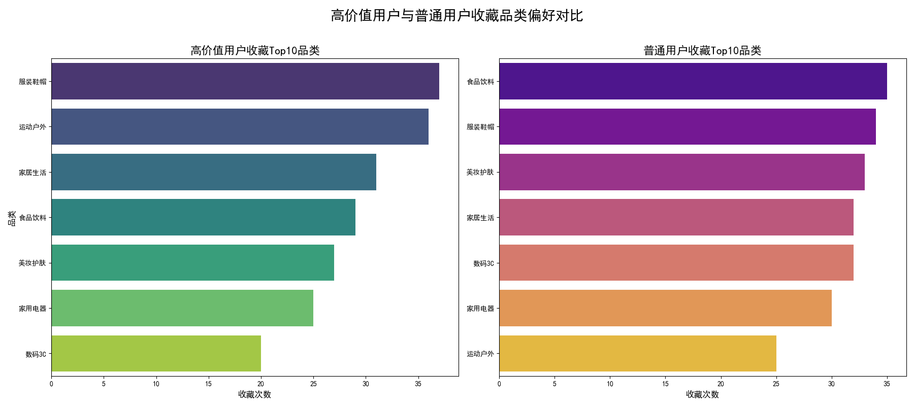

"""
# **高价值用户与普通用户行为差异分析报告**

## 一、分析背景与目标

为了有效提升平台的用户粘性与整体营收，我们必须理解不同用户群体的行为模式。本报告旨在深入分析高价值用户（钻石/白金会员）与普通用户在**搜索行为、收藏偏好及活跃时间**上的显著差异。通过这些洞察，我们将为精细化的用户分层运营和商品推荐优化提供数据驱动的策略支持。

---

## 二、核心洞察

### 洞察一：品类与品牌偏好存在显著分层

通过对用户的收藏和搜索行为进行分析，我们发现高价值用户与普通用户的消费心智和兴趣点存在清晰的界限。

#### 1. 收藏品类与品牌偏好：高价值用户更垂直，普通用户更泛化

