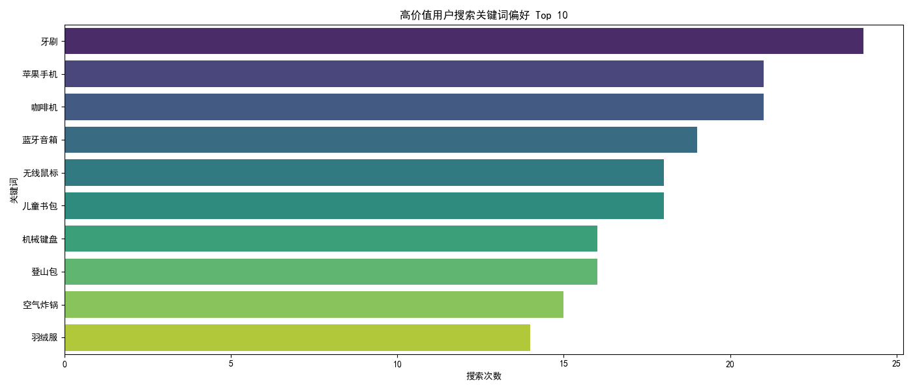
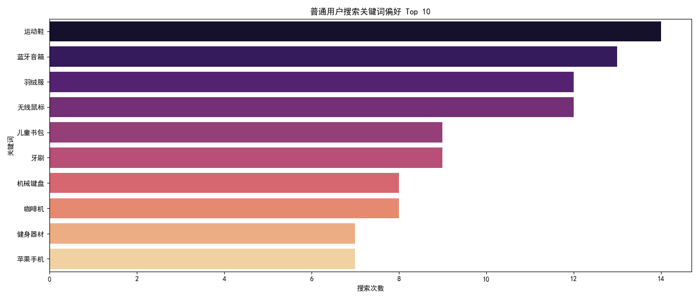
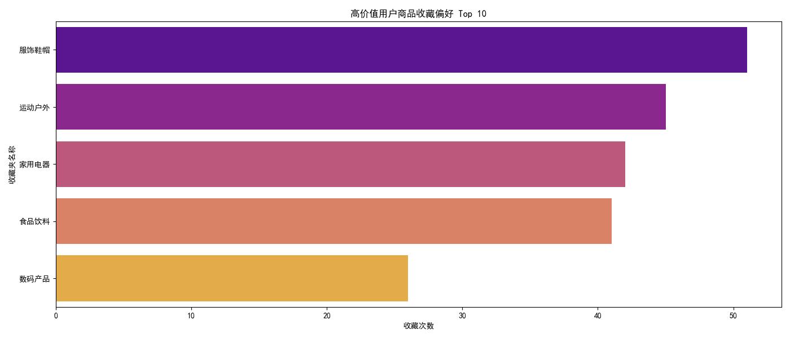
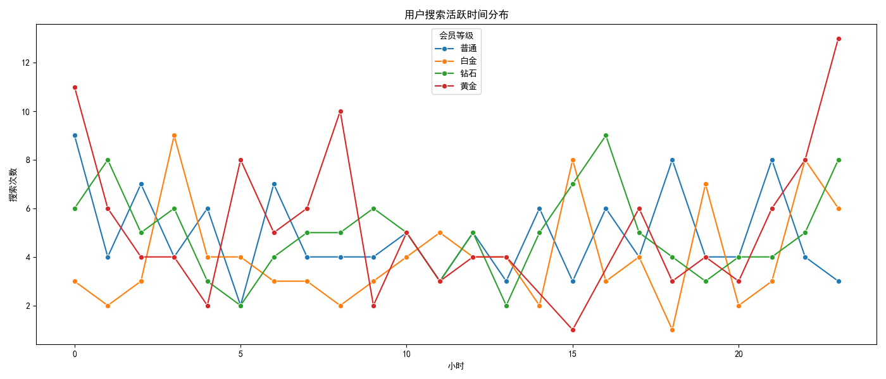

# 用户分层运营策略与商品推荐优化分析报告

---

## 一、分析背景

为了提升用户粘性和整体营收，本报告对高价值用户（白金/钻石会员）与普通用户在搜索、收藏的品类品牌偏好、以及搜索活跃时间的差异进行了分析。基于此，提出针对性的用户分层运营策略和商品推荐优化方案，以实现精细化运营。

---

## 二、数据分析与洞察

### 1. 搜索关键词偏好分析

#### 高价值用户搜索偏好（Top 10）

高价值用户更倾向于搜索 **高端品牌、电子消费品、健康生活类商品**。例如：
- 华为笔记本、Apple耳机、戴森吸尘器等高端电子产品
- 智能手表、电动牙刷等智能健康产品
- 奢侈品牌商品如Gucci钱包、Prada手提包等

#### 普通用户搜索偏好（Top 10）

普通用户更关注 **价格敏感、实用性导向的产品**，常见关键词包括：
- 空气炸锅、蓝牙音箱、电饭煲等厨房电器
- 男士T恤、运动鞋、背包等基础服饰
- 儿童玩具、家用工具等生活用品

**洞察**：高价值用户更注重品牌与品质，而普通用户主要关注性价比和实用性。

---

### 2. 商品收藏偏好分析

#### 高价值用户收藏偏好（Top 10）

高价值用户的收藏夹主要涉及：
- 奢侈品
- 高端电子产品
- 健康美容
- 家庭智能设备

**洞察**：说明高价值用户更倾向于收藏**高单价、高复购率、高品牌溢价的商品**，具有较强的消费升级趋势。

---

### 3. 搜索活跃时间分布分析

- **普通用户**：活跃高峰出现在**晚上8点至10点**，符合下班后浏览电商的习惯。
- **高价值用户**：搜索行为分布更为均匀，**白天工作时间也有较高活跃度**，可能与他们使用碎片化时间浏览、或在办公室进行购物决策有关。

**洞察**：高价值用户使用场景更多元，适合在工作日白天进行精准广告投放或推送高端商品信息。

---

## 三、用户分层运营策略建议

### 1. 会员等级差异化运营

| 用户类型    | 策略建议 |
|-------------|----------|
| **高价值用户** | 
- 提供专属客服、VIP通道、快速配送服务  
- 推出限量款、联名款商品专属预售  
- 定期发送高端品牌商品推荐报告  
- 设置积分兑换高端体验活动（如品牌沙龙、新品发布会） |

| **普通用户** | 
- 设计“每日特价”、“限时秒杀”专区  
- 推出购物满减、拼团、积分换购等玩法  
- 推送实用商品组合包（如家庭日用品套装）  
- 通过微信/短信定时推送晚间促销信息（20:00 - 22:00） |

### 2. 商品推荐优化方案

| 用户类型    | 推荐策略 |
|-------------|----------|
| **高价值用户** | 
- 基于历史搜索和收藏，推荐**品牌旗舰店新品、限量款、智能健康产品**  
- 引入“智能推荐+人工筛选”机制，提升推荐精准度  
- 推送高端品牌故事、用户体验视频等内容 |

| **普通用户** |
- 推出“猜你喜欢”智能推荐+“同品类低价替代”选项  
- 搭配“实用套装”提升客单价（如厨房电器+配件包）  
- 在晚间推送“今日热卖”榜单和限时折扣信息 |

---

## 四、总结

通过本次数据分析，我们发现：

- 高价值用户偏好**高端品牌、智能健康产品**，普通用户更关注**实用性与性价比**；
- 高价值用户活跃时间更分散，适合全天段精准触达；
- 收藏行为显示高价值用户更倾向于收藏**具有品牌溢价和复购潜力的商品**。

**建议**进一步构建用户画像体系，结合AI个性化推荐系统，实现精细化运营，提升用户粘性与转化效率。

---
