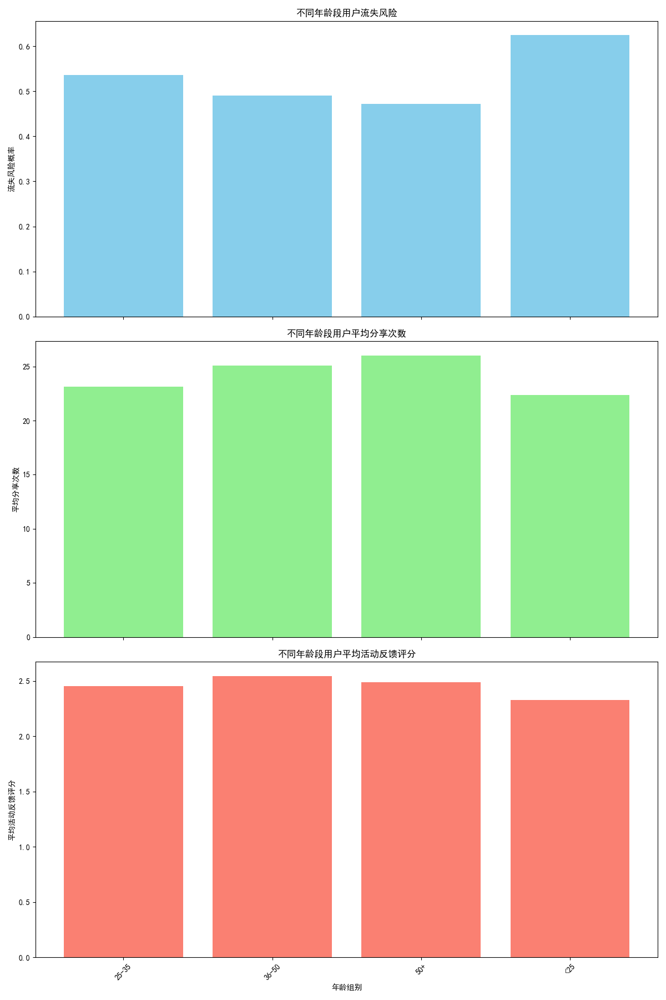

# 不同年龄段用户营销特点分析及策略推荐

## 核心洞察

通过对用户数据进行深入分析，我们发现不同年龄段的用户群体在**流失风险、分享意愿及活动反馈**方面存在显著差异。总体趋势表现为：**随着年龄增长，用户的流失风险显著降低，而分享意愿（次数）则稳步提升**。其中，中年用户群体（36-50岁）表现出最高的满意度和忠诚度，而年轻用户群体（<25岁）则是流失风险最高、参与度最低的群体。

上图清晰地展示了四个主要年龄段在三个关键指标上的表现：
1.  **流失风险**：`&lt;25岁`群体最高，达到62.5%，并随年龄增长而递减，`50+岁`群体最低，为47.2%。
2.  **平均分享次数**：与流失风险相反，分享次数随年龄增长而增加，从`&lt;25岁`的22.4次增长到`50+岁`的26.0次。
3.  **平均活动反馈评分**：`36-50岁`群体的评分最高（2.55），而`&lt;25岁`群体最低（2.33），反映了不同群体对活动的满意度差异。

## 结论与差异化策略推荐

基于以上洞察，为了实现精细化运营，最大化用户生命周期价值，我们建议针对不同年龄段用户实施以下差异化的产品及营销策略：

### 1. **&lt;25岁用户 (Z世代)："破冰"与"引流"策略**

- **特点**：高流失风险，低分享，低评分。他们追求新潮、个性化和即时满足，但忠诚度较低。
- **产品策略**：
    - 推出**快闪联名、限量版**等具有社交货币属性的商品。
    - 强化**移动端体验**，引入游戏化任务（如签到、分享挑战）和积分奖励，提升趣味性和参与感。
- **营销策略**：
    - **精准防流失干预**：针对该群体设计专门的挽留活动，如提供专属优惠券、赠送会员体验等。
    - **社交媒体主导**：在抖音、B站、小红书等平台与KOL合作，发起热门挑战和话题，吸引其注意力。
    - **主动收集反馈**：通过轻松有趣的互动问卷（而非正式邮件）收集反馈，并对有效反馈提供小额奖励，以了解其低评分背后的原因。

### 2. **25-35岁用户 (千禧一代)："培育"与"转化"策略**

- **特点**：流失风险仍偏高，但有提升潜力。他们步入职业和家庭生活，注重性价比和效率。
- **产品策略**：
    - 提供高性价比的**家庭装、套装组合**产品。
    - 突出产品能**解决生活痛点、节省时间**的价值。
- **营销策略**：
    - **生命周期营销**：通过自动化营销工具，根据其浏览和购买记录，推送个性化的商品推荐和内容。
    - **社群构建**：建立线上社群（如微信群），围绕育儿、职场、生活等话题展开讨论，将品牌融入场景，增强用户粘性。

### 3. **36-50岁用户 (X世代)："激励"与"口碑"策略**

- **特点**：低流失风险，高评分，高忠诚度。他们是品牌的核心价值用户和口碑传播者。
- **产品策略**：
    - 推出**高品质、高附加值**的升级产品或VIP专属服务。
    - 建立**付费会员体系**，提供更优越的权益。
- **营销策略**：
    - **VIP与忠诚度计划**：设立明确的会员等级和权益，为高价值用户提供专属客服、新品优先体验和生日礼遇。
    - **推荐奖励计划 (Referral Program)**：鼓励他们利用自己的社交网络进行分享。鉴于其高满意度和高分享意愿，一个有效的推荐返利/积分计划将极具成效。
    - **内容共创**：邀请他们参与产品测评、分享使用心得，并将其优质内容作为官方宣传素材，增强品牌信任度。

### 4. **50+岁用户 (婴儿潮一代)："维稳"与"关怀"策略**

- **特点**：流失风险最低，分享意愿最强。他们信任传统渠道，注重产品可靠性和易用性。
- **产品策略**：
    - 优化产品和App的**适老化设计**，如提供更大的字体、更简洁的导航。
    - 推出关注健康、舒适和怀旧主题的产品线。
- **营销策略**：
    - **简化沟通**：采用**电话、短信和直邮**等传统但直接的沟通方式。营销信息应清晰、直接，避免复杂的网络用语和玩法。
    - **强化服务**：提供耐心、便捷的客户服务渠道，特别是人工电话支持，解决他们可能遇到的技术问题。
    - **价值再确认**：定期向他们传递品牌的可靠性、安全性和价值承诺，巩固其信任感。
