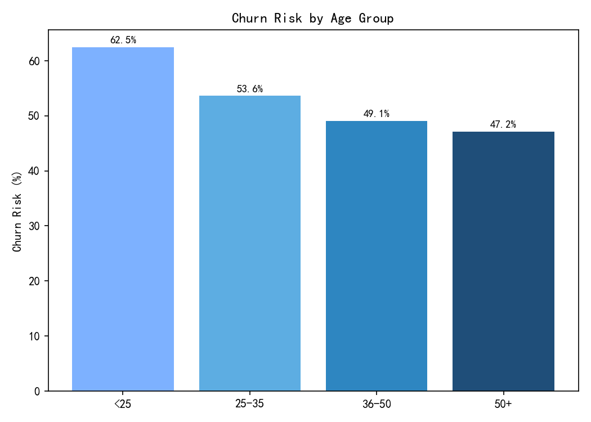
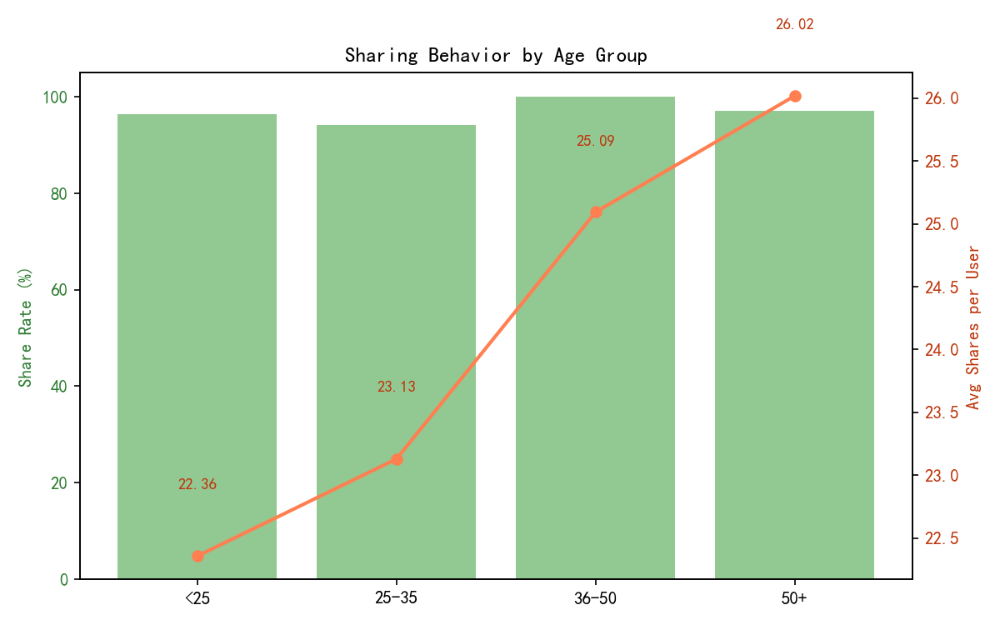
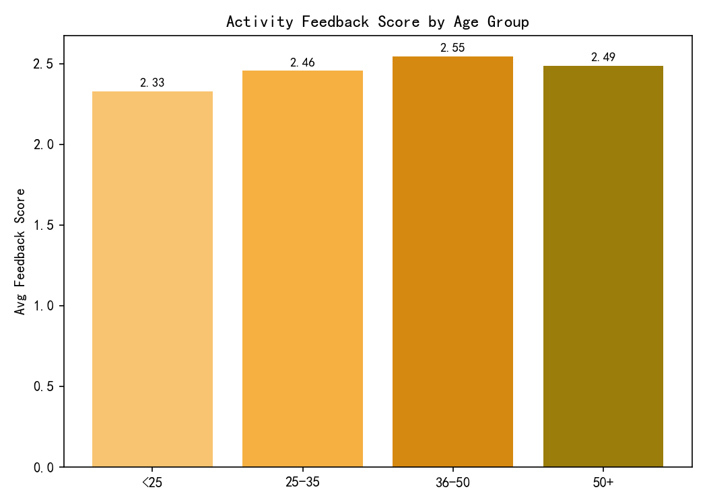
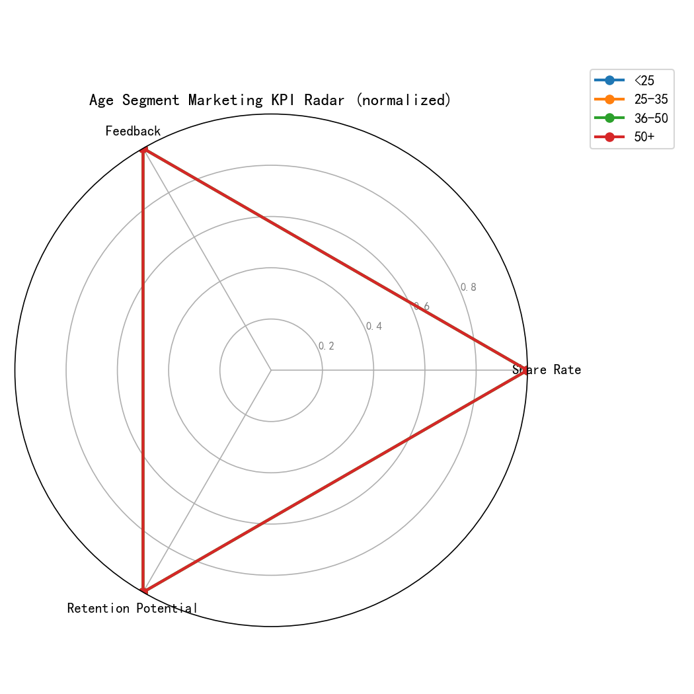
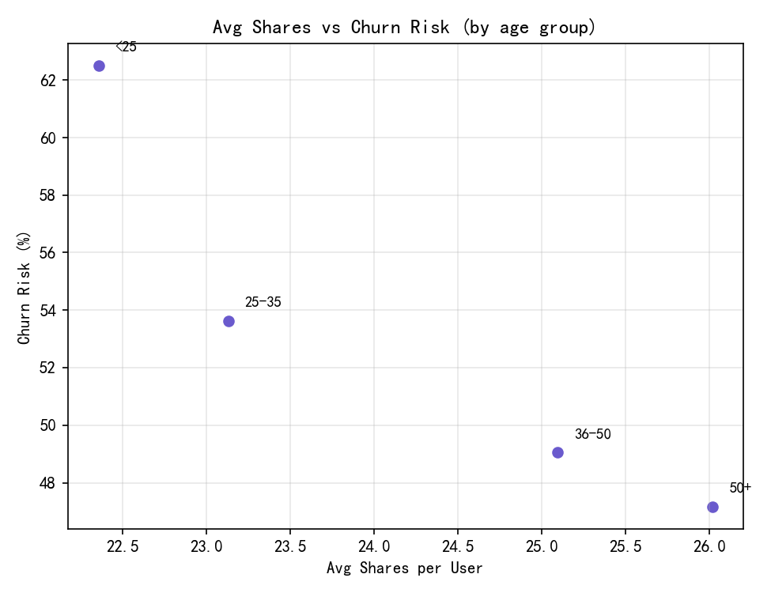

# 年龄段用户群体的营销特点与差异化策略建议

## 摘要
基于“用户基本信息表1”“用户标签表”“营销活动交互表”联表分析，我们在年龄组别维度评估了：
- 流失风险率（是否流失风险用户的比例）
- 分享率（有过分享行为的用户比例）
- 人均分享次数（用户层面的总分享次数均值）
- 活动反馈评分（用户层面的平均反馈评分，再在年龄段聚合）
- 屏蔽率（是否屏蔽过活动的用户比例）

核心发现：
- 流失风险与分享活跃度、反馈评分呈强负相关：avg_shares vs churn_rate 相关系数约 -0.928；avg_feedback vs churn_rate 约 -0.927，提示提升分享和正向反馈与降低流失高度相关。
- 年龄段画像显著不同：<25 流失最高且反馈最低；36-50 与 50+ 流失较低、分享最活跃、反馈较高；25-35 屏蔽率最高，存在信息疲劳与内容相关性问题。

可视化文件：
- 年龄段流失风险率图：age_churn_rate.png
- 分享率与人均分享次数（双轴）：age_share_behavior.png
- 平均反馈评分：age_feedback_score.png
- 年龄段营销KPI雷达图：age_marketing_radar.png
- 分享活跃度与流失风险关系散点：share_vs_churn_scatter.png

## 方法与口径
- 数据来源与字段：
  - 年龄组别：来自“用户基本信息表1”
  - 流失风险：来自“用户标签表”的“是否流失风险用户”（是/否）
  - 分享行为与反馈评分：来自“营销活动交互表”的“分享次数”“活动反馈评分”
  - 屏蔽率：来自“营销活动交互表”的“是否屏蔽活动”（是/否）
- 计算逻辑：
  - 流失风险率 = 该年龄段标记为“流失风险”的用户数 / 该年龄段用户总数
  - 分享率 = 该年龄段中“分享次数>0”的用户数 / 该年龄段用户总数
  - 人均分享次数 = 该年龄段所有用户的总分享次数 / 用户数
  - 平均反馈评分 = 先按用户平均，再在年龄段取均值
  - 屏蔽率 = 该年龄段中曾“屏蔽活动”的用户数 / 用户总数

## 关键指标（按年龄段）
样本规模（用户数）：50+（106）、36-50（106）、25-35（69）、<25（56）

- <25
  - 流失风险率 ≈ 62.5%
  - 分享率 ≈ 96.4%，人均分享 ≈ 22.36
  - 平均反馈评分 ≈ 2.33（最低）
  - 屏蔽率 ≈ 0%
- 25-35
  - 流失风险率 ≈ 53.6%
  - 分享率 ≈ 94.2%，人均分享 ≈ 23.13
  - 平均反馈评分 ≈ 2.46
  - 屏蔽率 ≈ 4.35%（最高）
- 36-50
  - 流失风险率 ≈ 49.1%
  - 分享率 ≈ 100%，人均分享 ≈ 25.09
  - 平均反馈评分 ≈ 2.55（最高）
  - 屏蔽率 ≈ 3.77%
- 50+
  - 流失风险率 ≈ 47.17%（最低）
  - 分享率 ≈ 97.17%，人均分享 ≈ 26.02（最高）
  - 平均反馈评分 ≈ 2.49
  - 屏蔽率 ≈ 1.89%（最低）

## 可视化
- 年龄段流失风险率分布
  
- 分享率与人均分享次数（双轴对比）
  
- 年龄段平均反馈评分
  
- 年龄段营销KPI雷达（标准化）
  
- 人均分享次数与流失风险的关系（诊断性散点）
  

## 诊断性洞察（为什么）
1. 分享活跃度与留存潜力密切相关  
   - 相关性强负向（-0.928），年龄段越活跃分享，流失越低。分享行为可能与用户的社会影响力、社交嵌入度、活动参与度相伴随，增强平台黏性与认同感。

2. 反馈评分与流失风险负相关（-0.927）  
   - 反馈评分较高的年龄段（36-50、50+）流失更低，说明活动体验质量（内容匹配、流程顺畅、奖品吸引力）是降低流失的关键。

3. <25 高流失、低反馈，但分享率不低  
   - 虽然愿意分享，但对活动质量/内容满意度低，可能偏好更强的互动、即时奖励与社交玩法；当前活动内容对年轻用户的匹配度不足。

4. 25-35 屏蔽率最高  
   - 暴露出信息疲劳或内容相关性不佳。该群体通常时间紧张、目标导向，过多泛化营销干扰其体验，应针对性降低打扰并强化实用价值。

5. 36-50 与 50+ 反馈更高且分享更活跃  
   - 对价值型内容（实惠、稳定、品质保障）敏感，且社交网络可能稳固，分享意愿强。可通过口碑与社区传播进一步固化低流失优势。

## 预测性推理与试验建议
- 基于强负相关关系，提升人均分享次数与反馈评分有望降低流失。由于相关性不等于因果，建议采用分年龄段的A/B测试：
  - 分享机制优化实验：在<25与25-35分组中测试“分享任务+即时激励（优惠券、积分、抽奖）”，目标提升人均分享次数5%-10%，观察4周滚动窗口的流失率变化。
  - 活动内容优化实验：按年龄段定制文案与权益，目标将反馈评分提升0.1-0.2分，监测对应的流失率变化与二次参与率。

## 规范性建议：差异化产品与营销策略

- <25（高流失、低反馈、分享不弱）
  - 产品/活动：加强游戏化与互动性（闯关、榜单、PK挑战）、校园/社团主题、短周期任务配合即时奖励。
  - 社交传播：设计“好友助力”“团队挑战”，解锁限定徽章/皮肤；鼓励UGC短视频/图文打卡。
  - 运营策略：提升活动内容“新鲜感”和“潮流感”；缩短参与路径；设置连续参与奖励（如连续3日参与加倍奖励）。
  - 指标目标：人均分享+10%，反馈评分+0.15，预计流失率阶段性下降（配合实验验证）。

- 25-35（中高流失、屏蔽率最高、偏效率）
  - 产品/活动：主打“效率与实用”（限时直减、急速福利、购物车核对赠券）；减少无关曝光。
  - 频控与个性化：引入频次上限与内容相关性提升（基于类目偏好、价格敏感度、品牌偏好）；在高价敏用户推送“叠券攻略”，在品牌偏好用户推“精选大牌日”。
  - 渠道与文案：强调节省时间、即时价值与明确收益；采用“任务清单式”文案。
  - 指标目标：屏蔽率-30%，反馈评分+0.1，人均分享+5%，支持流失率下行。

- 36-50（低流失、反馈最好、分享率100%）
  - 产品/活动：VIP权益升级（稳定折扣、专属客服、家用常购包）、家庭组合包与复购鼓励（加购返券、月度回馈）。
  - 口碑/转介绍：设置“老客推荐新客”奖励阶梯；举办品质生活主题活动（健康、家居、品质食品）。
  - 社区运营：兴趣社群（烹饪、健身、育儿），结合内容与福利。
  - 指标目标：维持低流失，提升转介绍转化与复购率。

- 50+（流失最低、分享最多、反馈良好）
  - 产品/活动：简化流程、大字版指引、电话/在线客服增强，强调“安心与省心”的产品组合（医养、保健、日常囤货）。
  - 传播机制：设“银龄分享官”，积分与实物奖励，组织线下小型社区活动。
  - 指标目标：巩固分享优势，促进长周期留存与复购。

- 跨年龄段共性策略
  - 提升活动反馈评分：优化报名与参与流程、提高奖品吸引力与公平性、增强活动内容与用户偏好匹配度。
  - 分享机制设计：分层任务与里程碑奖励、社交裂变道具（邀请卡、助力券）、公开榜单增强荣誉感。
  - 风险干预：对“是否流失风险用户”为“是”的人群设置挽留自动化（限时福利、客服关怀、专属推荐）。

## 指标联动与监控
- 核心KPI：流失风险率、分享率与人均分享次数、活动反馈评分、屏蔽率、复购率/转化率。
- 看板与预警：每周按年龄段监控上述KPI；当屏蔽率异常升高或反馈评分下滑，触发内容调整与频控策略。
- 实验评估：采用双样本比例检验与差分法评估优化效果；留存分布用Kaplan-Meier（如有时序数据）。

## 限制与注意
- 相关性并非因果，需通过实验与序列数据进一步验证提升分享/反馈对流失的因果影响。
- 本分析基于当前已加工的表结构，无额外清洗，指标定义以现有字段为准。

## 附：绘图代码片段
说明：完整绘图代码已执行并生成图片。以下片段展示中文字体设置与基本绘图示例。

```python
import matplotlib.pyplot as plt

# 中文显示设置
plt.rcParams['font.sans-serif'] = ['SimHei']
plt.rcParams['axes.unicode_minus'] = False

# 示例：绘制年龄段流失风险率（age_group与churn_rate已从CSV读取并处理为数值）
plt.figure(figsize=(7,5))
plt.bar(age['age_group'], age['churn_rate']*100, color=['#7db1ff','#5dade2','#2e86c1','#1f4e79'])
plt.ylabel('流失风险率(%)')
plt.title('不同年龄组的流失风险率')
for i,v in enumerate(age['churn_rate']*100):
    plt.text(i, v+0.5, f\"{v:.1f}%\", ha='center', va='bottom', fontsize=9)
plt.tight_layout()
plt.savefig('age_churn_rate.png', dpi=150)
plt.close()
```

以上分析为各年龄段提供了可执行的差异化产品与营销建议，并以图表与数据支撑。后续可在1-2个迭代周期内实施与评估，对策略进行效果验证与优化。
