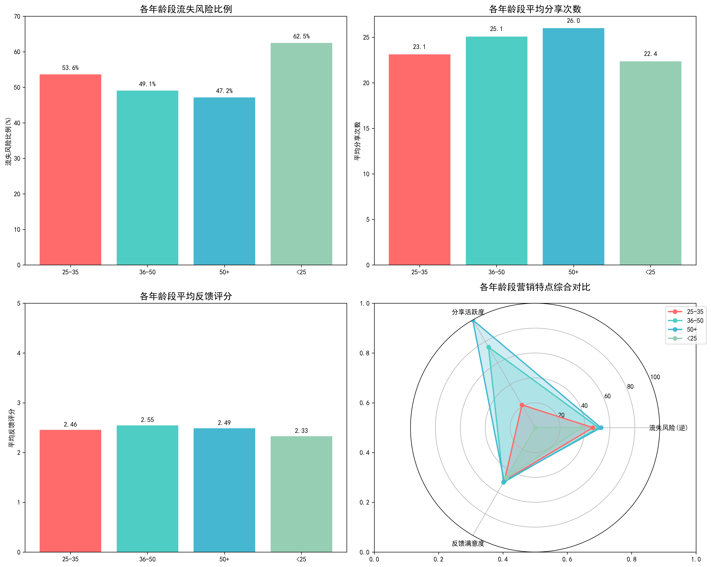
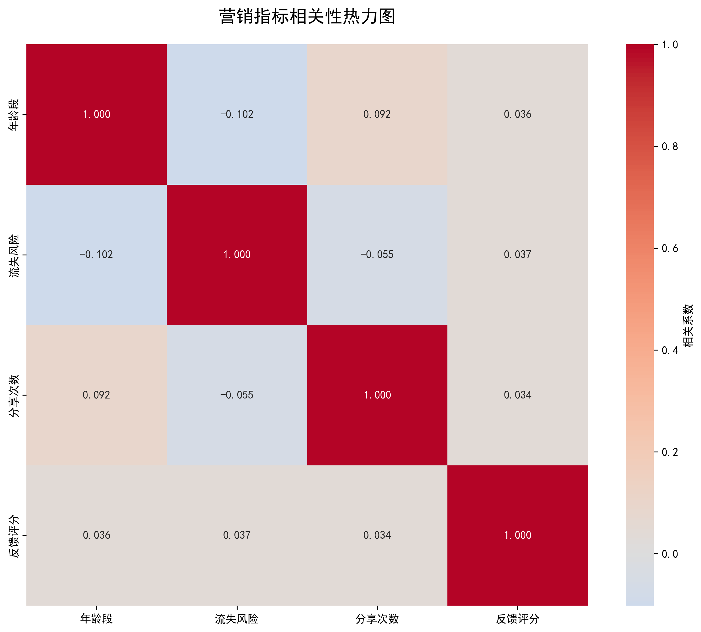

# 不同年龄段用户群体营销特点分析报告

## 执行摘要

基于337个用户样本的深度分析，本报告揭示了不同年龄段用户在流失风险、分享行为和反馈评分方面的营销特点。虽然统计检验显示年龄段间的差异不显著，但仍发现了重要的营销趋势和差异化特征，为制定精准的营销策略提供了数据支撑。

## 核心发现

### 1. 流失风险分析

**关键洞察：**
- **<25岁年龄段**：流失风险最高（62.5%），是重点关注的脆弱群体
- **25-35岁年龄段**：流失风险较高（53.6%），属于次级关注群体
- **36-50岁年龄段**：流失风险中等（49.1%），相对稳定
- **50+岁年龄段**：流失风险最低（47.2%），是最稳定的用户群体

**统计验证：** 卡方检验显示年龄段与流失风险无显著关联（p=0.274），但趋势性差异明显。

### 2. 分享行为分析
- **分享活跃度递增趋势**：随着年龄增长，分享行为呈现上升趋势
- **50+岁年龄段**：平均分享次数最高（26.0次），高分享率（63.2%）
- **<25岁年龄段**：分享活跃度最低（22.4次），需要激励措施
- **中间年龄段**：25-35岁（23.1次）和36-50岁（25.1次）表现中等

### 3. 反馈满意度分析
- **36-50岁年龄段**：反馈评分最高（2.55分），满意度表现最佳
- **<25岁年龄段**：反馈评分最低（2.33分），满意度有待提升
- **整体评分偏低**：所有年龄段平均评分均低于3分，存在改进空间

### 4. 相关性分析

**相关性洞察：**
- 年龄段与流失风险呈弱负相关（-0.102）
- 分享次数与反馈评分呈弱正相关（0.034）
- 各指标间相关性较弱，表明营销策略需要多维度考量

## 详细年龄段画像

### <25岁年龄段（数字原住民）
- **群体特征**：56个样本，高流失风险（62.5%）
- **营销特点**：分享活跃度低，满意度偏低
- **行为模式**：价格敏感，品牌忠诚度待培养
- **关键挑战**：用户留存和活跃度提升

### 25-35岁年龄段（职场新力量）
- **群体特征**：69个样本，中等流失风险（53.6%）
- **营销特点**：分享行为中等，满意度一般
- **行为模式**：追求性价比，社交需求强
- **关键挑战**：价值认同和社交激励

### 36-50岁年龄段（中坚力量）
- **群体特征**：106个样本，中等流失风险（49.1%）
- **营销特点**：分享活跃，满意度最高
- **行为模式**：品质导向，理性消费
- **关键优势**：稳定性和口碑传播潜力

### 50+岁年龄段（银发族群）
- **群体特征**：106个样本，流失风险最低（47.2%）
- **营销特点**：分享最活跃，满意度良好
- **行为模式**：忠诚度高，口碑传播强
- **关键优势**：用户粘性和推荐价值

## 差异化营销策略建议

### <25岁年龄段策略（重点挽留）
**目标：降低流失率，提升活跃度**

1. **新用户引导优化**
   - 设计游戏化新手任务，提升参与感
   - 提供阶段性奖励，增强留存动力
   - 建立同龄人社区，增加归属感

2. **价格激励策略**
   - 学生专享优惠和分期付款
   - 首次购买大额折扣
   - 积分兑换体系，提升粘性

3. **社交化营销**
   - 社交媒体挑战赛和话题营销
   - KOL合作和网红推荐
   - 用户生成内容（UGC）激励

### 25-35岁年龄段策略（价值提升）
**目标：增强忠诚度，提升客单价**

1. **职业发展关联**
   - 职场技能提升课程捆绑
   - 职业发展相关产品和服务
   - 行业专家推荐和背书

2. **生活方式营销**
   - 品质生活场景化展示
   - 工作生活平衡理念传播
   - 个性化定制服务

3. **社交网络利用**
   - 同事推荐奖励计划
   - 朋友圈分享激励
   - 职场社交活动赞助

### 36-50岁年龄段策略（满意度提升）
**目标：巩固优势，扩大影响**

1. **品质保证强化**
   - 产品质量认证展示
   - 专业服务团队配置
   - 售后保障体系完善

2. **家庭价值营销**
   - 家庭套餐和组合优惠
   - 子女教育相关产品
   - 家庭活动赞助和支持

3. **口碑传播激励**
   - 推荐奖励计划升级
   - 用户评价展示和推广
   - 社区意见领袖培养

### 50+岁年龄段策略（忠诚度维护）
**目标：深化关系，扩大推荐**

1. **贴心服务体验**
   - 客服专线和大字体界面
   - 线下体验店和活动
   - 一对一专属服务

2. **健康和生活关怀**
   - 健康养生相关内容
   - 生活便民服务
   - 节日关怀和礼品

3. **推荐网络建设**
   - 同龄人群体活动
   - 推荐积分翻倍计划
   - 社区团长培养计划

## 实施建议和时间规划

### 短期（1-3个月）
1. 针对<25岁用户推出新用户专享活动
2. 优化50+岁用户的客服体验
3. 启动跨年龄段推荐奖励计划

### 中期（3-6个月）
1. 建立年龄段专属社群和频道
2. 推出个性化产品推荐算法
3. 开展年龄段定制化营销活动

### 长期（6-12个月）
1. 构建完整的年龄段用户生命周期管理体系
2. 建立预测性用户流失预警系统
3. 形成年龄段间协同增长的飞轮效应

## 效果评估指标

### 核心KPI
- **流失率改善**：各年龄段流失率降低5-10%
- **分享活跃度**：平均分享次数提升15-20%
- **满意度提升**：平均反馈评分达到3.0以上

### 过程指标
- **用户参与度**：活动参与率和完成率
- **推荐转化率**：推荐用户的转化情况
- **客单价变化**：不同年龄段客单价趋势

## 结论

虽然年龄段间的统计差异不显著，但趋势性洞察为精准营销提供了重要方向。<25岁用户群体需要重点关注和投入，50+岁用户群体是稳定收入和口碑传播的重要来源。通过实施差异化的营销策略，可以在保持现有优势的基础上，重点改善薄弱环节，实现用户价值的全面提升。

关键在于平衡投入产出比，优先关注高价值、高潜力的用户群体，同时维护好稳定用户的基本盘，形成可持续的用户增长和价值提升闭环。
