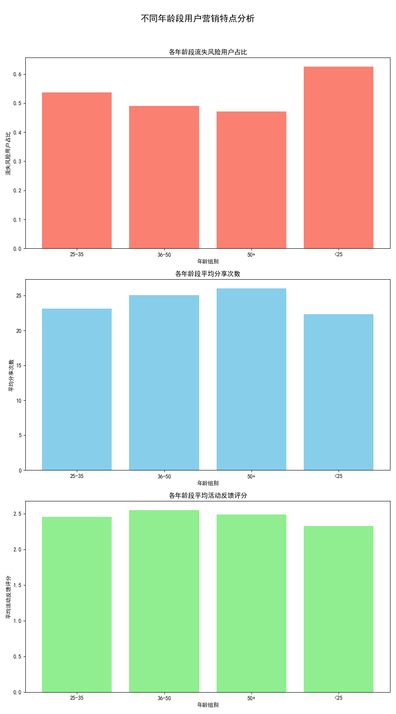

# **不同年龄段用户营销策略分析与建议报告**

## 一、 分析背景与目标

为了实现精细化用户运营，提升营销活动的投资回报率（ROI），本次分析旨在深入探究不同年龄段用户群体的行为特点，具体包括**流失风险、活动分享意愿及活动反馈评分**。通过对这些指标的量化分析，我们期望能够为不同年龄段的用户“画像”，并在此基础上，定制差异化的产品优化方向及营销活动推荐策略。

## 二、 核心数据洞察

通过对用户基本信息、标签数据及营销活动交互数据进行整合分析，我们发现了不同年龄段用户在关键行为指标上存在显著差异。

### 1. 流失风险：年轻用户忠诚度亟待提升

数据显示，**`<25岁`** 的用户群体表现出最高的流失风险（**62.5%**），显著高于其他年龄段。与之相对，**`50+`** 岁用户的流失风险最低（**47.2%**）。这表明，年轻用户群体对平台的粘性较低，是当前最容易流失的风险人群，需要我们投入更多关注和资源进行挽留。

### 2. 分享意愿：中老年用户是口碑传播的主力军

与传统印象不同，**`50+`** 岁用户群体的平均分享次数最高（约**26次**），其次是**`36-50`**岁用户（约**25次**）。而 **`<25岁`** 用户的分享意愿最低（约**22次**）。这说明，中老年用户更乐于分享，是平台进行口碑营销和社交裂变可以倚重的重要力量。

### 3. 活动评分：中年核心用户满意度最高

在活动反馈评分方面，**`36-50岁`** 用户给出的评分最高（平均**2.55分**），表明他们对当前的营销活动最为满意，是我们的核心价值用户。而 **`<25岁`** 用户的评分最低（平均**2.33分**），这与他们的高流失风险相吻合，再次印证了他们对现有产品或营销活动可能存在不满。

## 三、 用户群体画像与差异化策略建议

基于以上数据洞察，我们将用户划分为四个关键群体，并提出以下差异化的产品及营销策略：

### 1. 探索期用户（<25岁）：高风险，需重点干预

*   **特点**：流失风险最高、分享意愿最低、活动评分最低。他们追求新奇、注重社交，但耐心有限。
*   **产品策略**：
    *   **增强趣味性**：引入游戏化、个性化装扮等功能，提升产品本身的趣味性。
*   **营销策略**：
    *   **强化社交互动**：设计“好友助力”、“组队PK赢大奖”等社交裂变活动，利用其社交关系链。
    *   **提供即时满足**：设置低门槛、高频次的即时奖励，如签到红包、首次参与奖等，快速建立正向反馈。
    *   **内容年轻化**：采用网感强、有趣的文案和视觉设计，与他们建立情感共鸣。

### 2. 成长期用户（25-35岁）：潜力股，需积极引导

*   **特点**：各项指标居中，是平台的中坚力量，有向核心用户转化的巨大潜力。
*   **产品策略**：
    *   **关注价值感**：提供有助于个人成长、效率提升或生活品质改善的实用功能。
*   **营销策略**：
    *   **培养长期习惯**：推出“学习打卡”、“健身挑战”等培养型活动，通过长期激励提升用户粘性。
    *   **构建会员体系**：通过积分兑换、会员升级等方式，引导其深度参与，提升用户生命周期价值。

### 3. 成熟期用户（36-50岁）：核心价值用户，需精耕细作

*   **特点**：流失风险低、分享意愿和活动评分高。他们是平台最忠诚、最满意的核心用户。
*   **产品策略**：
    *   **突出品质与特权**：优化产品性能，提供会员专属权益、优先体验等增值服务。
*   **营销策略**：
    *   **彰显身份尊贵**：举办线下沙龙、新品优先体验会等，提供专属感和尊贵感。
    *   **深化口碑营销**：设立高价值的“推荐官”奖励计划，激励他们利用自身影响力进行口碑传播。

### 4. 稳定期用户（50+）：忠诚的传播者，需简化和关怀

*   **特点**：流失风险最低、分享意愿最强。他们是平台的忠实粉丝，也是重要的口碑传播者。
*   **产品策略**：
    *   **简化操作**：优化UI/UX，突出核心功能，降低学习成本，提供大字体、语音读等辅助功能。
*   **营销策略**：
    *   **主打情感链接**：开展围绕家庭、健康、怀旧等主题的关怀型营销活动。
    *   **简化分享激励**：设计“一键分享得健康金”、“分享给家人领福利”等简单直接的分享活动，最大化利用他们的高分享意愿。

## 四、 结论

不同年龄段用户在行为和偏好上存在显著差异。我们必须摒弃“一刀切”的运营模式，转向基于数据洞察的精细化、差异化策略。通过为不同群体量身定制产品功能和营销活动，我们不仅能有效降低年轻用户的流失风险，更能充分激活中老年用户的传播价值，从而实现整体用户价值和平台ROI的最大化。
