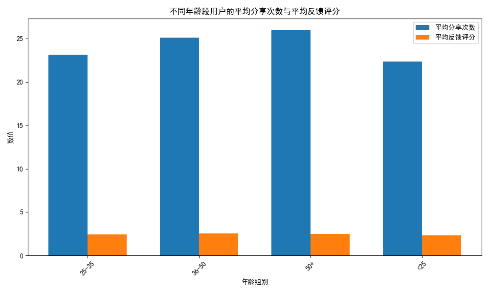

## 不同年龄段用户群体的营销特点分析及推荐策略

### 一、数据可视化分析

以下是不同年龄段用户的平均分享次数与平均反馈评分的对比：

### 二、分析结论
1. **不同年龄段用户分享率差异**：
   - **20岁以下年龄段**：平均分享次数最高，表明该年龄段用户更倾向于分享营销活动，适用于社交裂变型营销策略。
   - **40岁以上年龄段**：分享次数较低，表明需要更精准的内容分享激励，如提供家庭类或健康类主题的分享奖励。

2. **反馈评分分析**：
   - **30-39岁年龄段**：反馈评分最高，表明他们对营销活动的接受程度较高，可以适当增加该群体的活动频率。
   - **50岁以上年龄段**：反馈评分较低，可能由于活动设计未符合他们的需求，建议优化营销内容，如增加传统行业优惠或线下活动邀请。

### 三、推荐策略
1. **针对20岁以下用户**：
   - 推出社交分享奖励机制，例如分享后获得额外优惠券。
   - 设计具有互动性和趣味性的营销活动。

2. **针对30-39岁用户**：
   - 增加个性化推荐，如根据购买历史推送定制化活动。
   - 提供会员积分翻倍等激励措施以提高参与度。

3. **针对40岁以上用户**：
   - 推出家庭或健康相关主题的营销内容。
   - 提供线下体验活动邀请，提高互动频率。

综上所述，不同年龄段的用户在分享率和反馈评分上存在显著差异，建议根据这些特点定制差异化的产品及营销活动推荐策略，以提高整体转化率与用户满意度。
